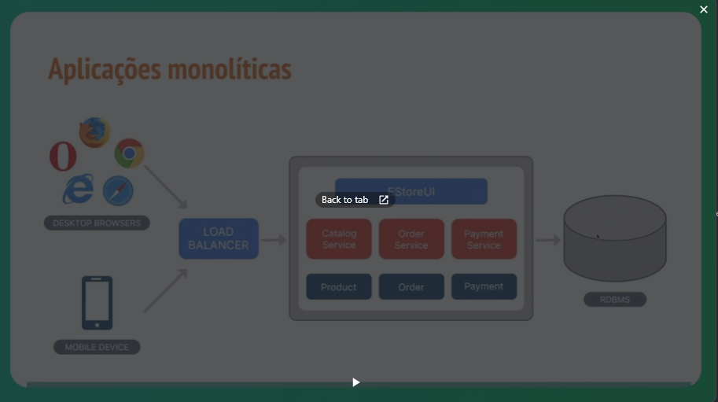

# Microsservicos

Aula teorica

## Tipos de solucao web

Cliente (app ou aplicacao desktop) -> Load balancer -> Aplicacao com diversas tarefas monolitica -> Banco de dados

### Problemas

- Demoras no deploy

- Falhas podem derrubar o sistema todo

- 1 projeto = 1 tecnologia

A abordagem de aplicações monolíticas, assim como qualquer abordagem no desenvolvimento de software, possui vantagens e desvantagens.

Qual das alternativas a seguir é uma desvantagem de aplicações monolíticas?

Alternativa correta
Deploys possivelmente mais perigosos

Alternativa correta! Uma aplicação monolítica tem um único deploy, então um erro em uma parte da aplicação pode quebrar uma outra que não tem nenhuma relação.

### Arquitetura de microsservicos

Cliente -> servico geral -> Catalogo de servico -> banco de dados especifico
                         -> servico de carrinho -> banco de dados especifico
                         -> servico de pagamento -> banco de dados especifico

A definicao formal

Microsservicos sao uma abordagem arquitetonica e organizacional do desenvolvimento de software na qual o software consiste em pequenos servicos independentes que se comunicam usando APIs bem definidas. Esses servicos pertencem a pequenas equipes autossuficientes

Os microsservicos precisam se comunicar de alguma forma entao apis nao sao somente back e front mas back com back tbm, com http mesmo ou com protocolos mais especificos

Entendemos neste vídeo o que são microsserviços.

Antes mesmo de conhecer suas vantagens e desvantagens, em que cenário você adotaria essa abordagem?

Alternativa correta
Quando manter uma aplicação monolítica se tornar um problema

Alternativa correta! Se uma aplicação monolítica tem deploys muito demorados e frágeis, usa tecnologias que não parecem ser coerentes com a tarefa e precisaria ser quebrada em equipes individuais, microsserviços podem ser a solução.

#### Vantagens

- Projetos independentes = tecnologias independentes

- Falha em 1 servico e isolada

- Deploys menores e mais rapidos

Tem mais metricas do que esta sendo mais usado para poder escalar o que da certo

#### Desvantagens

- Maior complexidade de desenvolvimeto e de infra

- Debug mais complexo

- Comunicacao entre os servicoes deve ser bem pensada

- Diversas tecnologias pode ser um problema

- Monitoramento e crucial e mais complexo

#### Quando utilizar?

https://www.martinfowler.com/bliki/MonolithFirst.html

Porque a complexidade de desenvolvimento é muito maior

Alternativa correta! Nos estágios iniciais do desenvolvimento de um software, o domínio ainda não é completamente conhecido. Erros serão cometidos e deverão ser fáceis de corrigir. Quando já conhecemos bem o domínio, fica muito mais fácil dividir uma aplicação em vários serviços.

#### Tipos de microsservicos

- Data Service (servir uma camada de dados antes do banco de dados)

- Business service (tipo de servico que consome data service ele fornece operacoes mais complexas, ela agrega os dados e fornece algo um pouco maior)

- Translation service (acessa recursos externos e utiliza ela no nosso controle)

- Edge service (entrega algo diretamente ao cliente, de acordo com o tipo de cliente, podendo aplicar limites e esse tipo de coisa)

## Separando servicos

Neste vídeo aprendemos 2 padrões muito comuns no desenvolvimento de microsserviços. Mas vamos falar do padrão Strangler.

Por que é interessante quebrar a aplicação em serviços depois que ela já está desenvolvida e funcionando?

Alternativa correta
Porque neste momento conhecemos melhor o negócio

Alternativa correta! Com uma aplicação já funcional, é muito mais fácil identificar os domínios que precisam ser separados e o que não é tão crítico, além de termos mais confiança nas implementações das regras.

### Servicos de dominio 

- DDD

- Comece modelando seu dominio, nao pensando na persistencia

- Avalie as acoes que serao disponibilizadas

- Construa o servico, pensando primeiro no contrato

- REST e RPC podem andar juntos

### Servicos de negocio

Sao operacoes que demandam mais de um dominio

- Em determinados momentos as operacoes precisam de mais de um modelo do nosso dominio para serem corretamente representadas em um servico

#### Processo do dominio do negocio

- Proveem uma funcionalidade do negocio de mais alto nivel

- Permite encapsular dominios relacionados

#### Criando um sevico de negocio

- Identifique o processo que voce pretende expor

- Identifique os dominios que serao necessarios nesse serico

- Defina a API que sera utiliza, focando no dominio e nao nos dados

- Consuma servicos de dominio para executar os processos

### Padroes

#### Estrangulando um servico

Padrao de estrangulamento

- Quebrar um monolito, tirando as funcionalidades dele

- Podemos comecar isolando os dados

- Ou podemos comecar isolando o dominio

Inicialmente voce separa as apenas os servicos mas o banco de dados pode ser um so depois com o tempo pode se separar esse banco

A questao aqui e separarmos os servicos aos poucos ate virar um servico completamente independente

#### Sidecar pattern

- Determine o processo comum

- Construa um modulo compartilhavel

- Aplique esse sidecar nos servicos que precisam dele

### Integrando servicos

Ponto unico de entrada

#### API Gateway

- Problema: Clientes acessando livremente os servicos geram caos

- Gateway fornece um proxy, uma fachada, para as necessidades reais

- Desvantagem: Esse portao de entrada pode se tornar um ponto central de falha

Tradeoffs

##### Comportamentos de gateway

- Simplesmente autorizar e redirecionar os requests

- Uso do decorator para adicionar informacoes necessarias aos requests

- Limitar o acesso ou conteudo trafegado

Qual a principal vantagem deste padrão?

Ter um ponto único de acesso para nossa aplicação

Alternativa correta! Dessa forma podemos ter controles de acesso unificados, autenticação em ponto único, etc. Mas essa também é a principal desvantagem: o ponto único de falha

#### Agregando processos

E algo que agrega diversos servicos de negocio (que por sua vez agrega servicos de dominio)

Process agraggator pattern

- Servicos de negocio agregam servicos de dominio

- Process aggragattors agregam servicos de negocio

- Agregadores fazem as chamadas para os servicos necessarios e montam a resposta correta

- Pode (e deve) ter logica de processamento

Deve se unir respostas de varios servicos

##### Construindo um agregador

- Defina um novo modelo para representar os dados agregados

- A partir deste modelo, pensa na API que fornecera as operacoes

Um mini mundo que representa todo um modelo de negocio (como matricular novo aluno)

#### Gateways especificos

Edge pattern

- Gateway especifico para determinados clientes

- Foco nas nescessidades reais de determinados clientes

Voce tem um gateway especifico para um servico, mas o edge pode mudar um pouquinho para que ele atenda a necessidades especificas

##### Contruindo uma ponta

- Identifique o cliente e suas necessidades

- Construa contratos especificos para o cliente (cliente de neogico ou cliente tipo desktop/mobile)

- Modifique os dados que sao transferidos para garantir a otimizacao do processo

- Existe a possibilidade de ter apenas edges, e nao gateways

Aprendemos sobre o tipo de serviço conhecido como Edge Service, ou serviço de ponta.

Quando esse tipo de serviço é interessante?

Quando clientes diferentes possuem necessidades diferentes

Alternativa correta! Se seu aplicativo móvel precisa de menos dados que a aplicação web, um serviço de ponta pode garantir que os dados extra não sejam enviados de forma desnecessária, por exemplo.

## Dados

Relacao de 1:1 entre servicos e banco de dados

### Single service database

- Problema: Escalabilidade do servico e do banco sao fortemente relacionados

- Solucao: Cada servico (que precisar) tera seu proprio banco de dados

### Shared service database

- Problema: as vezes precisamos centralizar os dados (ate por motivos contratuais)

- Solucao: trate esse banco em cada servico como se fosse separado

Ignore q e o mesmo banco, trate como um banco diferente para nao impactar a mudanca no futuro

Entendemos neste vídeo que o ideal é que cada serviço tenha acesso a seu próprio banco de dados apenas.

Qual a vantagem de termos bancos de dados diferentes para cada serviço que precisa de acesso a dados?

Alternativa correta
Praticidade

Escalabilidade

Alternativa correta! Com cada serviço tendo seu próprio banco, a escalabilidade do serviço e banco pode ser feita em conjunto. Assim, serviços que recebem poucos acessos podem ter bancos menos potentes e mais baratos, e vice-versa.

### CQRS - Command query Responsability Seggregation (padrao de codificacao)

Separar servicos de escritas e servicos de leitura (um de querys e outras de mutations) esse modelo precisa de um estudo separado pois compensa bastante

- Com leitura e escrita separados, cada parte pode realizar operacoes mais complexas

- O modelo de leitura pode ter informacoes agregadas de outros dominios

- O modelo de escrita pode ter dados sendo automaticamente gerados

- Aumenta ( MUITO ) a complexidade de um sistema

Por esse ultimo que precisa estudar mto esse modelo, pois tem que ser muito bem pensado 

### Eventos assincronos

- Determinados problemas nao podem ser resolvidos na hora (em tempo real)

- Um servico emite um evento que seta tratado em seu devido tempo

- Tecnologias como mensagerias e servicos de stream de dados brilham

Enviar email ou processamento em fila

## Operacoes

Agregacao de logs

Logs sempre sao importantes, porem em microsservicos a importancia dela dobra

- Formatos de log DEVEM ser compartilhados entre os servicos

- Uma taxonomia comum deve ser compartilhada

- Logs de monolitos sao agregados por padrao. Com microsservicos o buraco e mais embaixo

- Parte da tarefa de agregacao pode ser o parsing dos logs para categorizar corretamente

### Rastreamento de chamadas

- Uma parte importante de realizar logs e rastrear as chamadas de uma execucao

- Devemos poder reconstruir uma operacao a partir de um identificador

- Isso e o equivalente a call stack de um sistema monolitico

- Use padroes de trace ID para gerar os logs

- Use ferramentas de gerenciamento (APMs) para visualizar 

No monolito o trace e mais dificil de ver, por isso se espalha logs por eles

A gente deve estudar sobre padroes de trace Id, pois esses padroes ja existem 

Em microsserviços ou não, logs são uma parte fundamental de um sistema.

Por que logs são tão importantes?

São os logs que nos informam o estado e a saúde do sistema.

Alternativa correta! Logs estão para a saúde do sistema assim como exames estão para nossa saúde física. Através de logs podemos identificar informações muito valiosas sobre nossa aplicação.

Como já foi exaustivamente citado, os logs são muito importantes, seja em um sistema baseado em arquitetura de microsserviços ou não.

Por que logs são ainda mais importantes em microsserviços?

Alternativa correta
Pois sem eles não poderíamos rastrear as chamadas de uma execução.

Alternativa correta! Os logs são o que nos permitem montar uma espécie de call stack ou stack trace, ou seja, através de logs conseguimos reproduzir uma execução e depurá-la.

### Agregando metricas

- Enquanto logs precisam de desenvolvimento, metricas "so" precisam de instrumentacao

- Metricas nos permitem saber o que estao acontecendo em determinado momento

- Construa ou use dashboards de alto nivel para ter uma facil visao do status atual da aplicacao

- Depois, tenha dashboards especificos para cada servico, com mais detalhes

Assim como exames de sangue estao para a saude de um corpo, metricas estao para sistemas

Metricas servem muito para comunicar com o negocio como um todo
