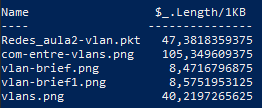
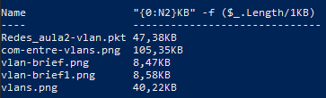
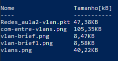

# Powershell 

WINDOWS+R digita MSTSC (abre a conexão de área de trabalho remota)

```sh
Get-Service -Name "Qualque um" (te dá se tal serviço está sendo feito pela sua máquina), poderia ter -ComputerName caso usassemos mais máquinas em estado remoto

variável $A (com $ na frente)

```

A estutura do comando é dada por:

```sh
comando (verbo-adjetivo)

switch arguments (-caracteristica)

propriedades
```

Nota-se que o powershell tem uma classe de funções bem com a cara verbo-adjetivo, tipo pegue-serviço e isso deixa o código um pouco mais legível, além de que podemos tratar a variável como um objeto, então podemos manusear uma pasta por exemplo de forma mais fácil e de forma a ser entendível.

Para pausar o áudio no windows podemos fazer:

```sh
$var=Get-Service -Name "Audiosrv"
$var.Stop()

E para voltar
$var.start()
```

O powershell não faz distinção entre maiúsculas e minúsculas

Uma função que pode ser feita no Ps É

```sh
 if($var.status -eq "Running"){
$var.stop()
$var.start()
}
```
Certos comandos comuns do dia-a-dia não são utilizados no PowerShell pois o mesmo se previne de alguns ataques maliciosos, porém isso acaba por fazer com que o powershell não execute simples arquivos .bat de maneira convencional então por isso temos que aplicar o CommandPrecedence então para executar um bat temos que fazer:

```sh
.\blabla.bat
```

Ou simplesmente colocar os bats no nosso Path e para ver o que tem na nossa PATH temos que escrever:

```sh
echo $env:path
```

env nos mostra as variáveis de ambiente, nele podemos ver o nome do usuário com:

```sh
echo $env:USERNAME
```

Ver o tipo da variável que estamos mechendo:

```sh
$env:path.getType()

Resultado:

IsPublic IsSerial Name                                     BaseType
-------- -------- ----                                     --------
True     True     String                                   System.Object
```

Qualquer dúvida em como manipular strings aqui, basta digitar no Google MSDN string

Então uma forma de melhorar o resultado do path podemos escrever:

```sh
$env:path.Split(';')
```

Então para ver algumas variáveis armazenadas dentro do Path 

```sh
 $env:path | Get-Member
```

O Get-Member nos dá todas as propriedades e métodos de uma função, tal como sua definição e escrita.

Note que podemos utilizar o comando dir, o comando cd de boa no nossa powershell e esses são comandos do prompt antigo do windows (o com fundão preto), porém o rename não. Por que? Por que o dir e o cd são bem usuais pra todos os universos então é criado um apelido para esses comandos e a lista de apelidos que existem no powershell é encontrado por:

```sh
get-alias
```

Então vamos recriar o comando rename no powershell, só que para isso precisamos descobrir que função já integrada no PS que nos dá algo parecido com isso.

```sh
get-command -Name *rename*
```

O comando get-command nos dá todos os comandos disponíveis no powershell mas dá para realizar um filtro pelo nome e um trecho de palavra que tem nesse nome e como queremos renomear um arquivo e o programa está em inglês então. E nisso encontramos um comando chamado rename-item que parece promissor, aí podemos ver o que ele faz com:

```sh
get-help -name rename-item
```

Só que esse comando não mostra muita coisa, sendo necessário dar uma atualização nessa ajuda então digitamos

```sh
update-help
```

A tecla tab autocompleta o comando e o SHIFT+TAB volta.

O parâmetro -WhatIf nos mostra o que ele faria caso fosse executado, isso acontece caso não tenhamos certeza do que estamos fazendo. Então um comando para testar se ele vai renomear um arquivo é:

```sh
rename-item blab.txt blabla.txt
```

```sh
new-alias -name "rename" rename-item
```

Só que assim como no cmd que não salvava no PATH eu tenho isso também com os alias assim que fecho o terminal do PS, quando abro um novo terminal meu apelido rename não está mais lá.

E para isso temos que criar um perfil no powershell na pasta que está em $profile, e com isso vemos a seguinte resposta:

```sh
$profile

C:\Users\Hiago\Documents\WindowsPowerShell\Microsoft.PowerShell_profile.ps1
```

Porém se formos para essa pasta nós notaremos que não existe uma arquivo Microsoft.PowerShell_profile.ps1 (onde ps1 é a extensão de um script no powershell), pois vamos criar-la e colocar todos os alias lá dentro. e para isso vamos fazer

```sh
new-item $profile
```

isso vai criar o item na pasta profile, e aí sim colocar nossos apelidos e outras coisas a mais, só que ai podemos esbarrar em mais uma segurança do powershell que te proíbe em executar scripts

```sh
Execute o powershell como administrador

Set-ExecutionPolicy Unrestricted 
s
Enter
```

Para encontrar uma ajuda sobre qualquer coisa podemos fazer:

```sh
get-help about_*
```

E para isso temos definições de muitos tipos de profile, como:

```sh
$profile
$profile.CurrentUserCurrentHost
$profile.CurrentUserAllHosts
$profile.AllUsersAllHosts
```

Então se queremos que todos os usuários da minha rede tenham acesso ao rename eu tenho que entrar como administrador, criar o arquvio na $profile.AllUsersAllHosts e aí colar o comando no arquivo somente isso e para abrir esse arquivo podemos escrever

'''sh
notepad $profile.AllUsersAllHosts
'''

Host é o hospedeiro do aplicativo que você está usando, e se você tem um alias no seu powershell e quiser criar um alias em todos os usuários nós teremos um conflito e o alias não vai ser executado somente para você.

O termo host representa o hospedeiro do PowerShell - seja uma console, um serviço do Windows ou outro tipo de hospedeiro. O profile em CurrentUserAllHosts é sempre executado independente do hospedeiro do PowerShell.

Para listar todos os itens dentro de uma pasta (pasta dentro da pasta também), basta fazermos:

```sh
ls -Recurse
```

E todos os arquivos

```sh
ls -Recurse -File
```

Então para filtrar arquivos com um nome específico e o tamanho dele nós fazemos:

```sh
ls -Recurse -File | where-object Name -like "*-caracteristica do nome-*"|Select-Object Name,Length
```

Filter left, format right


A variável $_ É uma variável existente nos scriptsblocks usados em cmdlets de iteração, como por exemplo, o Where-Object.

Só que não tá tão legal a forma do tamanho do arquivo ele devia estar em B, KB, MB ou até GB, TB o que não é o caso ele nos mostra apenas o número em bytes

E uma forma de resolver isso é da seguinte forma:

```sh
ls -Recurse -File | where-object Name -like "*vlan*"|Select-Object Name, { $_.Length/1KB }
```

Onde `$_` é um parâmetro de iteração e podemos colocar 1024=1KB, e por aí vai.



Porém ele fica com uma tabela onde o índice do tamanho do arquivo fica $_.Length/1KB bagulho feião e para ajeitar isso nós fazemos

```sh
ls -Recurse -File | where-object Name -like "*vlan*"|Select-Object Name, {"{0:N2}KB" -f ($_.Length/1KB) }
```

O `-f` é o formato da nossa string onde N2 é a especificação de duas casas decimais e 0: faz referência ao que queremos mostrar que é a expressão ($_.Length/1KB)

O que nos deixa com:



Agora vamos mudar os headers de Name para Nome e essa expressão para tamanho

Então uma coisa que podemos fazer para deixar o código melhor é substituir where-object para ? e select-object para select de forma que:

```sh
ls -Recurse -File | ? Name -like "*vlan*"|Select Name, {"{0:N2}KB" -f ($_.Length/1KB) }
```

Isso nos dá o mesmo resultado, cuidado ao querer editar demais a linha de código e quebrar as linhas o powershell ele lê cada linha indendentemente. Para isso usamos a crase (ou backtick), de forma que:

```sh
ls -Recurse -File `
| ? Name -like "*vlan*" `
|Select `
Name,`
 {"{0:N2}KB" -f ($_.Length/1KB) }
```

O resultado continua sendo o mesmo.

Ou colocar o pipe sempre no final da linha, sem a nescessidade da crase de forma que:

```sh
ls -Recurse -File |
 ? Name -like "*vlan*"| 
Select `
Name,`
 {"{0:N2}KB" -f ($_.Length/1KB) }
```

Uma outra forma de melhorar a legibilidade dessa linha é cirando variáveis pro nome e para a expressão do tamanho do arquivo de forma que:

```sh
$nameExp="Name"
$lengthExp= {"{0:N2}KB" -f ($_.Length/1KB) }

$params= $nameExp,$lengthExp

ls -Recurse -File |
 ? Name -like "*vlan*"| 
Select `
$params
```

Acredite mas isso dá o mesmo.

Um array no powershell pode ser criado como:

```sh
@(1,2)
,1
(1,2)
@(1)
```

Onde a segunda e a quarta forma são para vetores de 1 elemento, mas normalmente a vírgula é o mais usado. Agora ajeitando o nome das colunas temos que fazer:

```sh
$nameExp=@{}
$nameExp.Add("Label", "Nome")
$nameExp.Add("Expression",{$_.Name})

$lengthExp=@{}
$lengthExp.Add("Label","Tamanho[kB]")
$lengthExp.Add("Expression",{"{0:N2}KB" -f ($_.Length/1KB)} )

$params= $nameExp,$lengthExp

ls -Recurse -File |
 ? Name -like "*vlan*"| 
Select `
$params
```

O `@()` é o hash table e serve justamente para ajeitar o nome da coluna de forma que:



Só que meodeos que verborrágico que ficou isso, mas calma tem uma melhor forma de dizer isso tudo que fizemos que é:

```sh
$nameExp=@{
    Label="Nome";
    Expression={$_.Name};
}

$lengthExp=@{
Label="Tamanho [KB]"
Expression= {"{0:N2} KB" -f ($_.Length/1KB)};
}

$params= $nameExp,$lengthExp

ls -Recurse -File |
 ? Name -like "*vlan*"| 
Select `
$params
```

Isso dá a mesma coisa que o anterior, note que temos uma linha de label (que é o nome da coluna e outra da expressão).

Qualquer dúvida para encontrar uma variável que não conhecemos nós podemos encontrar pelo `get-variable | ? Name -like *tananan*`

## Scripts

Podemos editar nosso script via ISE

Comentários é com `#` ou com `<#  #>` para mais de uma linha, a extensão é .ps1.

Quando erramos no código o powershell continua mesmo assim, para isso podemos mudar a varíavel `ErrorActionPreference` para Stop fazendo:

```sh
$ErrorActionPreference="Stop"
```

Quando temos uma variável interna no script não conseguimos ver como essa variável estará no terminal, mas variáveis escritas no terminal são vistas pelo script.

Agora vamos printar nosso relatório em uma página Web, uau ne.

Nosso script está da seguinte forma

```ps
<#
Autor: Hiago
Ano:2020
                              Título


#>

cd .\Desktop\h1.labs\h1.labs\redes
cls
# Hash Table para os nomes dos arquivos
$nameExp=@{
    Label="Nome";
    Expression={$_.Name};
}

# Hash Table para o tamanho dos arquivos
$lengthExp=@{
Label="Tamanho [KB]"
Expression= {"{0:N2} KB" -f ($_.Length/1KB)};
}

# transforma essas duas tabelas em um vetor
$params= $nameExp,$lengthExp

# lista recurssivamente todos os arquivos
ls -Recurse -File |

# Filtra os nomes que tem vlan no nome
 ? Name -like "*vlan*"| 

 # E seleciona os parâmetros de nome e tamanho desses arquivos filtrados
Select `
$params
```

E para esse feito temos um comando chamado `ConvertTo-Html` da seguinte forma:

```ps
<#
Autor: Hiago
Ano:2020
                              Título


#>

cd .\Desktop\h1.labs\h1.labs\redes
cls
# Hash Table para os nomes dos arquivos
$nameExp=@{
    Label="Nome";
    Expression={$_.Name};
}

# Hash Table para o tamanho dos arquivos
$lengthExp=@{
Label="Tamanho [KB]"
Expression= {"{0:N2} KB" -f ($_.Length/1KB)};
}

# transforma essas duas tabelas em um vetor
$params= $nameExp,$lengthExp

$resultado=
ls -Recurse -File |
 ? Name -like "*vlan*"| 
Select `
$params

$resultado | ConvertTo-Html
```

Editando parâmetros da nossa página html

```ps
<#
Autor: Hiago
Ano:2020
                              Título


#>

cd $env:pasta_projetos\redes
cls
# Hash Table para os nomes dos arquivos
$nameExp=@{
    Label="Nome";
    Expression={$_.Name}
}

# Hash Table para o tamanho dos arquivos
$lengthExp=@{
    Label="Tamanho [KB]";
    Expression={"{0:N2}KB" -f ($_.Length/1KB)}
}

# transforma essas duas tabelas em um vetor
$params = @($nameExp,$lengthExp);

$resultado=
ls -Recurse -File |
 ? Name -like "*vlan*"| 
Select $params

$estilos= Get-Content $env:pasta_projetos\dicas-cmd-PS-windows\styles.css #temos que ter o arquivo css 
$estiloTag= "<style> $estilos </style>"
$tituloBody="<h1> Relatório </h1>"

#$resultado
#$estilos


$resultado | ConvertTo-Html -Title Relatório -Head $estiloTag -Body $tituloBody| Out-File $env:pasta_projetos\dicas-cmd-PS-windows\relatorio.html

#-Title-> Título da página -Head coloca nosso estilo css

Invoke-Item $env:pasta_projetos\dicas-cmd-PS-windows\relatorio.html #printa o html no brouser padrão
```

## Escolhendo saídas dos arquivos

Podemos gerar relatórios de diversas maneiras, as mais usuais são html, csv (excel) e JSON. Vamos aproveitar o que fizemos para selecionar o tipo de arquivo que queremos?

```ps
<#
Autor: Hiago
Ano:2020
                              Título


#>

param($saida)


cd $env:pasta_projetos\redes
cls
# Hash Table para os nomes dos arquivos
$nameExp=@{
    Label="Nome";
    Expression={$_.Name}
}

# Hash Table para o tamanho dos arquivos
$lengthExp=@{
    Label="Tamanho [KB]";
    Expression={"{0:N2}KB" -f ($_.Length/1KB)}
}

# transforma essas duas tabelas em um vetor
$params = @($nameExp,$lengthExp);

$resultado=
ls -Recurse -File |
 ? Name -like "*vlan*"| 
Select $params


if($saida -eq "html" -or "HTML"){

$estilos= Get-Content $env:pasta_projetos\dicas-cmd-PS-windows\styles.css
$estiloTag= "<style> $estilos </style>"
$tituloBody="<h1> Relatório </h1>"

#$resultado
#$estilos

$resultado | ConvertTo-Csv -NoTypeInformation |Out-File $env:pasta_projetos\dicas-cmd-PS-windows\relatorio.csv
$resultado | ConvertTo-Json |Out-File $env:pasta_projetos\dicas-cmd-PS-windows\relatorio.json
$resultado | ConvertTo-Html -Title Relatório -Head $estiloTag -Body $tituloBody| Out-File $env:pasta_projetos\dicas-cmd-PS-windows\relatorio.html

#Invoke-Item $env:pasta_projetos\dicas-cmd-PS-windows\relatorio.html
}elseif($saida -eq "json" -or "JSON"){

$resultado | ConvertTo-Json |Out-File $env:pasta_projetos\dicas-cmd-PS-windows\relatorio.json


}elseif($saida -eq "csv" -or "CSV"){

$resultado | ConvertTo-Csv -NoTypeInformation |Out-File $env:pasta_projetos\dicas-cmd-PS-windows\relatorio.csv

}
```

Código do professor

```ps
param($tipoDeExportacao)

$ErrorActionPreference = "Stop"

<#
  Aqui a gente cria um hashtable para a coluna de nome
#>
$nameExpr = @{
	Label="Nome";
	Expression= { $_.Name }
}

# Tambem montamos um hashtable. Só que esse daqui é pro Tamanho
$lengthExpr = @{
	Label="Tamanho";
	Expression= { "{0:N2}KB" -f ($_.Length / 1KB) }
}

# Basta usar uma vírgula e nos temos um array
$params = $nameExpr, $lengthExpr

$resultado =
	gci -Recurse -File |
		? Name -like "*_migrando_*" |
		select $params

		
if ($tipoDeExportacao -eq "HTML") {
	$estilos = Get-Content c:\scripts\styles.css
	$styleTag = "<style> $estilos </style>"
	$tituloPagina = "Relatorio de Scripts em Migracao"
	$tituloBody = "<h1> $tituloPagina </h1>"

	$resultado |
		ConvertTo-Html -Head $styleTag -Title $tituloPagina -Body $tituloBody  |
		Out-File c:\tempGui\relatorio.html	
} elseif ($tipoDeExportacao -eq "JSON") {
	$resultado |
		ConvertTo-JSON |
		Out-File c:\tempGui\relatorio.json
} elseif ($tipoDeExportacao -eq "CSV") {
	$resultado |
		ConvertTo-CSV -NoTypeInformation |
		Out-File c:\tempGui\relatorio.csv
}

```
