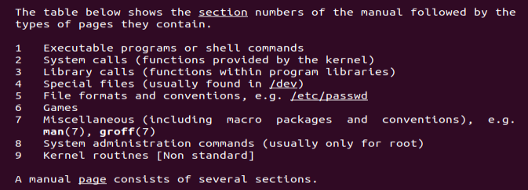

# Linux PLI parte 4

Essa parte vai falar sobre as ajudas que temos no terminal, como o `help`, `man` e o `locate`.

## Help

Em geral para pegar ajuda de um determinado comando fazemos

```sh
help cd
```

O help é a documentação dos comandos que são `builtin` do shell e para saber quais comandos são builtin nós usamos o `type` (ou `type -a` caso tenhamos um apelido). Então comandos como ls, cat e outros não vão ter um help. Então comandos como o `pwd`, `cd`, `type` vão ter o help.

Para isso temos o `--help` onde podemos ter a ajuda de um programa com:

```sh
ls --help
```

Só que o --help não é possível para programas que são builtin. (alguns até tem isso já mas no geral não é necessário ter)

Tem dois atalhos pro --help que não são muito populares mas que podem acabar servindo como o `-h` e o `-?` mas aí nem todos os comandos adotam essas opções, pois não é um padrão obrigatório. O mais comum é termos o --help.

Em geral os builtins que tem programas externos terão acesso ao --help. Com o pwd, cuja saída de `type -a pwd` será:

```r
pwd is a shell builtin
pwd is /usr/bin/pwd
pwd is /bin/pwd
```

Esses outros diretórios permitem o uso do --help e do man.

## man

Um outra forma de procurar ajuda é no navegador, se digitarmos ls help no google encontraremos a mesma informação. provavel de vermos algo assim <http://linuxcommand.org/lc3_man_pages/ls1.html>

Foi nos dado um tipo de manual.

E essa mesma página pode ser vista no terminal com:

```sh
man ls
```

Alguns builtins tem o man, outros não.

Certos programas mais complexos como o zip são bem interessantes o manual.

Mas quando for pesquisar no browser algum tipo de manual, pegue o manual da distro que você está usando pois pode ter algumas diferenças que podem passar desapercebidos.

Grande parte dos comandos tem um man.

### Mais sobre o man

Os manuais são separados em sessões (mas imagina que são sessões) e que podem ser vistas no manual do proprio manual ou `man man`, e que são:



E a essa parte nós temos o crontab. mas a sugestão é sempre ver o man do terminal mesmo

Para pesquisar um comando específico no manual basta eu digitar / na página do manual e ver o que quero encontrar com `n` para avançar entre as opções e espaço para ir mais rápido. Por padrão o man usar o less para visualizar os arquivos.

Para pesquisar uma determinada palavra no man e ver que manuais contem ela eu digito

```sh
man -k <palavra>
```

Outra opção é o apropos

```sh
apropos <palavra>
```

E o final desse comando serão todos os manuais que contém aquela palavra em sua composição

### Onde o man localiza esses manuais

Se formos ver o onde está o manual de um determinado arquivo com `whereis` nós vemos que:

```sh
whereis cat
```

Que temos um manual em /usr/share/man, mas essa pasta não está no nosso PATH, então com ele faz para nos mostrar esse man.

Existe um arquivo de configuração que pode ser lido em `/etc/manpath.config` que nos dá toda essa configuração para encontrar o arquivo.

Uma forma melhor de ler é com

```sh
less /etc/manpath.config
```

E com esse arquivo vemos um MANPATH que é por onde ele procura esses arquivos. e simplesmente digitando `manpath` vimos onde estão as pastas que o comando vai procurar esses manuais.

O manpath não é uma variável de ambiente e acabar exportando ela pode acabar quebrando o comando man (pelo menos naquele bash), e para deixar num jeito mais visivel no terminal um programa bom é o groff.

O programa whatis pode nos mostrar somente o manual desse programa como 

```sh
whatis zip
```

E o retorno é o manual e uma pequena descrição do programa.

## info

o info é uma outra ajuda que temos no terminal e ele usa o emacs para mostrar as informações para a gente, onde nele eu posso navegar entra os tipos de ajuda e dar um enter para entrar na documentação de um arquivo por exemplo.

E eu posso querer uma ajuda específica de um programa como:

```sh
info chmod
```

O info não é um padrão para todos os sistemas mas pode ter documentação com esse tipo de padrão, no geral os programas que tem licensa GNU usam o info.

Assim como o man usa o groff o ifo usa o tex.

## /usr/share/doc e o HOWTO

Nessa pasta é onde os programas costumas instalar toda a documentação desse programa. E nessa pasta podemos ver como fazer configuração de uma penca de coisas com o HOWTO. Que são formas de configurar diversas coisas no meu linux

Eu posso ver diversos desses arquivos no the linux documentation project <tldp.org>

Os HOWTOs geralmente trazem formas de como fazer determinadas atividades que nem sempre se restringem a um único comando. Os HOWTOs vão funcionar como guias, com os quais poderemos resolver alguns problemas do dia a dia.

## locate

As vezes temos que instalar o locate para que ele funcione, pois nem sempre ele vem com a distro. Muita das vezes é o `mlocate` o nome do pacote a ser instalado.

Esse comando localiza para mim todos os locais onde tem uma determinada palavra que eu quiser com o comando

```sh
locate <palavra>
```

Isso é bem rápido, diferente do windows. Isso acontace porque cria-se um banco de dados interno no linux com todos os arquivos do sistema, então sempre que criarmos um arquivo nós teremos que atualizar esse banco de dados.

Para atualizar esse banco fazemos:

```sh
sudo updatedb
```

Uma forma de driblar isso quando excluimos um arquivo e não queremos que ele apareça é com `locate -e` então para não ter que ficar atualizando esse banco toda hora que queremos localizar algo de tempos em tempos ele atualiza esse banco de dados automaticamente , basta vermos o que tem em `ls /etc/cron.daily/` e la temos o mlocate sendo executado. Dando um cat nesse arquivo vemos que ele atualiza pelo menos uma vez por dia.


O locate permite o globbing, mas cuidado pois quando eu faço `locate log*` eu estou procurando arquivos que começam com log dentro da pasta e o locate retorna as pastas.

Para usar o glob deveriamos fazer `locate *log*` ou com aspas
