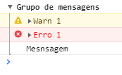
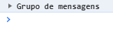
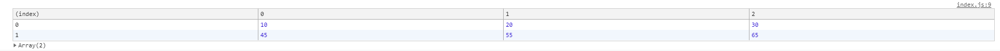
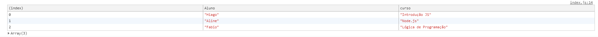
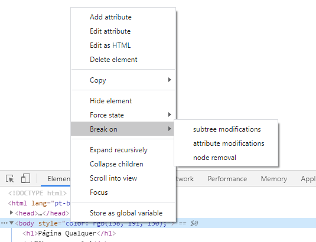
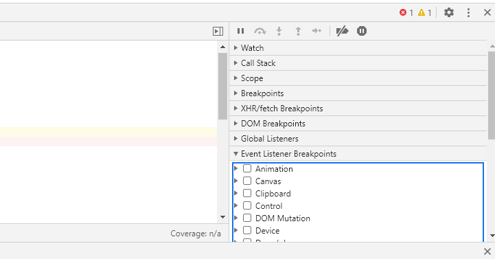
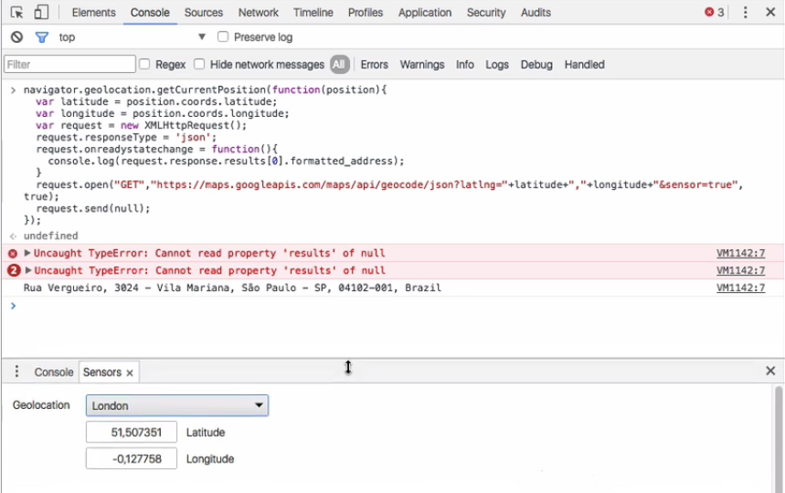

# Chrome Dev Tools

F12 é um bom atalho no windows para abrir pelo menos a caixa de elementos

Clicando em qualquer elemento eu posso colocar qualquer classe na caixa mais a direita em .cls, além de conseguir ajeitar em tempo real tanto tags html e propriedades do css

O DOM é toda a parte do html que nos mostra na parte de elements, só que ela muda conforme o js altera as classes de cada elemento, então ela não é o html da pagina mas sim o document que está sendo mostrado para a gente

## Console

Posso abrir nessa parte do dev tools direto com CTRL+SHIFT+J e serve para mostrar erros e mensagens dos nossos arquivos javaScript

Além do `console.log()` para mostrar uma mensagem eu também tenho o `console.error()` para mostrar mensagens de erro, e a mensagem de aviso com `console.warn()` e o `console.assert()` substitui o que seria a função abaixo

```js
var num=12;
if(num>10){
    console.error("numero não pode ser maior que 10);
}
```

Dando uma sintaxa menor como:

```js
var num=12;

console.assert(num<=10, "numero não pode ser maior que 10);
```

Onde a primeira condição é a condição verdadeira, se não for printe a mensagem

E eu ainda posso agrupar mensagens fazendo:

```js
console.group("Grupo de mensagens");

console.warn("Warn 1");
console.error("Erro 1 ");
console.log("Mesnsagem");

console.groupEnd();
```



Porém isso nos dá um grupo com todos os comentários expostos para esconder essas mensagens eu somente faço

```js
console.groupCollapsed("Grupo de mensagens");

console.warn("Warn 1");
console.error("Erro 1 ");
console.log("Mesnsagem");

console.groupEnd();
```

Então sempre que der F5 eu terei o console da seguinte forma



Posso mostrar uma tabela com `console.table` e fazemos uma tabela simples da seguinte forma

```js
console.table([
    [10,20,30],
    [45,55,65]
]);
```

O que nos dá no console algo como



Ou seja eu tenho uma coluna de index (das linhas) e [] nos dá o conteúdo das linhas , além de que cada coluna teria um nome dado pelo browser

Para dar um titulo a cada coluna eu teria que fazer algo um pouco diferente eu faria

```js
console.table([
    {Aluno:"Hiago" ,curso: "Introdução JS"},
    {Aluno:"Aline" ,curso: "Node.js"},
    {Aluno:"Fabio" ,curso: "Lógica de Programação"}
])
```

O que nos dá



### Filtros

Do lado do campo de filtro eu posso filtrar mensagens de erro, mensagens de informação (o log) e mensagens de warn

Selecionando preserve log na engrenagem no canto direito, faz com que eu não perca todas as informações de console

### Alguns atalhos interessantes

Com `$_` eu consigo recuperar o resultado do ultimo comando que eu dei no console

Com Ctrl+L ou clicando no sinal de proibido na horizontal de onde encontra-se o filtro eu limpo o console

Se eu subir a área do console na guia elements eu consigo ver o console, os elementos do DOM e o css e se eu clicar em um elemento e esse elemento tiver focado e digitar `$0` eu consigo toda a linha html no console e os historicos de navegação serão dados por `$1` e por aí vai até o `$4` ou seja temos o histórico dos ultimos 5 elementos

Uma outra forma de selecionar um elemento sem precisar dar `document.querySelector("bla")` é com o import do jquery que é `$("bla")` só que essa forma é equivalente ao querySelector e essa forma é válida mesmo sem a biblioteca do jQuery ativa no seu sistema

O equivalente ao querySelectorAll seria `$$("bla")`

### getEventListener

Com `getEventListener` eu posso ver quais eventos estão atrelados a uma tag, classe ou ID,mas na tabela a direita (onde tem os estilos) eu também tenho uma guia específica de Event Listeners, mas se lembre que um evento tem um efeito de bolha que ela vai subindo até chegar na tag html, então descelione o Ancestros All caso não queira ver todos os eventos atrelados ao pais daquela tag.

Nele conseguimos ver onde estão os eventos, mesmo sendo por jQuery ou não

O conteúdo da aula pode ser visto [aqui](https://github.com/alura-cursos/chrome-devtools/raw/master/devTools_stage2.zip)

## Debug

Na aba Sources vemos todo o código fonte do arquivo, até mesmo as imagens da aplicação, e o bom de ter o código fontr na página é que se clicarmos no erro ele nos mostra direto no arquivo e onde está esse erro

Caso uma função esteja dando erro no meu console eu posso fazer o debug adicionando um breakpoint dentro desse meu arquivo no devTools e assim que eu chamar esse função o debug entra em ação e eu consigo depurar o código sem me preocupar de onde ele vem e coisas do tipo.

Essa ação me abre o escopo e mesmo que não tenhamos declarado uma variável o escopo já sabe as variáveis que tem lá dentro, isso é comum pois antes de entrar na função ele cria variáveis e atribui valores depois

Escopo Local -> Onde estão todas as variáveis daquela função

Escopo Global -> escopo window que me dá todas as características da página

Escopo Closure -> Variaveis que morrem depois que aquela função acabar e servem com o proposito de ninguem poder acessar essas variaveis estando de fora

Com F10 ou o botão de seta curvada no sentido horário eu pulo uma linha e para não ficar vendo toda a bagunça na tela a direita o debugger nos dá os valores presentes na linha anterior atualizados

Com setinha para baixo eu entro na função que está dentro dessa função

Eu consigo editar o arquivo original com o DevTools ao colocar a pasta fonte dentro do sorce e depois adicionando o network mapping

Dom Breakpoint -> com esse atributo posso ver quando tenho alterações do meu DOM, ou seja quando tenho modificaçoes internas ao elemento que criei, quando mudo atributos ou quando removemos esse elemento, para acessar clique com botão direito no elemento focado e depure o código em seguida



E ele pula direto para as linhas onde há a mudança no DOM

E eu posso adicionar pelo devTools um debug nos event listeners estando no sources e:



Com o pretty print eu melhoro a legibilidade de um código que foi "piorado" com a intenção de melhorar a performance do código (ficar com tamanho menor e carregar mais facilmente) e em muitos sites você encontrará isso e para dar um pretty print (que é um formatador eu aperto as duas chaves {} no canto inferior esquerdo do console). Para esse código sem espaços e sem quebra de linha nós dizemos que ele está minificado.

Para adicionar a página no console para poder editar tem que ir na aba Filesystem. Mas antes eu tentei arrastando uma pasta do Windows Explorer para dentro do Devtools e funcionou também (conforme mensagem exibida pelo próprio Devtools ao abrir ele), inclusive já faz o mapeamento automático, não precisa adicionar a pasta e depois mapear.

## Conectividade

Na aba network se selecionarmos all e reloadarmos a página vemos todas as requisições que nosso computador faz para carregar a página

xhr é uma requisição assíncrona (ou do tipo ajax) e ele não afeta o processamento da página

Protocolo normalmente usa-se o http para transferência de arquivo, como os arquivos estão na nossa página então o protocolo será do tipo file

type, formato que se usa desde o email que é o MIME, os arquivos html são do tipo document, css do tipo stylesheet e os js do tipo script, conexão externa com um servidor é do tipo xhr

initiator é quem chamou aquela página, o html foi a gente mesmo, com um mouse ou teclado (ou qq outra coisa q de) então é do tipo other, e quem chama os js e os css são o arquivo html

Size mostra o tamanho de cada arquivo

Time é o momento que passou desde o momento da requisição até carregar o último byte no browser e se o tempo for muito é um sinal de que não carregou

A timeline nos mostra o tempo de conexão para acessar o que queremos acessar em outros servidores, normalmente temos o tempo de queing e stalled que são tempos que nosso processador tem para mandar o sinal de comunicação com essa máquina de DNS lookup que é onde está o servidor nesse mundo onde eu posso me comunicar para pegar aquela informação, o SSL que é um certificado de que aquela conexão é segura e o initial conection onde é o tempo para o protocolo TCP agir 

Para mais informações desses tempos veja [aqui](https://developers.google.com/web/tools/chrome-devtools/network/reference?utm_source=devtools#timing-explanation) o que google diz sobre.

Uma requisição na aba network tem seus headers (que são todos os cabeçalhos necessários para realizar a comunicação entre o site e um servidor) e ele tem a response (que nos mostra a resposta desse servidor) e o preview que nos mostra o que o navagador entendeu nessa comunicação

Posso simular sinais de internet piores mudando de online para slow 3G por exemplo

Já o path "carregar" não possui esse cabecalho. Para corrigir, temos que passar uma função de callback para o servidor. Que é o modo antigo de se conseguir essa permissão:

### Exercício

Se olharmos os códigos fontes do comportamento do botão ? e a lógica executada no começo do sincronizacao.js. Ambos chamam a função $.getJSON() do jQuery. Mas Essa segunda lógica gera um erro no console. Qual a diferença entre as duas requisições?

Resposta

Os cabecalhos de resposta

Ambas são iguais no lado do navegador. O problema está no lado do servidor. O path "instrucoes" no servidor está configurado para permitir que qualquer domínio o acesse, ele faz isso mandando para o navegador o header Access-Control-Allow-Origin:*

Já o path "carregar" não possui esse cabecalho. Para corrigir, temos que passar uma função de callback para o servidor. Que é o modo antigo de se conseguir essa permissão:

```js
    $.getJSON(
            "https://ceep.herokuapp.com/cartoes/carregar",
            {usuario: usuario},
            function(res){
                console.log(res.cartoes.length + " carregados em " + res.usuario);
                res.cartoes.forEach(function(cartao){
                    controladorDeCartoes.adicionaCartao(cartao.conteudo, cartao.cor);
                });

                $(document).trigger("precisaSincronizar");
            }
        );
```
deve virar

```js
    $.getJSON(
            "https://ceep.herokuapp.com/cartoes/carregar?callback=?",
            {usuario: usuario},
            function(res){
                console.log(res.cartoes.length + " carregados em " + res.usuario);
                res.cartoes.forEach(function(cartao){
                    controladorDeCartoes.adicionaCartao(cartao.conteudo, cartao.cor);
                });

                $(document).trigger("precisaSincronizar");
            }
        );
```

## Perfomance

Aqui só vai pincelar sobre perfomance e nos mostrar que a timeline dentro do perfomance pode nos dizer por que o site trava com algumas transições e coisas do tipo

Uma animação se mal otimizada ou mal programada pode emperrar nosso site, fazendo com que o browser tenha que processar muita coisa ao mesmo tempo, e como o site tenta deixar tudo a 60 frames por segundo ele deixa uns gaps pelo caminho

Na aba perfomance temos a opção de gravar um tempo o site que estamos desenvolvendo e ver como está a animação de sobe e desaparece do elemento de forma que a melhorar a experiência de uso do usuário

A aba Timeline permite gravar todo o processamento realizado pelo navegador por um determinado período para que se possa analisar possíveis gargalos na performance. Incluindo quadros por segundo, processamento da CPU e chamadas de funções JS.

### Memory e Profiles

Com allocation sampling eu consigo ver quais ações eu fiz enquanto estou gravando e quanto eles consomem na memória do computador e com heap snapshot eu vejo em baixo nível quais variáveis estão alocadas em memória e quanto elas pesam na RAM

#### Exercício

O que pode-se medir com os profiles do DevTools?

Identificar vazamento de memória (memory leaks)

Memória alocada pelo navegador

Processamento da CPU gasto com JS

Os profiles permitem uma análise bem baixo nível, mostrando processamento da CPU e alocação de memória. Isso permite que se identifique prolemas em casos de web apps muito dependentes de JS, como Gmail ou Facebook

## Aplication

A nova aba resources que grava informações de usuário e eu tenho uma lista de informações chamada de cookie que leva todas as informações do usuário e fazendo com que a informação fique cacheada no browser para a gente

Pegando o arquivo da aula 5 e logando como deco@alura.com.br vemos diversos cartões especificados de outros alunos e de mim mesmo, pois o servidor tras essas informações para mim, e vejo elas pela aba network e na aba aplication vejo no localFile o usuario no qual estou logado, além de pequenos bancos de dados que o js consegue acessar como o indexed DB e o web sql os cookies e o cache

O localStorage é uma ferramenta que permite bastante versatilidade, mas ela está na mão do cliente. Portanto tome cuidado e evite colocar nele coisas essenciais.

## Security

Se estamos em uma página HTTPS então a página é dada como segura na aba Security no devTools e ver se as conexões que esse site faz com outros serviços também são confiáveis e por aí vai.

## Device Mode

Se colocarmos o modo device (celular) nós conseguimos ver o quão responsivo o site é em diversas aplicações e em diversos tamanhos. Ativar o modo responsivo (testar varios tipos de tamanhos diferentes, criar telas diferentes) e no três pontinhos tirar uma screenshot de como aquele app estará no aplicativo que você quiser, além de ver todas as media querys (o @media no css) na barra amarela que aparece em cima do celular

Utilizando o seguinte código abaixo conseguimos ver a localização do celular



Além disso dentros dos três pontinhos acima da linha de elements conseguimos simular sensores e atributos do hardware de um celular, muito legal mesmo!
