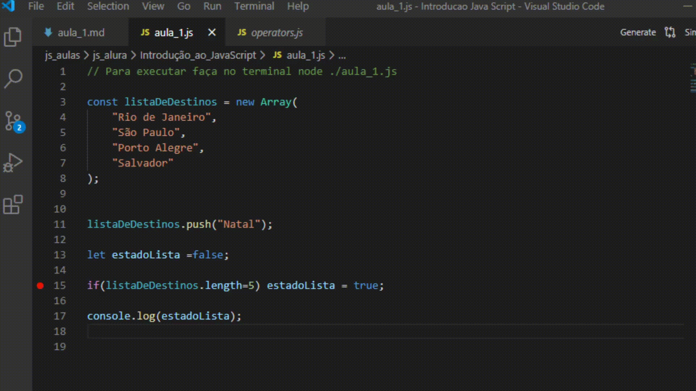

# Introdução ao Java Script

Para ver no github os codigos usados em aula acesse <https://github.com/alura-cursos/introJS/tree/aula5>

Utilizando o VsCode e o interpretador Node, que permite interpretar a linguagem sem usar o browser. Somente via terminal, para rodar um arquivo qualquer basta irmos na pasta e executarmos o comando

```js
node arquivo.js
```

Ou simplesmente digitar `node` no terminal apertar ENTER e ir brincando com códigos como se estivesse no modo desenvolvedor do browser. E lá conseguimos ver quer podemos fazer contas matemáticas como:

```node
>2+2
4
```

## Variáveis

Para printarmos qualquer imagem no terminal fazemos o seguinte script

```js
console.log("Apresentando variáveis: ")

const idade= 25;

console.log("Printando os resultados: ")

console.log("A idade é de " + idade + " anos.");
console.log("Idade: ", idade)
```

As duas formas estão corretas.

Ou tbm podemos fazer o seguinte:

```js
const idade=25
var media;
const idade2=13;
media=(idade+idade2)/2
console.log("A média das idades é : " , media)
```

Uma outra visão é com:

```js
const nome = "Hiago";
const sobrenome = "Guedes";

console.log(nome , sobrenome);
console.log(nome + " "+ sobrenome);
```

Pro Tip: na linha que você está se pressionar `SHIFT+ALT+ seta para baixo` você copia o código para a linha de baixo.

Pro Tip: na linha que você está se pressionar `SHIFT+ALT+ seta para baixo` você copia o código para a linha de baixo. Tipo assim.

Uma outra forma que lembra muito o shell é com crase que pode ser:

```js
const idade=22;
console.log(`A idade é ${idade}`);
```

Essa maneira pode ser melhor com textos grandes.

## Trabalhando com variáveis

Uma boa forma de nomear variáveis mais complexas é da seguinte forma:

```js
variavelComMaisDeUmaPalavra
```

O nome desse tipo de prática se chama camelCase

O js é sensível a letra maiúscula então não escreva `Console.Log` e sim `console.log`, tanto que se fizermos:

```js
a=21;
A='cachorro'
console.log(a,A,a)
```

O resultado é:

```r
21 cachorro 21
```

São duas coisas diferentes e uma não afeta a outra. Porém isso é uma má pratica, principalmente pelo nome que não tem descrição do que é essa variável, e use apenas uma vez a semântica daquela variável.

Mas note que não precisamos declarar nem a e nem A para o script funcionar, isso nos diz que o Js é uma linguagem fracamente tipada. É sempre bom definir qual o tipo daquela variável (`const,let, var, string`) mas o js é inteligente o suficiente para conseguir descobrir por si, mas na hora da debugação isso pode ser um problema.

A falta de padronização entre os nomes das variáveis pode gerar muitos problemas no futuro da aplicação e os programadores não saberão quando usar cada tipo de nomenclatura

|O que não fazer|Boa Prática|Comentário|
|--|--|--|
|`mes="Janeiro"`|`const mes="Janeiro"`|Por questão de debugação de códigos mais complexos, coloque o tipo da variável|
|`console.log("qq coisa") console.log("outra coisa");`|Bote ; no final dos dois comandos ou não em nennhum deles |Não é bom misturar duas coisas, um dos lances mais dificeis para quem começa é ter consistência|

## Matemática

O javaScript realizada operações matemática seguindo as regras da matemática ou seja

```js
console.log(6/2*(1+2));
```

Resultado 9, (não pode ser 1 né? NÉ? ), primeiro faz a operação entre parenteses, depois a divisão e as multiplicações da esquerda para a direita.

## Converter

Existem vezes que escrevemos números em volta de letras e para realizar operações matamáticas com ela eu preciso realizar uma conversão para números inteiros e para isso eu uso o parse da seguinte forma


```js
console.log(parseInt("22i")+parseInt("43j"));
```

Cujo resultado dá 65, ele transforma o primeiro para 22 o segundo para 43 e depois soma. Pois se não fizermos isso ele vai concatenar e o resultado será `22i43j`

## Const e let

Imagina que queremos setar uma variável e depois mudar ela como:

```js
const nome="Hiago";
const sobrenome="Guedes";
nome= nome + sobrenome
console.log("Nome: "+ nome)
```

Isso vai dar um erro para a gente por que nome é constante, e primeiro setamos ele como Hiago e depois com HiagoGuedes, e aí como resolvo isso, com o let.

```js
let nome="Hiago";
const sobrenome="Guedes";
nome= nome + sobrenome;
console.log("Nome: "+ nome);
```

Resultado: HiagoGuedes

Ele deixa a mudança acontecer. O ideal é não deixar as coisas variarem muito, só o que realmente é necessário.

## Arrays - Trabalhando com Listas

```js
const listaDeDestinos= new Array(
    "Rio de Janeiro",
    "São Paulo",
    "Porto Alegre",
    "Salvador"
);
```

E posso printar todos os elementos do array com:

```js
const listaDeDestinos= new Array(
    "Rio de Janeiro",
    "São Paulo",
    "Porto Alegre",
    "Salvador"
);

console.log("Destinos Possíveis: ")
console.log();
for(let i = 0; i<listaDeDestinos.length; i++){
    console.log(listaDeDestinos[i]);
}
```

Ou simplesmente com  `console.log(listaDeDestinos)` onde aí conseguiremos uma visualização como:

```js
[ 'Rio de Janeiro', 'São Paulo', 'Porto Alegre', 'Salvador' ]
```

Para colocar um elemento dinamicamente (como normalmente é feito na web) nós fazemos

```js
listaDeDestinos.push("Natal");
```

E se dermos um `console.log(listaDeDestinos);` nós teremos:

```js
[ 'Rio de Janeiro', 'São Paulo', 'Porto Alegre', 'Salvador', 'Natal' ]
```

Note que mesmo declarando a lista como const, não há nenhum problema em adicionar elementos na lista. Pois não estamos mudando o tipo do dado.

Para remover, se eu quero remover o ultimo que eu coloquei basta fazer.

```js
listaDeDestinos.pop();
```

Se eu quero deletar apenas São Paulo, eu faço

```js
listaDeDestinos.splice(1,1);
```

Onde o primeiro número é de onde eu quero começar a deletar, o próximo é quantos além desse eu quero deletar, se somente queremos deletar São Paulo coloque 1.

Um bom site que tem a documnetação de como se trabalha com arrays é <https://developer.mozilla.org/en-US/docs/Web/JavaScript/Reference/Global_Objects/Array>

## Condicionais e iterações

Funciona igual a qualquer outra linguagem de programação com diferença que no `for` para ler um vetor por exemplo você usa o let para iterar um contador como em:

```js
for(let i = 0; i<listaDeDestinos.length; i++){
    console.log(listaDeDestinos[i]);
}
```

De resto eu posso fazer que nem sempre, sabendo que existe um estado booleano que pode ser declarado como.

```js
let estadoAtual= false
```

Se você vai variar o estado dessa desse estado então coloque let.

## Debugger

Para debugar um código no visual studio code basta selecionar um ponto de quebra do lado do número da linha onde se deseja, apertar no símbolo do bug e colocar run and Debug, da seguinte forma



Se não aparecer essa tela você pode criar um arquivo .json dentro de uma pasta .vscode e ali ele me dá o programa atual para ser debugado, para mudar o programa eu mudo o nome do arquivo dentro do `program`. Para adicionar outros eu dou uma , depois a estrutura de chaves da configuração e adiciono outro programa para debugar. Então na aba de debug eu consigo escolher os programas a serem debugados.
