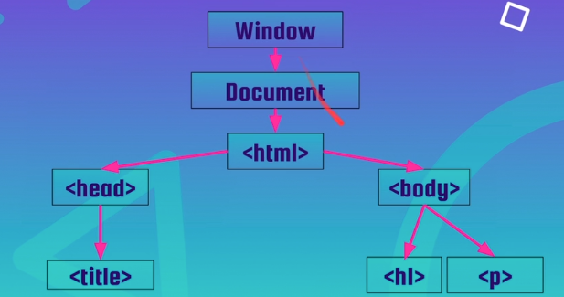

# DOM

O dom nada mais é que uma representação em objeto de tudo o que o html representa naquela página, podendo ser alterada dinamicamente com o tempo por linguagens de programação próprias, sendo uma delas o javaScript

Objetos importantes de conhecermos é o `document` que representa o documento da página atual

E para selecionar um objeto desse dom nós precisamos de um seletor, esse podendo ser uma tag, um classe ou uma id e dado o html abaixo temos:

Estamos construindo nossa aplicação e temos a seguinte estrutura HTML até o momento:

```html
<div class="app">
  <div class="todo-list">
  <h1 class="title">Ceep</h1>

 <form class="form" action="">
    <input class="form-input" type="text" data-form-input>
    <button class="form-button" data-form-button> Novo Item </button>
 </form>

  <ul class="list" data-list>
    <p>Comprar um abacate</p>
  </ul>
</div>
```

Quando o navegador criar uma representação deste documento em formato de objetos, queremos acessar o nó que representa o parágrafo e alterar seu texto de forma dinâmica para comprar um morango. Qual o código abaixo realiza essa tarefa?

```js
document.querySelector('p').textContent = 'comprar um morango'
```

Alternativa Correta. Exatamente! Utilizamos querySelector para percorrer a árvore do DOM, através da propriedade textContent conseguimos acesso ao texto do parágrafo, e por fim, trocamos o texto. Ou seja na classe documento fizemos um solicitação pelo seletor p (que só tem um) e pedimos pelo seu conteudo de texto, e alteramos o texto pro que queríamos

O dom representa todos os elementos em html por meio de nós e esses nós são objetos

Além do document eu tenho a window que representa a janela a estrutura seria a seguinte

Window -> Document -> html

E do html eu tenho a head e a body que é onde se encontra o projeto da página. Sua estrutura basica pode ser vista abaixo




E note uma certa estrutura em árvore,onde o h1 por exemplo é filha da body e body é filha do html, essa arrumação é bem importante, pois essa estrutura de dados é mais eficiente.

## Para saber mais - Selecionando Elementos

Utilizamos o método querySelector para percorrer a árvore do DOM e encontrar o elemento que queremos utilizando JavaScript. Porém existem outros métodos que podem ser utilizados para o mesmo fim.

```en
document.getElementById(‘id’) seleciona o elemento pelo id passado.

document.getElementsByClassName(‘classe’) seleciona o elemento pelo nome da classe passada.

document.getElementsByTagName(‘tag’) seleciona o elemento pelo nome da tag passada

document.querySelectorAll(seletor) devolve todos os seletores com o mesmo nome
```

Esses comandos são comandos que trazem toda a linha do html referente a aquele seletor

## scripts

Com o dom lê a página de cima para baixo de forma sequencial então quando a página encontra algum erro todo o processo para, então por isso é comum colocarmos a tag script depois ou quando a body acaba, pois se o script der problema a página pelo menos estará toda carregada.

Outra forma de selecionar os elementos é pelo data atributes, pois com ele nós deixamos a classe e o id livres pro css ser alterado (pois outros membros da equipe podem não achar aquele nome semântico o suficiente) então pelo data-atribute podemos deixar somente para o javascript.

E para fazer o querySelector de um data-form podemos fazer

```js
document.querySelector.('[data-form]')
```

## Escutador de evento

podemos atribuir algum elemento do mundo externo (mouse e teclado, geralmente) com ações na página e para isso temos o elemento de input como um botão e o escutador de evento (addEventListener) que espera receber dois parâmetros tal como no código abaixo

```js
const buttonForm = document.querySelector('[data-button-form]');

buttonForm.addEventListener('click',()=>{
    alert('Cliquei no botão');
})
```

Onde eu seleciono toda a propriedade do butão e espero um click esquero nele, feito isso eu exibo um popup via browser com a mensagem Cliquei no botão, a função está em modo de arrow function

Quais as três coisas que precisamos para utilizar um escutador de eventos?

Evento(no exemplo o click) / Elemento que recebe o evento(no caso buttonForm) / O que vai acontecer quando o evento disparar(o alert)

Alternativa Correta. Exatamente! Precisamos do tipo do evento, do elemento que vai receber o evento e o que vai acontecer quando o evento for disparado

## O comportamento padrão de um botão dentro da tag form

A tag form nos indica o local do site que irá se comunicar com um servidor web ou para algum lugar e por representar um tipo de evento padrão nós podemos manipular esse evento colocando uma variável dentro da função de forma que

```js
const buttonForm = document.querySelector('[data-button-form]');

buttonForm.addEventListener('click',(event)=>{
    alert('Cliquei no botão');
})
```

E para prevenir o comportamento padrão (que recarrega a página) nós fazemos

```js
const buttonForm = document.querySelector('[data-button-form]');

buttonForm.addEventListener('click',(event)=>{
    event.preventDefault();
    alert('Cliquei no botão');
})
```

## Para saber mais - Nós do DOM

Todos os elementos na nossa árvore do DOM são nós e todos os nós podem ser acessados via JavaScript. Os nós podem ser deletados, criados ou modificados. Durante o curso utilizamos o método appendChild que sempre é adicionado no final do nó, para colocar um nó filho dentro do nó pai

Existem outros métodos que podemos utilizar para manipular nós:

```en
insertBefore(pai, filho): Coloca um nó antes do outro.

replaceChild( elemento1, elemento2): Substitui o nó elemento 1 pelo nó elemento2.

removeChild(elemento): Remove um nó da árvore.
```

Para ver os arquivos da aula <https://github.com/alura-cursos/1823_DOM/tree/projeto_final>
