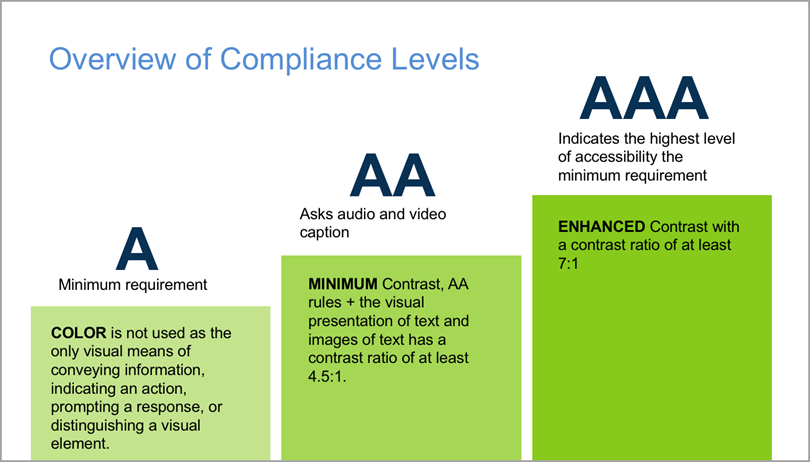

# Acessibilidade Web parte 1

Esse texto vai falar muito sobre como o layout deverá ser para pessoas com deficiência, uma vez que elas representam 25% das pessoas no país e elas representam boa parte do fluxo de pessoas em um site

Inicialmente a página começa [assim](https://www.figma.com/file/dnZ6RF6yhOdRZlRIbNv4ejlk/Apeperia-(projeto-inicial)?node-id=0%3A1)

Tabela de Conteúdo

1.[Termos](#termos)

2.[Normas para acessibilidade web](#normas-para-acessibilidade-web)

3.[Autismo](#autismo)

4.[Surdez](#surdez)

5.[Dislexia](#dislexia)

6.[Baixa Visão](#baixa-visão)

7.[Deficiência Física](#deficiência-fisica)

## Termos

Cara, muito cuidado com termos como pessoa com problema ou doente, o certo é chamar elas de PCD (pessoas com deficiência), chame pelo que elas são mas não de maneira a suavizar (como ceguinho) e nem de esculachar, seja polido

Interfaces web e interfaces físicas são exemplos de coisas da vida real que podem ser mais acessíveis para projetos do dia a dia

Um bom site para esses termos pode ser visto em <https://desculpenaoouvi.com.br/terminologias-atuais-para-falar-sobre-deficiencia/>

## Normas para acessibilidade web

Assim como a W3C normaliza as tags de html e css a mesma fez a WCAG (web content accessibility guidelines) que nos guia para esse mundo de acessibilidade na web <https://www.w3.org/Translations/WCAG20-pt-br/WCAG20-pt-br-20141024/>

E acessibilidade não é somente mudar o tamanho da fonte e contraste de tela ok?

Sem contar que isso no brasil é uma lei como pode ser visto em <https://www.acessoparatodos.com.br/acessibilidadeweb.php>

## Objetivo

O objetivo aqui está mais no layout do site e uma boa ferramenta gratuita para esse fim é o figma que é gratuito ao invés do ilustrator

## Autismo

O autismo é caracterizado por ser uma síndrome comportamental e não uma deficiência em si

E os autistas podem ser divididas em duas partes, de alto funcionamento e os de baixo,os de auto conseguem desenvolver habilidades pessoais e profissionais para poderem se relacionar e serem capazes de adquirir o emprego e os de baixo podem no extremo não conseguirem falar.

Pessoas autistas no geral não gostam de coisas muito fortes, como abraços, e nem cores muito chamativas

Tons mais pastéis são uma boa para pessoas desse tipo, o adobe color pode te ajudar muito nesse aspecto, escolha uma plaeta calma e tá ok. o appy austism pode te ajudar para esse fim também

Cartilha da microsoft com o governo br <https://docs.wixstatic.com/ugd/85fd89_a9baa902e9c94ce5b8b19e4072baf46a.pdf>

Bons vídeos que falam mais sobre o autismo e como o autista vê o mundo

<https://www.youtube.com/watch?v=cfCaU-q7Yxk>

<https://www.youtube.com/watch?v=Lr4_dOorquQ>

Canal [Diário de um Austista](https://www.youtube.com/channel/UCbhT_vtlwr7X2wG6q_0mWVQ)

### Boas práticas para fazer um site acessível para autistas

A primeira ação já foi comentada, as cores não devem ser muito fortes e as imagens não devem ter mtas luzes e flashs além de que o texto não deve ter muitas figuras de linguagem como metáforas e analogias. Nem usar figuras para explicar aquilo que uma palavra faria. A dica é eliminar coisas que podem ter dupla interpretação

Frases imperativas como "CLIQUE AQUI" e "COMPRE já", "confira" incomodam os autistas então use frases mais suaves.

Sem contar que botões tem que ter cara de botão, então coloque fundo no butão e tire o stroke que isso será legal para eles e não invente a roda, deixe a página o mais padronizável possível o mais comum possível para que ele não se canse com o seu site. Use frases como "Conheça nosso estoque", "continuar lendo o post", a esse tipo de texto nós chamamos de micro texto

O autista não gosta de surpresas ele gosta de coisas rotineiras e normais, ele quer receber aquilo que se espera

#### Exercício

No seu site existe uma seção com o título: “Não durma no ponto e aproveite a queda de preços!”.

Qual o problema da frase, pensando-se no Transtorno do Espectro Autista (TEA)? Qual seria uma boa alternativa para manter seu sentido?

Metáforas e figuras de linguagem podem não ser compreendidas por autistas. Corrigir para: “Preste atenção e aproveite os ótimos preços!”

A frase dessa forma pode ser compreendida mais facilmente, pois substituiu figuras de linguagem por português claro e bem definido.

### Textão

Simplesmente evite textao, nem pessoas neurotipicas quanto autistas não gostam de textão, simplesmente por termos muita informação nós gostamos de coisas mais mastigadas e objetivas.

Tenta dar o maior número de parágrafos caso o texto tenha que ser realmente grande

### ícones

Tente usar ícones legais e simples (e de preferência sem copyright também). Bons sites são o <https://www.flaticon.com/> e o <https://www.iconfinder.com/> esse ultimo tem coisas pagas mas coisas de graça também e o <https://thenounproject.com/>

Mas tenha cuidado com copyright de verdade

### Estilo das divs

Tudo bem você quebrar os padrões de design de sites e deixar as divs não tão quadradas, mas desde que se siga um padrão. Não adianta você deixa um cantos arredondados enquanto outra está quadrada, deixe tudo com uma cara só sabe?

### Para saber mais

Diretrizes: <https://gaia.wiki.br/>

Dica de série: Atypical

Um exemplo de página mais habituada para o autismo <https://www.figma.com/file/qfVRdijn8pPG6UVLkeXKs2/Apeperia---(1%2F5---Autismo)?node-id=0%3A1>

## Surdez

De novo sobre termos siga o link <https://desculpenaoouvi.com.br/terminologias-atuais-para-falar-sobre-deficiencia/> apesar de não entender mesmo o sentido de surdo ser diferente de Surdo mas ok.

Mas entenda que existem surdos que sabem português (que são os oralizados) e os que não sabem então ocasionalmente acabam tendo problemas na fala

No caso de uma pessoa que nasceu surda a primeira linguagem que ele aprenderá é a de libras, e como a lingua mãe é diferente então ela pode ter dificuldades com a lingua portuguesa.

Então a boa é deixar menos texto possível e mais imagens representativas, deixa os textos grandes para um post em um blog ou matéria jornalistica.

Outra consideração também é abranger formas de contato, então não coloque somente por telefone, coloque email, perfil em rede social, sinal de fumaça o que der, tipo contato na página da empresa

O formulário de contato deve ser mais visual, com bordas coloridas para dizer se está preenchido corretamente ou não.

Coloque legenda dos videos que você precisar colocar na aplicação, no iframe do youtube você pode colocar a legenda em portugues no video que fale sobre a empresa por exemplo.

Colocar legenda/áudio-transcrição no vídeo

Não só Surdos podem se beneficiar com isso, mas pessoas com a audição prejudicada, sem fone de ouvido no transporte público, etc.

Tenha consistência visual na página, se um botão tem borda arredondada coloque borda arredonda em todos botões e formulários, pois o aspecto visual em pessoas surdas são mais fortes do que nas outras. Então pradonize fontes e estilos para componentes parecidos

Caso o vídeo seja direcionado para surdos, aí coloque tradução em libras e legenda com auto descrição

Uma página mais adequada para a surdez pode ser vista [aqui](https://www.figma.com/file/dnhcSOm4Yu4NoYZJ2I7dye/Apeperia-2-5-Surdez)

### Links interessantes para surdos

Curso gratuito de libras pela USP <http://eaulas.usp.br/portal/video.action;jsessionid=B4A4E40E1C082A097747BA73A812A979?idItem=6163>

<https://www.youtube.com/watch?v=bubbJSVJFRs>

## Dislexia

Os sintomas podem variar de um disléxico para outro, dentre os quais podem estar a dificuldade para ler, escrever, soletrar, e por aí vai. A dislexia não é considerada uma deficiência, e sim um tipo de transtorno ou disturbio. O dislexo até consegue ler as coisas mas as palavras meio que se misturam e eles precisam ler diversas vezes um texto para entender de fato o que aquilo se trata

Um bom simulador de como um dislexo lê um texto pode ser visto [aqui](http://data.qz.com/2016/dyslexia/) ou [aqui](https://geon.github.io/programming/2016/03/03/dsxyliea)

Possível dificuldade em memorizar informações

Não é o principal sintoma do dislexia, porém pode acontecer em alguns casos

### O que fazer para ajudar o dislexo?

Não justifique texto, tente alinhar ele a esquerda ou a direita, o texto justificado cria caminhos de rato que atrapalham e muito a leitura (até mesmo para pessoas não dislexas), a centralização de texto também é algo ruim (ao menos que seja necessário mas tente fazer isso para textos pequenos), por que a centralização faz com que o começo de cada linha comece em um lugar diferente,  e isso cansa a pessoa.

[Não diga isso para os dislexos](https://www.youtube.com/watch?v=OSJoajRo4Pw)

Tire os underlines (só deixe se for link mesmo), NÃO USE TUDO EM MAIÚSCULO , isso é horrível esteticamente e para dislexos é ruim de ler. Então deixe nesse caso um sublinhado mais discreto

Textos sublinhados

Por ter mais elementos visuais (a linha embaixo das letras), isso pode prejudicar a velocidade de leitura e interpretação do texto. Além disso blocos de texto feitos somente em caixa alta também são uma má prática.

Alternativa correta
Textos centralizados

O fato de as linhas começarem em lugares diferentes em textos centralizados pode atrasar ainda mais a leitura.

Não coloque contrastes muito altos, como texto preto tela branca

Coloque texto de placeholder dentro do input mas coloque uma label para identificar o que é aquele campo, pois o contraste baixo entre o campo e a letra cinza clarinho do placeholder não é o suficiente (essa cor é ruim para as pessoas de baixa visão também mas isso é para outra hora). Lembre a label acompanha o input. Ou o placeholder é forte o suficiente para ser uma 'label'.

Colocar sugestões enquanto digita-se algo é bem legal, sugestão de telefone no placeholder para digitar o telefone é bem legal.

Imagens com muito detalhes não são legais, ou vídeo de background também pois eles tiram a atenção, nada contra coisas se movimentando no background desde que ele não destaque muito do que está escrito

Carroseis (aquilo que mostra o conteúdo por um tempo e depois de um tempo mostra outra coisa), ou coloque pouco texto ou dê uma opção para pausar a reprodução desse carrossel por que é bem triste fisgarmos a atneção do cara mas depois esse conteúdo some. Uma sugestão é não usar-lo muito pode ser visto por [esse](http://shouldiuseacarousel.com/) site hahaha a falta de controle do que está nesse carrossel mata a usabilidade e a acessibilidade

Fontes muito pequenas atrapalham muito, ao menos que sejam detalhes que não precisam ser lidos

### Bons exemplos

Formulários do paypal, perceba a iconografia e o por que está errado


Um [guia](https://www.designmantic.com/blog/infographics/designing-for-users-dyslexia/) do que se deve e do que não se deve fazer para pessoas dislexas em uma imagem

Resumo

Faça as modificações feitas em aula a fim de deixar o projeto inicial mais acessível para o público disléxico.

Lembre-se de pontos como:

evitar textos muito longos;
remover sublinhados e textos inteiros em caixa alta;
oferecer correções automáticas ou sugestões.

Uma boa fonte para pessoas dislexas <https://www.opendyslexic.org/>

O site adaptado para dislexia pode ser visto [aqui](https://www.figma.com/file/KvOKfGMaD8yTOWdwoE85TT/Apeperia-3-5-Dislexia)

## Baixa Visão

Considera-se baixa visão tudo aquilo que o óculos não corrige então não eu não to nessa hahahah e baixa visão não é a pessoa cega também, é o meio termo entre os dois

### O que ajuda a pessoa com baixa visão

Tirar o baixo contraste entre fundo e cor da letra. Por que não adianta nada botarmos azul claro de fundo e uma cor branca de letra, isso é ruim, mas não coloque fundo preto e cor branca por que o dislexo acaba saindo prejudicado. E você não pode matar sua identidade visual, então coloque um tom mais escuro de azul, nada mais que isso, mas faça questão de fazer isso

Na wcag brasil vemos a seguinte colocação para contraste

```pt-br
Contraste (Mínimo): A apresentação visual de texto e imagens de texto tem uma relação de contraste de, no mínimo, 4.5:1, exceto para o seguinte: (Nível AA)

Texto Ampliado: Texto em tamanho grande e as imagens compostas por texto em tamanho grande têm uma relação de contraste de, no mínimo, 3:1;

Texto em plano Secundário: O texto ou imagens de texto que fazem parte de um componente de interface de usuário inativo, que são meramente decorativos, que não estão visíveis para ninguém, ou que são parte de uma imagem que inclui outro conteúdo visual significativo, não têm requisito de contraste.

Logotipos: O texto que faz parte de um logotipo ou marca comercial não tem requisito de contraste.
```

Níveis estão relacionados a isso aqui



O nível A é o que voce tem que fazer, o AA é o que você deveria e o AAA é o "não fez mais que sua obrigação"

E o nível de constraste pode ser visto basicamente digitando [Contrast Checker](https://webaim.org/resources/contrastchecker/) no google ou vendo esse [aqui](https://contrastchecker.com/) também. Aqui entra um divisor de águas por que as vezes o layout ta bonito mas nao ta inclusivo então, o que você prefere? O certo é discutir e ver o melhor a se fazer mesmo

As vezes mudar a saturação e alguns aspectos da imagem de fundo ajuda também

Não passar informação apenas por cor

Uma solução é fazer uso de iconografia e microtextos relacionados ao elemento tratado.

A página se ajustar com o zoom (com CTRL+Scroll) desde a pagina não esconda coisas inportantes no processo de zoom (nao bloqueie o zoom pq pro pessoal de baixa visão isso é vital, é mais importante isso do que aumentar tamanho de fonte)

Existe um plugin chamado [noCoffe](https://chrome.google.com/webstore/detail/nocoffee/jjeeggmbnhckmgdhmgdckeigabjfbddl) que ajuda a ter uma visão de como é enxergar um site quando se tem alguns problemas de visão, e simula problemas como daltonismo, miopia,  catarata e outros

Para daltonicos (e outros problemas) não basta passar informações pela cor (como verde para sim e vermelho para não) pois para eles isso é a mesma coisa. Use ícones e frases informativas também

#### Sobre tirar o zoom

Quais os problemas nesse pedido?

**Prejudica a experiência de usuário como um todo**

Pensar mobile first ao desenvolver um layout pode ajudar indiretamente nisso também.

**Qualquer usuário pode sentir dificuldade em ler e tentar aumentar a fonte inutilmente**

Isso é bem ruim para acessibilidade e usabilidade, é bom evitar sempre.

**Tira a liberdade do usuário**

Uma das [10 Heurísticas de Nielsen](https://brasil.uxdesign.cc/10-heur%C3%ADsticas-de-nielsen-para-o-design-de-interface-58d782821840). Apenas tire essa liberdade caso ela prejudique a experiência do usuário.

### Resumo

- tomar cuidado com a contraste das cores;

- evitar fontes muito pequenas;

- evitar passar informações apenas por cor.

Modelo do site para pessoa com baixa visão [aqui](https://www.figma.com/file/bFu720qX1EuijumTE2yhjd/Apeperia-4-5-Baixa-visao)

## Deficiência Física

O certo e mais aceito é PCD (pessoa com deficiência física)
