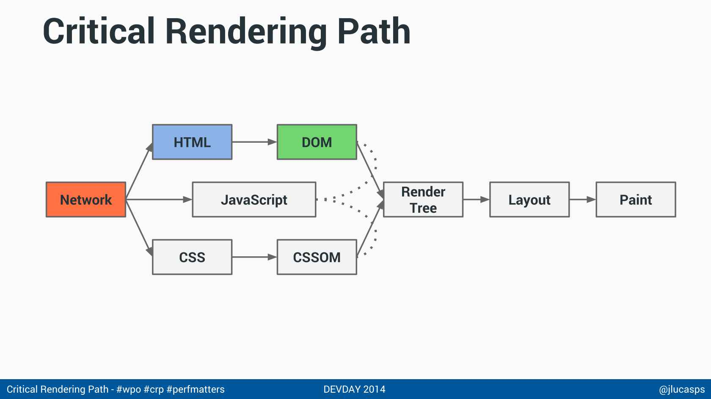

# Performance 2

Esse curso se tratará bastante sobre como a web e o browser opera debaixo dos panos de maneira mais avançada e como podemos adaptar nossos projetos sabendo dessas informações.

Afinal performance é UX.

## Mais sobre o web page test

Configurações importantes: colocar a localização real de teste, ir em avançado (aba test settings) e habilitar o capture video e testar com várias conexões diferentes, além de habilitar first view only (ou o repeat view caso queira ver o comportamento do cache)

E é interessante ter mais de um teste pois eles representam estados de servidor diferentes (pois o servidor pode estar mais lento ou mais rápido em questão de instantes)

### Os tempos que realmente importam

É mais pertubador uma página em branco por muito tempo ou sem letras do que uma página que não tenha conseguido carregar uma imagem ou outra. Então é mais importante o tempo de Start Render do que o Load Time, pois o start render significa que alguma coisa está sendo mostrada para o usuário

O speed index é o tempo necessário para o topo da página estar visível, o que representa uma segurança maior para o usuário de o ínicio está carregado. O Speed Index é um número que indica em milissegundos quanto tempo se passou até o topo do site estar visualmente estável. A ideia é captar a sensação de performance do usuário ao abrir a página. De quando ele poderá consumir o conteúdo do above the fold sem problemas.

## Como a página é carregada e Critical Path

Vamos por partes, você digita a URL e essa url busca na rede a página index.html nada demais e esse html tem dentro dele recursos como o css, arquivos js e imagens e dispara o download desses recursos para carregar a página em cascata.

Porém tem uma particularidade quanto ao css, pois o css redesenha nossa página de maneira a acontecer de um arquivo css conseguir anular o que outro faz, então a página não carrega enquanto os css forem todos carregados. Chamamos isso de recurso blocante, então o responsável pela página branca é por esses recursos blocantes e isso se da para os arquivos js, pois eles são capazes de adicionar e remover css além de serem capazes de alterar a view de uma página então são muito blocantes hahah

Para esses blocks nós chamados de critical rendering Path



Explicação da imagem: a rede dispara a rquisição da página e de forma quase instantanea o HTML e o css começam a serem baixados e carregados na página e com isso é montado o DOM com todos os elementos do HTML e um CSSOM (o dom do css) que carrega em objetos os elementos do css com os dois carregados que começamos a criar a árvore de renderização, então não adianta o DOM ser montado e carregado se o CSS não está pronto, aí entramos na parte de calculo das distancias entre os elementos que o css traz para ai sim começar a desenhar na tela.

E o elefante branco que é o javaScript que tem o poder de alterar os elementos do DOM e do CSSOM, e assim afetar o paint lá no final, essa é o porque colocamos os scripts no final da página muita das vezes, pois como ele pode afetar o tempo de carregamento total da página, e se tirarmos ele do head nós deixamos os arquivos css serem carregados o mais rápido possível.

E colocando os scripts no final fica um tanto inútil utilizar o `window.load` pois se eles estão no final com certeza a página foi carregada já.

Tanto o CSS e o JS bloqueiam a renderização. As imagens, não - elas são baixadas em paralelo e sem bloquear nada.

O JS, como veremos depois, tem a vantagem de poder ser carregado assincronamente de forma fácil. O CSS já é mais complicado, por isso costuma ser o principal componente blocante de todas as páginas.

## Carregamento assíncrono

Com o atributo `async` vinda do HTML5 nós conseguimos carregar scripts de forma assíncrona porém nós podemos perder a ordem desses scripts (que é bem importante) pois um scrip pode carregar primeiro que o outro (por ser mais leve) e podendo crashar. Em alguns frameworks você consegue dar prioridades no carregamento das dependências mas aí é para cursos voltados para isso, e isso está muito ligado a módulos. E dessa forma podemos voltar os scripts no head (lembrando de voltar o onload)

No HTML5, apenas scripts externos podem ser async. Isso faz com que o download seja iniciado em paralelo com o restante da execução da página. E, conforme os scripts chegam, eles são executados sem nenhuma ordem garantida.

O browser e o js por padrão são aplicações single thread, ou seja mesmo que eu tenha o threadrripper da AMD mais caro e absurdo de todos a nossa aplicação roda tudo em um unico processador. Não existe programação single thread para javaScript, isso é bom por que descomplica a aplicação e não dá crash quando damos o scroll no browser e isso dispara uma ação em outro thread, porém temos um gargalo aí pois ações de usuário e ações da página estão competindo pelo uso do mesmo processador

Então uma request assíncrona pode atrapalhar caso eu tenha um recurso mais pesado e eu posso adiar a execução desse script eu posso executar ele com `setTimeout` e isso adia o recurso de um footer e faz com que ele não brigue com outros recursos mais importantes. Além desse temos o `requestAnimationFrame` para adiar animações. Um delay de seus 200ms é bem positivo e interessante

## Lazy Load e throttle

Nessa idéia de colocar recursos para depois, com o java script mesmo eu posso pegar um elemento mais pesado esperar um tempo e depois colocar esse elemento dentro da div. Um vídeo vindo de um serviço externo pode ser apendado ao site dessa forma com um

```js
setTimeout(()=>{
iframe='<iframe> blablabla </iframe>';
document.querySelector(".nome-div").innerHTML=iframe;
},200)
```

E voilá depois de 200ms vemos o vídeo la, dessa forma colocamos um 'carregamento assíncrono' de componentes não js e mesmo que o site demore mais a carregar essa forma gera mais satisfação ao usuário

Outra abordagem é carregar as imagens somente quando o usuário estiver chegando perto delas com o `scroll` e isso pode ser feito da seguinte forma

```js
window.onscroll = function() {

    var imgs = document.querySelectorAll('img[data-src]');

    for (var i = 0; i < imgs.length; i++) {

        if (imgs[i].getBoundingClientRect().top < window.innerHeight +200px) { 
        imgs[i].src = imgs[i].getAttribute('data-src')

        }
    }
};
```

A idéia é no html trocar o `src` das imagens pelo data-source e assim quando estivermos proximos (pelo scroll Y) de chegar na imagem trocar o data-src (que não faz nada) pelo src e ai carregar a imagem quando o usuario estiver perto delas (isso poupa o carregamento todo no começo) Só que temos um problema, o scroll é disparado diversas vezes, para corrigir isso é fácil, basta limitar a frequência de execução do código principal da seguinte forma

```js
let setFreq=false;

window.onscroll = function() {

if(setFreq) return;
setFreq=true;
setTimeout(()=> setFreq=false,100);

//código a ser executado
console.log('scroll');
}

```

A essa técnica nós damos o nome de throttle, isso trunca o código de ser executado milhões de vezes

Mas esse código não está otimizado né, afinal fazemos `var imgs = document.querySelectorAll('img[data-src]');` toda vez que damos um scroll na página e mesmo com o throttle não conseguimos uma otimização de código, para isso vamos para um exercício

### Exercício

(desafio) Mais otimizações

Mesmo com o throttle, o `onscroll` ainda é executado várias vezes. Dado isso, uma boa prática é melhorar o código executado no `onscroll` para que rode mais rápido. Idealmente, devemos limitar o acesso a elementos do DOM, que é o mais custoso.

Exemplo: precisamos mesmo fazer o querySelectorAll a cada execução do `onscroll`? Talvez não, talvez dê para cachear esse resultado.

Outro exemplo: os elementos nessa página em particular não mudam de posição. Então precisamos fazer o `getBoundingClientRect()` de cada imagem a cada scroll? Também não, podemos dar um jeito de calcular a posição absoluta da imagem com relação ao topo uma única vez. (mas cuidado quando o navegador é redimensionado!)

Mais: precisamos ler o window.innerHeight a cada `onscroll`? Não também, podemos cachear.

E o `onscroll` poderia ser removido depois que todas as imagens terminarem de carregar.

Pense em como alterar nosso código a evitar esse tipo de manipulação de DOM a cada scroll.

Na resposta do exercício, dou minha solução para o desafio.

## Rede e mobile

A diferença entre largura de banda e latência (RTT) é que largura de banda é o quanto de informação sua rede pode trafegar de uma vez só a latência é o quão longe é o local que eu estou buscando a informação, quanto mais longe mais lento independente do quanto de informação consegue trafegar ali, pois as informações demoram mais tempo para passar de um local para outro. O rtt (round trip time) é o tempo que leva para passar 1kB de informação da minha casa até o servidor

E o processo para acessar um site é estruturado da seguinte forma

DNS LOOKUP -> TCP -> TLS -> HTTP

Primeiro eu pergunto para um servidor DNS (o da minha operadora provavelmente) quem é www.site.com, ai ele me responde com o IP desse site, depois eu abro conexão com o servidor, depois abre uma conexão segura e depois eu mando o GET index.html que pega o site de fato via HTTP. Essas operações consomem 1 RTT, então pelo menos temos 4 tempos RTT até começar a acessar o site, então sim a latência é vital aqui. Principalmente para mobile.

E mesmo com 4G ou wifi da casa o mobile tem um ping mais alto que o pc da casa e o 4G tem dois estados (um frio e um quente) o frio é quando ele acabou de ser ligado (o 4G no caso) é quente é com ele já ativo e navegando um tempo

E segundo o google mesmo se eu tiver 10MB ou 100MB de internet o tempo de carregamento da página em pelo menos 1.5s. Tudo por conta da latência e quanto mais próximo o cliente está do serviço melhor e isso é o que diminui de fato o tempo de carregamento da página

Quando você fala de mobile o processo de acesso de site é do tipo

RRC -> DNS LOOKUP -> TCP -> TLS -> HTTP

Onde o RRC é a negociação que seu celular faz com a antena para ai sim poder se conectar a internet e que pode levar de 200 a 2500 ms, a tendencia é melhorar (provavelmente já melhorou) mas tem todo um despertar do seu celular para ai conectar e que demora mais tempo do que normalmente melhora, essa negociação é necessária pois senão sua bateria vai pro espaço e isso é responsabilidade da operadora do serviço. Por isso é ótimo pensar nos casos médios de rede do país onde se pensa em 5G mas a realidade é 3G ou 2G (o E quando a rede tá uma bosta, pois vem de EDGE), o H (HSPA+) vem de 3.5G

Por isso não devemos levar em conta que eu tenho o 4G então se no 4G tá bom o tempo de acesso fechou ja era, não, o certo é pensar no cara que usa 3G sempre. Pois ele é a realidade e sua realidade é uma internet de 1MB e por isso a diminuição de requests é extremamente necessária (seja com inline, concatenação e coisas que vimos no curso anterior), por isso aprenda a mexer no GULP (você não vai fazer outras pessoas terem a mesma raiva que você teve um dia)

E colocar servidores do seu sistema no local que você e seus clientes vão acessar senão você vai pagar a latência sempre que acessar.

Com mais dinheiro você pode tirar o serviço dos EUA e colocar no brasil, com mais ainda o ideal são as CDNs que você dispersa servidores no mundo e torna a conexão mais especializada pros clientes de uma determinada região.

Evite redirects também, pois é gasto um RTT desnecessário so para isso

### TCP

Vamos comentar sobre o protocolo TCP e mais algumas dicas para melhorar o seu projeto. O protocolo TCP funciona da seguinte maneira:


O browser manda um pacote SYNC para o servidor que manda um pacote de volta dizendo que recebeu o SYN ACK. Nesse momento o browser manda um pacote ACK e logo de cara começa o request do "http". Depois disso o GET é enviado para o servidor que recebe o request, processa e manda a resposta para o browser, nesse estágio da conversa ele é capaz de enviar 4 TCPs de uma única vez, isso é aproximadamente 5,8 KB. O cliente manda uma requisição GET e começa a mandar a resposta com esses quatro segmentos onde só cabem os 5,8 KB. Se tivermos uma página maior do que o segmento não será possível mandar ela. Por fim, quando o browser recebe esses 4 TCPs, o servidor enviará o dobro e assim por diante até a rede aguentar.

Esse é um cenário bastante simples e que não contêm diversas outras considerações.

O começo é bastante demorado, até que a conexão realmente iniciar. O que podemos fazer para tentar resolver esse problema é diminuir o impacto do começo. Toda vez que vai e volta a seta é um RTT, então, até termos a resposta temos diversos RTTs. Queremos economizar nisso, a maioria dos servidores modernos trabalha com mecanismo que chamamos de keep alive, quando o servidor estabelece uma conexão com o navegador essa conexão será mantida, reaproveitada.

O próximo passo que podemos pensar é na etapa de processamento que trava o cliente. Algo que podemos fazer quando estivermos mexendo no back end é já ir mandando coisas para o cliente o mais rápido possível, principalmente se isso couber na primeira janela TCP. Isso chama-se flush.

Outro aspecto que queremos comentar é em relação a janela inicial do "TCP" que tem basicamente 4 segmentos e no qual temos que encaixar o máximo possível ou, se possível, o "html inteiro em 5,8 KB. Existe uma mobilização virtual para que a janela seja aumentada. Se reivindica que ocorra um aumento de pelo menos 10 segmentos. Existe um processo de aumento gradual, de low start, mas a primeira janela poderia ser maior. Se você possui um servidor moderno e pessoas que acompanham esse debate é bem provável que você já possua um servidor que contem 10 segmentos.

### Exercícios (respostas)

Latência é o maior limitante no acesso a páginas Web no mundo real, já que os requests costumam ser pequenos em relação à banda disponível e porque o HTTP é bastante sensível a latência.

Com a Web distribuída pelo mundo, os servidores frequentemente estão bastante distante dos clientes. E aí o RTT é alto pela simples distância geográfica. A latência acaba sendo o maior limitante no mundo real ao acessar página Web. Como os requests são pequenos, é difícil uma banda de 10 mega ou 100 mega fazer alguma diferença. Estudos mostram até que após 4 ou 5 mega, já dá na mesma no mundo real.

A banda seria importante em cenários de baixar um volume grande de dados, como um streamming de vídeo por exemplo.

Não existe usuário 4G. Existem pessoas que passam boa parte do dia conectadas a rede 4G mas que gravitam em redes 3G e até 2G ao longo do dia. Isso varia com intensidade do sinal, capacidade das antenas da região, números de usuários na mesma antena e mais.

Estudos mostram, por exemplo, que no Brasil, um usuário com celular 4G, um plano 4G, numa operadora 4G, passa apenas 45% do tempo conectado no 4G. Resto do tempo fica gravitando em outros Gs pelos mais variados motivos. Se você tem um celular 4G, provavelmente deve ver o tempo todo sua conexão mudando pra H (3G) ou E (2G).

Mesmo em países mais desenvolvidos, esse número não chega nem perto de 100%. Nos EUA, por exemplo, é 67%. No Japão, 68%.

Sempre lembre: não existe "usuário de 4G". Existe usuário que eventualmente conecta num 4G. (da mesma forma que não existe "usuário 3G" etc)

Qual(is) dessas práticas não está envolvida na diminuição do preço que pagamos pela latência em páginas Web?

Lazy load / carregamento assíncrono

Tudo aquilo que diminui o número de requests, evita que requests sejam feitos e diminui a distância geográfica diminui o impacto da latência.

O que é TCP Slow Start e como isso afeta nossa performance front-end?

O slow start diz que uma conexão TCP começa trafegando poucos pacotes (4 segmentos por padrão) e vai dobrando a cada novo round trip. Isso até a conexão e as 2 pontas aguentarem. Aí a conexão atinge seu máximo que é bem maior que os 4 segmentos iniciais. Ou seja, uma conexão TCP começa lenta e vai esquentando com o tempo.

O padrão é de enviar 4 segmentos, mas isso surgiu uma época de redes piores. Hoje a recomendação é usar uma janela inicial de 10 segmentos, o que aumenta para 14KB o volume de dados trafegados inicialmente. Garanta que seus servidores estejam configurados corretamente.

Qual dessas práticas não está relacionado a melhoria de performance de rede?

Usar um mecanismo de scroll throttle

Várias dessas práticas envolvem configurar adequadamente a infraestrutura do seu servidor. Se não for você que cuida disso, conversa com seu pessoal de Infra para resolver esses pontos. Isso afeta diretamente a performance final das suas páginas.

***O que ajuda***

Habilitar o Connection Keep Alive

Aumentar a janela TCP inicial para 10 segmentos

Fazer flush mais cedo se o processamento no servidor for demorar

### Para saber mais: 14KB ou não

Uma expansão recente muito interessante sobre o assunto neste artigo de 2019:

<https://www.tunetheweb.com/blog/critical-resources-and-the-first-14kb/>

Uma análise moderna sobre como os pacotes TCP funcionam no mundo real atualmente, principalmente pensando que quase tudo hoje já está em TLS e HTTP/2.

Talvez muitos daqueles 10 segmentos iniciais já sejam usados pelo protocolo antes mesmo da requisição começar. E que nas stacks modernas de networking, mesmo o ACK desses pacotes iniciais já são enviados.

Na prática, significa que a janela TCP provavelmente já estará maior que os teóricos 10 pacotes quando for a hora de enviar e receber a requisição. Dando até mais espaço que os clássicos 14KB.

## O melhor dos mundos (de novo sobre critical PATH)

O melhor dos mundos aqui é batermos no servidor e quando voltarmos com apenas uma requisição conseguirmos carregar a primeira view do site para pelo menos o cliente ficar satisfeito com a experiência, como fazer isso?

Colocar o css da parte inicial no começo e se tiver um js nessa parte (para algum input ou algo do tipo) eu colocar ele como inline também e imagens no inline também. Caso seu site seja muito grande cabe aqui o flush dessas informações (como o google faz com seu cabeçalho)

E esse é o segredo carregar o que importa no começo e depois os arquivos js fazem de forma assíncrona

Mas aqui entra uma questão, colocamos o css do header no inline. O nosso site tem muitas rotas, vamos baixar o mesmo header diversas vezes? Pois é, depende de projeto para projeto mas geralmente acaba valendo a pena fazer isso em nome da perfomance e experiência do usuário desde que no final o index.html gzipado fique com menos de 14kB, já que queremos pegar o site com 1RTT apenas

Uma forma legal é carregar css de forma assincrona para isso temos uma biblioteca javaScript chamada loadCSS que faz esse papel, porém ele involde js e isso é blocante o que realmente pode não ser o que queremos.

A solução que está sendo mais aceita é invés de chamarmos o css com `<link rel="stylesheet` é usar o `<link rel="preload" as="style" href="./estilos.css" onload="this.rel='stylesheet'">`, onde a ideia é baixarmos o css de forma assincrona e coloar ele em cache. E caso dê problema como javascript não habilitado colcoa-se uma tag `<noscript>` com o correto.

Mas lembrando que o preload não é aceito em todos os navegadores, para isso o loadCSS recomenda dois scripts vá no git deles e aplique no seu gulp

### Fazendo isso na prática

1 RTT render
PRÓXIMA ATIVIDADE

Implemente a técnica de renderizar o topo do site em 1 RTT como vimos na aula.

Divida o CSS em duas partes: o inicial e o restante.
Os arquivos do inicial são: reset.css, base.css, colors.css, font.css, block-header-busca.css, block-header.css, block-buttons.css, block-categoriaCard.css, block-titulo-destaque.css, home-fundo.css, home.css, home-diferenciais.css

Os demais não são necessários pro topo.

Faça o carregamento inline dos arquivos iniciais. Com nosso plugin do gulp, isso significa colocar o atributo inline na tag link de cada arquivo. Ex:
```html
<link inline rel="stylesheet" href="assets/css/reset.css">
```

O resto dos arquivos deve ser buildado pelo gulp num arquivo async.css. Faça o truque do duplo comentário como vimos na aula para evitar que a tag link gerada seja colocada no HTML.

```html
            <!--
            <!-- build:css assets/css/async.css -->
                <link rel="stylesheet" href="assets/css/block-conteudo.css">
                <link rel="stylesheet" href="assets/css/block-cursoCard.css">

        .... ETC DEMAIS ARQUIVOS AQUI...
            <!-- endbuild -->
            -->
```

Agora precisamos carregar esse async.css de forma assíncrona com o truque do preload. No head da página:

```html
<link href="assets/css/async.css" rel="preload" as="style" onload="this.rel='stylesheet'">
<noscript><link href="assets/css/async.css" rel="stylesheet"></noscript>
```

Se testar no Chrome ou no Opera já deve funcionar. Mas vamos adicionar os polyfills para navegadores antigos.

```html
<script async src="assets/js/loadcss.js"></script>
<script async src="assets/js/cssrelpreload.js"></script>
```

Ufa, agora faça o build da página rodando gulp no terminal e teste.

Implemente a solução do exercício com o noscript.

Remova o código anterior que tínhamos com o <noscript><link ....></noscript>

Faça o código com o truque novo:

```html
    <noscript>
        <!-- build:css assets/css/async.css -->
        </noscript>

        <link rel="stylesheet" href="assets/css/block-conteudo.css">
        <link rel="stylesheet" href="assets/css/block-cursoCard.css">
        <link rel="stylesheet" href="assets/css/block-depoimentos.css">
        <link rel="stylesheet" href="assets/css/block-elasticMedia.css">
        <link rel="stylesheet" href="assets/css/block-footer-listaCursos.css">
        <link rel="stylesheet" href="assets/css/block-footer.css">
        <link rel="stylesheet" href="assets/css/block-form-erro.css">
        <link rel="stylesheet" href="assets/css/block-grupoCaelum.css">

        <link rel="stylesheet" href="assets/css/block-highlighted.css">
        <link rel="stylesheet" href="assets/css/block-painelPlanos.css">

        <link rel="stylesheet" href="assets/css/block-titulos.css">

        <link rel="stylesheet" href="assets/css/home-aprenda.css">
        <link rel="stylesheet" href="assets/css/home-diferenciais.css">

        <noscript>
        <!-- endbuild -->
    </noscript>
```

Rode o build com gulp. Teste novamente e garanta que tudo funciona.

No vídeo propus um desafio adicional de evitar que a versão do rel=preload seja executada em desenvolvimento. Ou seja, quero que apareça apenas em produção, após o build com gulp.

Uma ideia é colocar a linha do rel=preload dentro de um `<noscript>` em desenvolvimento e remover esse noscript quando o build gera. Com o plugin do gulp dá pra rodar um comando remove. Desta forma:

```html
<!-- build:remove --><noscript><!-- endbuild -->
<link rel="preload" href="assets/css/async.css" as="style" onload="this.rel='stylesheet'">
<!-- build:remove --></noscript><!-- endbuild -->
```
