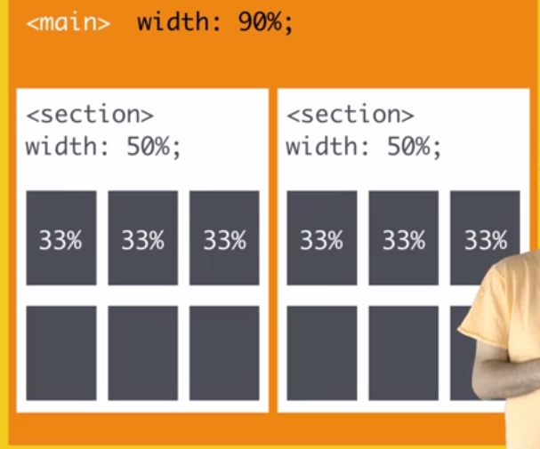
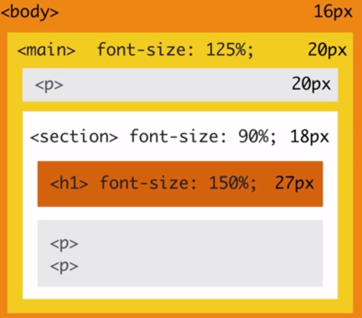

# Web responsiva

Você quer sites mobile ou que sua página seja responsiva para diversos tamanhos?

A pergunta que foi feita é, existe mobile? Até existe, mas o que define o mobile? Tamanho de tela, portabilidade, redes móveis? Meio dificil dizer, por que se for tamanho, então um tablet não é mobile, se for portabilidade então laptop não é mobile e se for redes móveis se eu conectar um plug de 4G da vivo meu desktop grandão virou mobile, até mesmo o touch muitos laptops possuem touch assim como tablets. Então o lance é, não existe um marco que diz, daqui para lá é tudo mobile. Então fazer um site como tinha antes como `m.facebook.com` com esse m de mobile na frente é um baita erro pois você coloca um marco do que é ser um mobile, o mais inteligente é considerarmos medidas de tela diferentes e assim mudar dinamicamente o css.

## Medidas proporcionais

O primeiro passo é mudar todo tipo de medida fixa em px para porcentagem, pois a pixelagem de uns 500px já é o suficiente para não caber na tela de um smartphone isso é um começo de design fluído. Design fluído é o coração de um bom design responsivo. Com o uso de medidas flexíveis, como as porcentagens, a página consegue adaptar seu layout a diversas resoluções diferentes.



O tamanho proporcional também se aplica para tamanho de fontes (font-sizes), o que nos dá



Por padrão o tamanho de uma fonte é de 16px mas se formos multiplicar dentro dos elementos filhos a fonte se multiplica tendo como referencia o elemento pai, isso é meio obvio pois a porcentagem atua de acordo com o container que ela está inserida, em uma página responsiva isso é interessante pois evita retrabalho, essa mudança será feita proporcionalmente com o tamanho das fontes, essa ideia é válida para a medida `em` também, onde

```en
font-size:120% = font-size:1.2em
```

Ou seja não há diferença entre porcentagem e em.

O em é uma boa medida também para separação entre textos, em é uma unidade de medida normal do CSS, podendo ser usada em qualquer propriedade. Seu cálculo é com relação ao tamanho do texto, mas seu uso é universal.

Caso tenhamos telas muito grandes, podemos setar a máxima largura de um container com `max-width` e o tamanho mínimo de um container com `min-width`, até por que fica meio trabalhoso demais lidar com responsividade com dispositivos muito grandes e muito pequenos.

Para imagens o bom é colocarmos `max-width:100%` para não fazer com que a imagem estoure quando em telas muito grandes e nem que ela vaze do container quando for muito pequeno

O inline-block é interessante por simular uma linha de texto com seus elementos. Se não cabe mais um "caracter" na linha, a "palavra" escorrega pra linha de baixo.

## Media Queries

O design fluido não resolve o problema todo, ele resolve somente metade. Pois as vezes o problema é que para um determinado tamanho de tela as coisas fiquem muito coladas, ou a letra tenha ficado muito pequena. Para resolver essas situações eu tenho os media querys que normalmente são

```css
@media(min-width:<>px){}
@media(max-width:<>px){}
```

O primeiro nos diz o css que a tela terá que respeitar para um tamanho min de x px e o segundo é todo um comportamento para uma tamanho de tela (na horizontal, sempre) de x px.

Essa escrita diferente vem do media types que vem do css2 e que tinha o `@media screen` e o `@media print`, o segundo vem de uma época que era comum printar as páginas web (o que não se faz mais hoje) e o `@media screen` diz sobre elementos que estão sendo mostrados em tela, as vezes é comum vermos a mistura dos dois tipos com `@media screen and (min-width:<>px){}` mas no geral pode se colocar apenas a busca pelo tamnho da tela que já está aceitável, no mundo real você verá somente algo como o `@media min` ou `@media max`.

Posso ter a media query naquele exato tamanho de tela, com `width` (o que é inutil hahahas) ou pesso pegar a media query pelo `height` também. Outra coisa são os `device-width` e o `device-height` que pegam os tamanhos exatos de tela do usuário, outras são `orientation:portrait` e `orientation:landscape` que pegam o estado de um celular, se ele está em pé ou deitado. As media query de `height` são um tanto inuteis pois o heigth é usado muito para scroll e limitar comportamentos por ela não fazem muito sentido, os `device` heigth e width também não são muito uteis pois você estará interessado na janela do navegador e não a da tela do usuário, por que a janela pode estar redimensionada, no geral as medias mais interessantes são o `min-width` o `max-width` e as orientações.

No geral `480px` é um bom valor para celulares, a dica é usar o responsivo do chrome dev tools e ver o tamanho de tela que afeta sua página e ir alterando com esses parâmetros

O `min-width` está mais atrelado a ideias de mobile-first, onde primeiro você projeta o ambiente mobile por padrão e você vai modelando as variações de tela ajeitando os detalhes para telas maiores, pois lembre o `min-width` é o no minimo para esse tamanho de tela, então se o seu mobile já está ok vai fazendo o ambiente desk.

A especificação de todas as media querys pode ser vista [aqui](https://www.w3.org/TR/css3-mediaqueries/)
