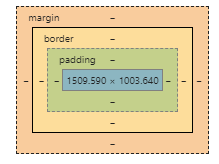

# CSS (folha de estilo em cascata)

O css serve para estilizarmos as tags dentro de uma página (para que não fique tudo preto e branco), e para isso nós criamos identificadores para mudar o estilo de uma tag específica.

O comum é criarmos um página exlusiva de css dentro do diretório da página e dentro do head colocarmos a seguinte tag, mas podemos fazer o css inline (linha por linha) usando a propriedade `style` dentro do html ou até criar um style dentro do head, só que dessa forma poluímos um pouco o código.

```html
<link rel="stylesheet" type="text/css" href="styles.css" />
```

rel siginfica relação, e o css usa uma folha de estilo

Onde em href fixamos o caminho da pasta que leva ao arquivo sabendo que o HTML se baseia nele para identificar as demais. Linkando um arquivo externo nós conseguimos utilizar o mesmo estilo para diversas páginas diferentes.

Tudo que eu coloco nessa folha pai reflete nos filhos (arquivo html)

## Alguns estilos comuns

|Estilo|Descrição|
|--|--|
|font-size|Por padrão o tamanho de uma letra está em 16px|
|text-align|alinha o texto|
|background|Mudar a cor em hexadecimal, rgb ou até mesmo o nome da cor (o visual Code tem um editor de cor bem legal)|
|div|cria uma divisão em containers dentro do conteúdo no body, podendo editar trechos separadamente|
|text-transform: uppercase;|transforma texto em maiúsculo|

É de suma importância utilizarmos um editor de código como o Visual Code pois ele nos dá dicas de códigos corretos

Por questão de projeto é comum que os estilhos de body e html venham primeiro das de parágrafo e coisas estilização de letras

Cores em hexa são representadas por 

```css
#_ _ _ _ _ _
Dois primeiros- pro vermelho
Dois próximos - verde
Dois últimos - azul

0-> minimo
F-> máximo
```

Cor em rgb

```css
rgb(_, _,_)
vermelho, verde, azul indo de 0 até 255. 
```

## Formas de relacionar o css

|No html|No css|
|--|--|
|id="a"|#a|
|id="a" e uma tag|#a tag|

Uma dica é, toda id tem uma hashtag #, onde o identificador é único

## Espaçamentos



Padding, cria um espaço além da imagem, border cria uma borda e margin separa a borda das partes físicas da página. Uma boa é ir olhando no browser em develper tools e ir adequando para algo que te agrade

`padding: _ _ _ _` : primeiro para cima, depois para a direita, para baixo e para a esquerda.

`padding: _ _` : (o primeiro é para cima e para baixo e a segunda é para esquerda e para a direita)

## Classes

As classes são identificadores que podem se repetir e para adicionar el no html eu faço

```html
<li class="nomes"> Item 1</li>
```

E para referenciar ela no css é com

```css
.nomes {}
```

## reset.css

O navegador impoe diversas caracterísiticas ao nosso site que não pedimos (como margem nas laterais, link com fundo azul e espaçamentos nas tags h1,h2 e afins) o rest.css (na aula 2) zera essas coisas e deixa a página do jeito que queremos.

## Posição

Quando renderizamos uma tag na página por padrão o navegador entende que o posicionamento dessa palavra é estática, para movermos isso de lugar em relação ao ponto onde essa tag se situa nós colocamos que ela está em posição relativa (pois é relativa a onde ela deveria estar), agora para estar em qualquer posição da página (útil quando temos que mover ela para cima e para a direita por exemplo) nós dizemos que a posição dela é absoluta e página inteira passa a ser a referência.

Por exemplo a posição do navegador

```css
nav {
    position: absolute;
    top: 100px;
    right: 300px
}
```

Passa a ser 100px distante do topo da página e 300px a direita do limite direito da página.

Com o position: absolute, eu consigo posicionar meu elemento em qualquer lugar da página

Para fazer com que o menu fica dentro de um div de caixa e se movimento a partir dessa caixa eu tenho que fazer com que essa caixa tenha posição relativa.

E a melhor forma de centralizar uma div é delegando para o navegador fazer a conta de calcular a largura que resta, dividir por dois, e adicionar metade em cada um dos lados.

E fazemos isso com:

```css
    margin: 0 auto;
```

Pois colocamos quanto vale a largura desse div, quanto que ele tem que preencher, a margem que vai ocupar no meu computador, só meu computador sabe, por isso auto para a direita e a esquerda.

## Cantos arredondados

Para deixar uma div ou uma caixa qualquer com cantos arredondados nós temos os comandos:

```css
    border: solid 3px black;
    border-radius: 20px;
```

Onde na primeira linha eu posso declarar direto, o tipo da linha (linha solida, tracejada,pontilhada, whatever), a espessura da linha e a cor da linha de borda.

## Mapeamento do usuário

Quando tenho o mouse do usuário em cima de algo clicável ou mesmo clicando eu tenho uma mudança de comportamento daquele trecho de código, isso é o mapeamento das açoes do usuário.

Normalmente é declarado no css da seguinte maneira:

```css
nav li:hover{}
```

Onde hover é passar com o mouse em cima do elemento (que pode ser qualquer um), active é quando se clica.

E na ação eu apenas mudo uma das açoes que foi específicada quando criamos aquele elemento.

E para mudar uma fonte h2 dentro dessa lista eu faço

```css
nav li:hover h2{}
```

Esses comportamentos são chamados de pseudo-classes.

## Adicionando imagem de fundo com css

Primeiro tenha a imagem na pasta do projeto e adicione com

```css
background: url("Caminho da imagem")
```
