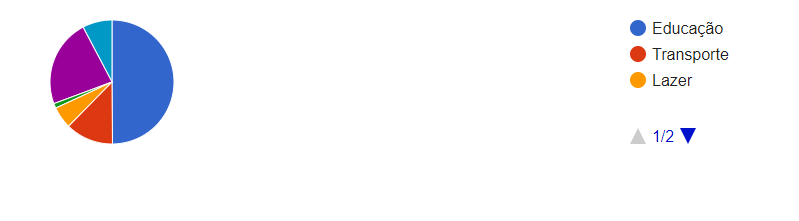

# Gráficos na web com google charts

Estaremos utilizando aqui o google charts para gerar gráficos em nossos sites e essa biblioteca é feito todo em javaScript.

## Estrutura básica

O site do google charts já ajuda e muito no processo de aprendizagem, mas vamos os poucos de como usar essa biblioteca

Primeiro vamos importar o loader no js com:

`<script src="https://www.gstatic.com/charts/loader.js"></script>`

Aí dentro do script que vamos escrever o gráfico de pizza vamos fazer:

`google.charts.load('current', {'packages':['corechart']});`

Isso vai carregar todos os pacotes necessários para escrever os gráficos, agora vamos escrever a função que conterão os dados na tabela

```js
const desenharPizza = () => {

const tabela = new google.visualization.DataTable();
tabela.addColumn('string','Categoria');
tabela.addColumn('number','Valores');

tabela.addRows(
    [
        ['Educação',2000],
        ['Transporte',500],
        ['Lazer',230],
        ['Saúde',50],
        ['Cartão de Crédito',920],
        ['Alimentação',310]
    ]
);

const grafico = new google.visualization.PieChart(document.querySelector('.grafico-pizza'));
grafico.draw(tabela);

}
```

Primeiro criamos a tabela instanciando a visualização do google, depois adicionamos colunas com o seu tipo de dado, as linhas com as informações de fato, depois selecionamos onde desenharemos esse gráfico (selecionando um lugar no html), para depois desenhar mesmo.

Passado isso fazemos o callback da função com:

`google.charts.setOnLoadCallback(desenharPizza);`

E temos o primeiro gráfico que ficou com a seguinte cara:



Agora vamos estilizar esse gráfico

## options

Podemos colocar titulo, aumentar e diminuir tamanho dentro de uma variável options da seguinte forma:

```js
const options = {
    'title': 'Gastos do Mês',
    'height': 350,
    'width': 450
};
```

E desenhar esse gráfico com:

```js
grafico.draw(tabela,options);
```

Se formos incluir o título Categorias de gastos em 2018 dentro do objeto opções do gráfico, qual a sintaxe correta?


`'title': 'Categorias de gastos em 2018'.`

Correto! O nome title pode ser usado com ou sem aspas simples, o google chart permite os dois. Mas a string do título precisa estar entre aspas simples.

`title: 'Categorias de gastos em 2018'.`

Correto! Podemos usar o title com ou sem aspas simples, o Google Charts permite os dois. O que precisamos manter são as aspas simples no valor, que é o nome do título.

Dentro de um projeto, pediram para que trocássemos um gráfico de pizza para um gráfico de donut.

Qual a maneira de fazermos isso no Google Charts?

Adicionando a opção `pieHole`.

Correto! Nessa opção, podemos setar um valor de 0.0 até 1.0 para o raio do círculo que criará o buraco do donut na pizza.

Para outros tipos de gráfico veja a documentação, a aba guides tem muita coisa

Em um gráfico de pizza é interessante deixar a legenda das seções como em `legend: 'labeled'` e talvez mudar o que está escrito na seção com `pieSliceText: 'value'` onde coloco o valor e não o percentual (que é o default)

## Para saber mais

Algo que devemos fazer ao criar os gráficos é prestar atenção em quais estão contidos no pacote que importamos, até para entendermos se é necessário adicionar mais pacotes ou não.

Para sabermos quais gráficos estão no pacote corechart que estamos usando, basta acessarmos a parte de [Referência](https://developers.google.com/chart/glossary) da documentação.

E podemos procurar por corechart ("Crtl + F"). E então iremos encontrar uma lista completa de gráficos que estão no pacote:

Caso usemos algum gráfico que não está contido na lista, basta voltarmos para a opção Guias na barra que fica acima do texto e clicar no gráfico correspondente em Chart Types.

Ao fazermos isso, teremos um pouco mais de informações sobre o gráfico, e muito provavelmente exemplos que estão importando o pacote usado para desenhá-lo. Sabendo qual o pacote, podemos inclusive pesquisar, dessa vez na própria barra de Search do site para encontrar mais detalhes e usos.

Procure sempre ir se familiarizando com a documentação, é a melhor fonte que temos.

## Alterando cores

Com o opção `colors` nós alteramos as cores do nosso gráfico em ordem (ou de modo intercalado caso coloquemos menos cores que linhas)

Porém a propriedade `colors` não permite a edição de cores individualmente para isso podemos usar a propriedade `slices` da seguinte forma:

```js
    slices: {
        0:{},
        1:{color:'grey'},
        2:{color:'#a6a6a6'},
        3:{color: 'grey'},
        4:{color: 'orange'},
        5:{color:'#a6a6a6'}
    }
```

Onde 0,1,2,... são as posições das linhas na tabela que criamos

Para destacar ainda mais aquela seção podemos destacar o setor do gráfico com offset dentro do slice

Estamos fazendo uma visualização inspirada no jogo Pac Man e iremos deixar um gráfico de pizza com 3 pedaços inteiramente amarelos.

Para fazermos isso com facilidade, o que podemos customizar nas opções do gráfico?

`colors: ['yellow'].`

Correto! Quando usamos o array de cores, se colocarmos apenas uma cor, ela já colore todas as fatias da pizza.

## Para saber mais

Quando usamos uma biblioteca como o Google Charts, é sempre bom criarmos o hábito de consultar a sua documentação para entendermos tudo o que podemos fazer com o gráfico.

Por exemplo, o fato de conseguirmos fazer um gráfico de pizza 3D, mas não um donut em 3D, já que a biblioteca não suporta a propriedade que gera o donut com a 3D juntas.

Fica [aqui](https://developers.google.com/chart/interactive/docs/gallery/piechart#donut) a parte da documentação (em inglês) com esse detalhe.

Somos informados de que não podemos combinar as opções pieHole e is3D; caso contrário, pieHole será ignorada ("You can't combine the pieHole and is3D options; if you do, pieHole will be ignored").

Assim, podemos entender o motivo das duas propriedades não serem compatíveis: o pieHole será ignorado. Isso significa que, se usarmos as duas dentro das opções, sempre teremos um gráfico de pizza 3D ao invés de um donut.
