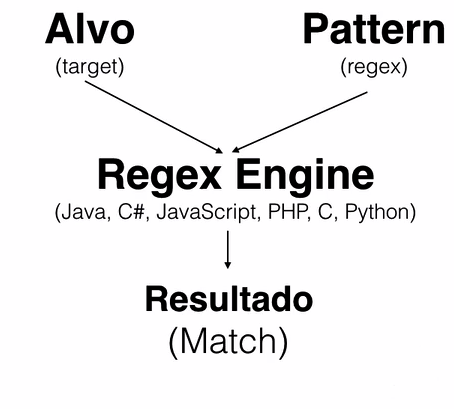
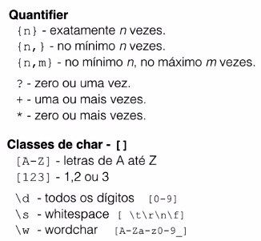
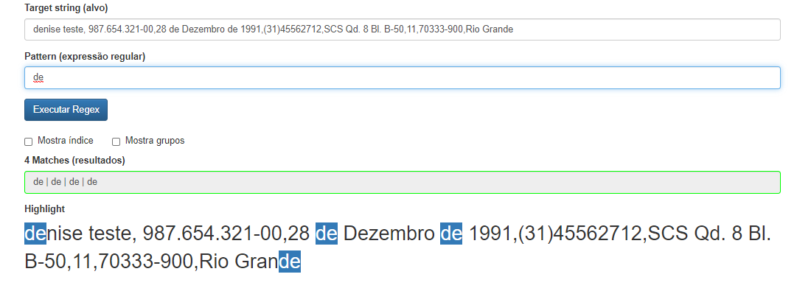
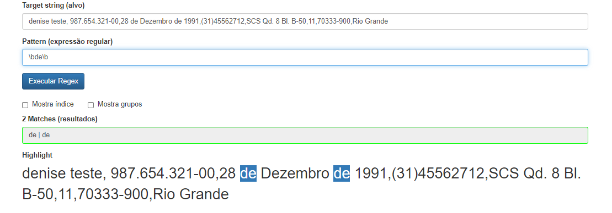
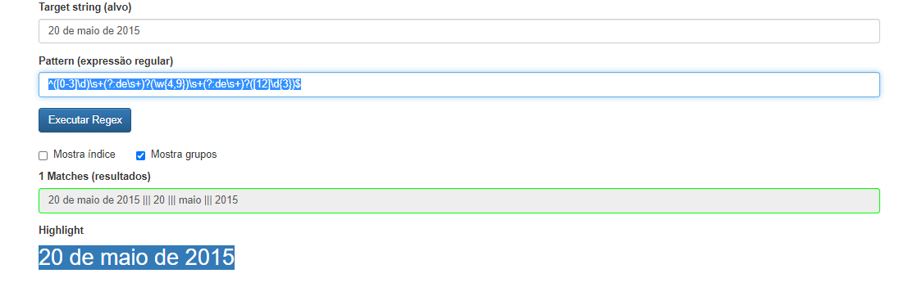
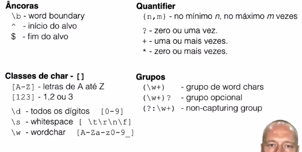

# RegEx

Aprendendo a Regex com javaScript, Uma expressão regular, ou Regex, são padrões utilizados para identificar determinadas combinações ou cadeias de caracteres em uma string. Elas são usadas em linhas de comando (para encontrar informações em arquivo ou diretórios específicos), formulários em html, buscas em editores de texto no próprio Visual Code por exemplo com CTRL + F e ver o símbolo de .* na barra.

O regex pode ser encontrado em muitas linguagens de programação com o Java o C# o PHP o C o Python enfim muitas linguagens

A linguagem que vai seer utilizada é a seguinte 

 

 Então o que é um Regex-Engine?

 Uma expressão regular sozinha é apenas uma string. É preciso ter um software para interpretar a regex e aplicá-la no alvo. Esse software é o Regex Engine que existe para a maioria das plataformas de desenvolvimento, como JavaScript, C#, Python, Ruby ou PHP.

## meta char

 Existem alguns caracteres que possuem um significado especial para o regex engine. Especial significa que o regex engine não interpreta o valor literal e sim diferente. Esses caracteres são chamados de meta caracteres.

Nessa aula já vimos alguns:

- `.` o "ponto" que significa qualquer char

- `*` o asterisco que serve para definir uma quantidade de chars, zero ou mais vezes

- `{` e `}` as chaves que servem para definir uma quantidade de caracteres específicas que é desejado encontrar
Por exemplo:

 a{3} letra `a` 3 vezes. A essas chaves chamamos de quantifier

- `\d*` um digito zero ou mais vezes
Lembrando também, se quisermos procurar pelo `*` ou `.` literalmente (sem significado especial), devemos utilizar o caractere `\`, o `\` serve para escaparmos o caractere que tem significado na linguagem (tipo o terminal do linux)

Observação: Dependendo um pouco da linguagem e regex engine que você usa, também pode ser necessário escapar o char /, ou seja, usando \/

### Encontrando IP

O número do IP de um computador é gerado ao conectá-lo à internet, esse número permite que o dispositivo seja identificado e capaz de enviar/receber informações. Abaixo há alguns exemplos de IP:

```ip
126.1.112.34

128.126.12.244

192.168.0.34
```

Cada grupo pode ter de um a três algarismos. Considerando somente essa regra, como podemos encontrar o padrão desses números?

Resposta:

```r
\d{1,3}\.\d{1,3}\.\d{1,3}\.\d{1,3}
```

Um IP tem quatro grupos de no mínimo um e máximo três números. Repare que estamos escapando o ponto (.) entre os números, que são blocos de dígitos \d entre 1 e 3 caracteres {1,3}

### Mão na massa - Buscando o telefone

Usando o que aprendemos até então, qual padrão podemos utilizar para encontrar o número telefônico? Por exemplo: (21) 3216-2345

Lembre-se que os telefones podem ser também no formato novo: (21) 93216-2345. Seu padrão deve considerar esta modificação.

Dica: Os parênteses são meta-chars e precisam ser utilizados para capturar o valor literal: `\(e \)`

O que eu fiz:

```regex
\(\d{2,3}\)\d{4,5}-\d{4}
```

Pois um número pode começar com (21) ou (021) e vir seguida de 99978 ou 9978

### Para que servem as regex?

Na aula e nos últimos exercícios já vimos alguns exemplos de expressões regulares. Com isso, avalie as seguintes opções:

A) Extraindo seções específicas de um arquivo de texto
B) Validação de formatação de, por exemplo, e-mail ou telefone
C) Análise de arquivos de texto e extração de dados para, por exemplo, gravar no banco de dados
D) Substituindo os valores de um texto para limpar, reformatar ou alterar o conteúdo
Dentre essas opções, quais alternativas correspondem às possibilidades utilizando RegEx?

Resposta: Todas as afirmativas

Todas as alternativas estão corretas e representam exemplos clássicos para utilizar expressões regulares.

No entanto, é importante lembrar que uma expressão regular faz a análise de um determinado padrão de caracteres em uma string. Podemos usar esse padrão para por exemplo validar um email ou telefone. Para saber se o email realmente existe e validar a autenticidade do email uma regex não serve.

## Caracteres opcionais

Note que um cpf pode ser escrito de várias formas, como

```cpf
147.420.797-95
14742079795
147420797-95
```

Todas essas formas são formas válidas de se escrever um CPF, ou seja a pontuação aqui é opcional, é legal que tenha por conta de legibilidade mas não precisa ter ou não e seria legal o regex identificar isso, e para isso ser o ? que serve justamente como um caractere opcional, o que nos deixa com um pattern

```regex
\d{3}\.?\d{3}\.?\d{3}-?\d{2}
```

Pois o ponto é escapado mas é opcional, o ? pode ser entendido como {0,1}, ou seja temos 0 ou 1 uma vez e eu posso incrementar esse regex para mais símbolos como - em tudo

```regex
\d{3}\.?-?\d{3}\.?-?\d{3}-?\.?\d{2}
```

Para deixar isso mais organizado eu uso o colchetes de modo que fica:

```regex
\d{3}[.-]?\d{3}[.-]?\d{3}[-.]?\d{2}
```

E dentro do colchetes eu não preciso escapar o caractere `.`, como o colchete eu posso definir um dígito por [0-9] invés de \d e aos colchetes dizemos que temos uma classe de caracteres

### Ajudando a Alura

Os textos e exercícios no Alura usam uma formatação para deixar uma parte em negrito, itálico ou para mostrar que se trata de código. Na primeira versão da Alura era necessário usar tags HTML no texto para essa formatação. Por exemplo, veja uma de um exercício antigo:

```en
No <code> for </code>, o valor de <code>i</code> começa de zero e é incrementado a cada volta enquanto <code>i < 10</code>, portando o bloco de código do for é executado 10 vezes.
```

A sua tarefa agora é criar uma regex que procurará o `<code>` ou `</code>` dentro do alvo acima. Mãos à obra!

A regex utilizada é: `</?code>`

Repare que usamos o meta-char `?` para sinalizar que o `/` é opcional.

### Qual é a classe?

Veja as alternativas abaixo.

Qual é a classe correta para definir os números entre 1 e 3 E 6 e 9?

Resposta: `[1-36-9]`

Definimos uma classe com os números de 1-3 e 6-9!

## Mais meta-chars especiais

O que define um espaço ou um simples Tab, ou vários espaços como em

```pt-br
olá tudo bem
olá     tudo bem
olá         tudo bem
```

Como eu defino esses espaços em regex, bem em programação chamamos esses espaços de `white-espace` e em regex o padrão para esse espaço é usado com `\s`

E como eu posso ter um ou mais espaços em branco eu posso colocar `\s{1,}` ou `\s+` os dois significam a mesma coisa e significam justamente ter um ou mais espaços em branco

- `?` zero ou uma vez, um caractere opcional
- `*` zero ou mais vezes
- `{n}` exatamente n vezes
- `{n,}` no mínimo n vezes
- `{n,m}` no mínimo n+1 vezes, no máximo m vezes

Vamos para algo mais difícil, vamos fazer um regex para uma data como

02 de Abril de 2015

Não se assuste a resposta é

```regex
[0-3]?\d\s+de\s+[JFMASOND][a-zç]{3,8}\s+de\s+[12]\d{3}
```

Meu deus, calma, vamos por partes

- O dia `[0-3]?\d` o começo pode ser representado por 01 ou 1, e o primeiro dia só vai de 0 até 3 e de forma opcional enquanto o segundo dia pode ser qualquer dígito, isso pode dar como resultado válido 39 o que não é uma data válida. Mas note que o regex não é um validador e sim uma forma de pegar padrões de resposta. Podemos forçar via html a data certa

- O espaço em branco representado por `\s+`

- O mais complicadinho o mês que é representado por `[JFMASOND][a-zç]{3,8}` cuja primeira letra empre é maiúscula e por ser J (de janeiro,junho e julho), F de fevereiro, M de março e maio, A de Agosto e Abril, S de setembro, O de Outubro, N de novembro e D de dezembro. E depois de 3 até oito letras minusculas (3 de maio e 8 de fevereiro) contando o ç de março que não é contemplado no padrão Ascii de a até z.

- O espaço em branco representado por `\s+`

- E o ano que é começado por 1 ou por 2 como é dito em `[12]` e três dígitos logo em seguida

Trabalheira né, mas é uma boa forma de representar o padrão dessa data

### Mão na massa: Reconhecendo a placa de um veículo

Fomos contratados para desenvolver um sistema para cadastros de veículos em um estacionamento. Para isso, precisaremos cadastrar as placas dos veículos no sistema e para fazer a validação usaremos expressão regular.

Como seria a expressão regular que devemos usar para validarmos a placa de um carro?

Exemplo de placa: `KMG-8089`

Primeiro deve definir as 3 letras maiúsculas: `[A-Z]{3}`

Agora só falta o hífen e os 4 dígitos, a regex completa fica:

`[A-Z]{3}-\d{4}`

o atalho de classe `\w` que pega qualquer dígito, seja ele letra ou número:

### Mão na massa: Separando joio do trigo

Temos a seguinte linha:

```pt-br
BALEIRO GARROTE SERROTE GOLEIRO ROTEIRO
```

Escreva uma expressão regular que faça match apenas com as palavras GARROTE, SERROTE e ROTEIRO. Não esqueça de usar nossa ferramenta para testar nossas expressões regulares.

VER OPINIÃO DO INSTRUTOR
Opinião do instrutor

Uma solução possível é:

`[A-Z]*ROT[A-Z]+`

Veja que usamos a classe de caracteres `[A-Z]` porque queremos lidar apenas com todos as letras em maiúsculo. Além disso, na primeira parte da expressão temos `[A-Z]*,` usamos o quantifier * que indica zero ou mais vezes. Por fim temos `[A-Z]*ROT[A-Z]+`.

### Tudo o que está dentro do colchetes deixa de ser um meta char

Sabendo disso e dado o seguinte alvo: `?classes+poderosas*`

Qual regex abaixo seleciona o alvo inteiro (um match apenas)?

Resposta: `[a-z?*+]+`

Como falamos, a grande maioria de meta-chars são valores literais na definição da classe (dentro de []). Por exemplo, a classe abaixo define apenas valores literais:

`[.?+*{}]`

Apenas os caracteres \ (barra invertida), - (hífen) e ^ (circunflexo) realmente são meta-chars dentro de uma classe. O hífen e a barra invertida já vimos na aula, por exemplo na classe:

`[a-z\d]`

### Opcional: Validando o usuário no serviço Rest

Você é um desenvolvedor back-end de uma startup que possui uma aplicação web de anúncios de restaurantes e lanchonetes. A aplicação que foi desenvolvida usando AngularJS no client-side consumindo serviços Rest desenvolvidos em Jersey/JAX-RS, precisa fazer um cadastro dos seus usuários que possuem um username.

Esse username possui regras de quais caracteres ele pode compor e nós queremos que ele seja válido antes de consultarmos no banco de dados as informações sobre ele.

Vamos ver abaixo a action que receberá o usuário para ser cadastrado:

```en
@POST
@Path("/user")
@Consumes(MediaType.APPLICATION_JSON)
public Response listaDeRestaurantes(@Valid User user) { 
    // codigo omitido
}
```

O projeto utiliza a especificação Bean Validation que permite realizar validações de modelos através de anotações. Para validar um campo usando expressões regulares, podemos usar a anotação @Pattern(regexp="...")

```
// User.java
public class User {
    @Pattern(regexp = "???")
    @NotEmpty
    private String username;

}
```

O username precisa ser da seguinte forma:

O limite é de 10 caracteres;
O primeiro caractere deve ser uma letra do alfabeto, não pode ser um número;
A partir do segundo caractere podemos ter letras maiúsculas, minúsculas e números;
Como deve ficar a anotação @Pattern com uma expressão regular com essas características?

RESPONDA
Opinião do instrutor

A resposta é: `[a-zA-Z][a-zA-Z0-9]{0,9}`.

Também é possível usar expressões regulares na anotação @Path do JAX-RS. Por exemplo: `@Path("/username/{username:[a-zA-Z][a-zA-Z0-9]{9}")`

Se você quiser conhecer um pouco mais sobre Jersey e AngularJS (1 e 2) temos alguns treinamentos específicos sobre esses temas:

Webservices rest com Jaxrs e Jersey

Angular Js - MVC

Angular2 parte1

### Para saber mais: Melhorando a legibilidade

Na aula criamos um pequeno "monstro" para definir a expressão da data:

`[0123]?\d\s+de\s+[A-Z][a-zç]{1,8}\s+de\s+[12]\d{3}`

Como poderíamos deixar a expressão mais fácil de entender?

Uma forma fácil de melhorar a legibilidade seria usar algumas variáveis auxiliares, que deixam claro o que estamos definindo, por exemplo no JavaScript podemos criar 4 variáveis:

```js
var DIA  = "[0123]?\d"; 
var _DE_ = "\s+de\s+";
var MES  = "[A-Za-z][a-zç]{1,8}";
var ANO  = "[12]\d{3}";
```

Repare que cada variável representa uma parte da regex. Depois disso é só concatenar esses variáveis para ter a expressão final:

`var stringRegex = DIA + _DE_ +  MES + _DE_ + ANO;`

Essa string passamos para a regex engine do JavaScript:

var objetoRegex  = new RegExp(stringRegex, 'g');

Uma regex é algo muito compacto e aquilo que escrevemos hoje, amanhã já pode ser difícil de se entender. Criar variáveis auxiliares pode ajudar muito para deixar claro o que a regex representa, mesmo para desenvolvedores que não são especialistas de expressões regulares.

O objeto `RegEx` é a engine de RegEx do javaScript

O que aprendemos?
Podemos definir facilmente a classe de qualquer caractere com o [A-Z].

Conhecemos todos os quantifiers como `?`, `+`, `*` e `{n}`.

\s significa whitespace e é um atalho para `[ \t\r\n\f]`.

\w significa word char e é uma atalho para `[A-Za-z0-9_]`.

## Um pequeno resumo do que foi visto até aqui



Volte para exemplos com eles

## Âncoras

Um âncora em regex é uma forma de conseguirmos identificarmos apenas uma palavra mesmo tendo diversas variações dela dentro de uma frase como na frase

```regex
denise teste, 987.654.321-00,28 de Dezembro de 1991,(31)45562712,SCS Qd. 8 Bl. B-50,11,70333-900,Rio Grande
```

Se formos pesquisar a palavra de dentro dessa frase encontraremos a seguinte resposta



Uma forma de pegarmos apenas as palavras de dentro dessa frase é usando a word boundary \b que identifica se não temos nenhum wordchar ou seja `[A-Za-z0-9_]` então se verificarmos nenhum wordchar nem antes e nem depois o pattern seria `\bde\b` o que nos deixa com a seguinte resposta



Isso seria o âncora, ele me garante que encontraremos exatamente aquela palavra dentro de várias outras formas, sem espaços

Uma âncora não casa caracteres como as classes fazem, e nem definem quantidades. Âncoras marcam uma posição específica no alvo, por isso não é possível combiná-las com um quantifier.

Existem várias âncoras predefinidas, mas as mais comuns são ^, $ e \b. Lembrando também que os caracteres ^ e $ são meta-chars.

O `^` representa o que deve vir no começo de uma frase e o `$` a palavra que deve vir no final (como a extensão do arquivo)

### Mão na massa: Encontrando o número de um CPF

Dada a seguinte regex, que encontra o número de um CPF: `^\d{3}\.\d{3}\.\d{3}-\d{2}$`. Qual das strings abaixo é compatível com ela?

Resposta: 111.111.111-11

Como foi visto no capítulo, o circunflexo (^) é uma âncora e garante que na string nada deve vir antes, por isso a string CPF: 111.111.111-11 não é compatível, pois antes do número do CPF há o trecho CPF:. Já o $ é o contrário, nada na string deve vir depois, por isso a string 111.111.111-11 é o número do meu CPF também não é compatível, pois depois do número do CPF há o trecho é o número do meu CPF.

### Mão na massa: Encontrando uma expressão de data

Qual das regex abaixo capturaria exatamente as strings de data que seguem o modelo: Data: dia/mes/ano ou Data:dia/mes/ano?

Alvos: Data: 02/09/1964 ou Data:02/09/1964.

Se tiver com dúvida, use o nosso testador (está em index.html).

Resposta: `^Data:[\s]?[0-9]{2}\/[0-9]{2}\/[0-9]{4}$`

A regex para pegar data é bem simples, vocês já sabem: [0-9]{2}\/[0-9]{2}\/[0-9]{4}.

Mas também queremos a expressão Data: e um espaço (por exemplo: \s) entre eles, que é opcional, ou seja, temos que utilizar o interrogação (?). Basta adicioná-los à regex acima:` Data:\s?[0-9]{2}\/[0-9]{2}\/[0-9]{4}`.

Mas como queremos exatamente essa string, precisamos colocar as âncoras ^ e $, no início e fim da string, respectivamente: `^Data:[\s]?[0-9]{2}\/[0-9]{2}\/[0-9]{4}$`

### Mão na massa: Extensão de arquivo

Temos a seguinte regex:

```regex
.*\.html$
```

Ela captura uma página html, seja o nome de um arquivo, uma url de uma página, etc... Qual das strings abaixo não será capturada pela regex?

index.htmlx

A string index.htmlx não será capturada pois a regex, através da âncora $, não admite nada após a expressão .html.

### O âncora \B

Alvo: português proporcional compor

Pattern: \Bpor\B

Resultado:


A nossa regex seleciona a sílaba por, e antes e depois dela, deve ter um Non word boundary. Em outras palavras, a silaba por deve aparecer dentro de uma palavra, nunca no inicio ou fim.

## Grupos

Nós separamos grupos dentro de um regex com `()` e com eles conseguimos gerar mais de um resultado dentre de um regex geral

Um exemplo são as datas `20 de maio de 2015 ou 20 maio 2015`

Que pode ser representada pela regex

```regex
^([0-3]\d)\s+(?:de\s+)?(\w{4,9})\s+(?:de\s+)?([12]\d{3})$
```

Vamos por partes

- `^` para dizer que começa com esse valor

- `([0-3]\d)` esse grupo é do dia

- `\s+` white-space de qq tamanho

- `(?:de\s+)?` aqui vem a novidade, colocamos um grupo para caso tenha a proposição de ou não, se tiver ela tem espaço se não tiver não tem mas o `?:` serve para dizer que não queremos que ela fique mostrada como resultado do grupo. A isso chamamos de Non-Capturing group - `(?:de\s+)` (não deve devolver o grupo formado pela preposição de e por um \s), não confundir com o quantifier `?` ambas usam ? mas são bem diferentes

- `(\w{4,9})\s+` forma meio preguiçosa que tive de dizer o mês

- `(?:de\s+)?` mais um de opcional

- `([12]\d{3})$` o grupo de ano

Isso nos dá como resultado final



Ou seja os grupos são apenas 20 maio 2015 e suas três palavras

### Desafio #1: Ajudando a Alura

Na Alura existe um filtro de permissões para habilitar alguns recursos para usuários da Alura ou da Caelum. A sua tarefa é criar a regex que verifica o email desses usuários e extrair o nome do usuário

O email deve ter um @ e terminar com caelum.com.br ou alura.com.br. O nome do usuário (tudo antes do @) tem apenas letras minúsculas, pode ter um número no final e tem de 5 a 15 caracteres.

Por exemplo:

super.mario@caelum.com.br extrai super.mario
donkey.kong@alura.com.br extrai donkey.kong
bowser1@alura.com.br extrai bowser1
Mais uma dica, para definir dentro de um grupo que queremos um OU outro usamos o caractere | (pipe). Por exemplo, selecionando alfa OU beta, escrevemos (alfa|beta)

Mãos à obra!

Minha solução: ``([\w.]{5,15})@(?:alura|caelum)\.com\.br``

Segue uma possível regex:

`([a-z.]{4,14}[a-z\d])@(?:caelum.com.br|alura.com.br)`
Repare que o segundo grupo usa o pipe: | para selecionar email que terminam com caelum.com.br OU alura.com.br. Além disso, o grupo não é capturado (?:).

Pronto para mais um desafio?

## Desafio #2: Validando email

A validação de um email é um dos exemplos clássicos sobre expressões regulares e claro que não pode faltar neste curso.

Novamente, é preciso ajudar a equipe de desenvolvedores do Alura, mas agora é preciso validar qualquer email!

Seguem algumas dicas:

Aproveite algo da sua regex do exercício anterior;
use os âncoras `^` e $;
analise parte por parte:
primeiro focando na parte local (tudo antes do @);
depois no domínio (tudo depois do @);
você pode repetir um grupo:
por exemplo, `(([a-z]+)\.)+` significa vários caracteres minúsculos seguido por ponto, uma ou mais vezes.
Seguem alguns emails que devem ser pegos pela regex:

```emails
donkey.kong@kart.com.br
bowser1@games.info 
super-mario@nintendo.JP
TEAM.donkey-kong@MARIO.kart1.nintendo.com
```

E aqui alguns exemplos do que não pegar:

```emails
toad@kart...com
wario@kart@nintendo.com
yoshi@nintendo
daisy@nintendo.b
..@email.com
```

Mãos à obra!

Minha solução: `^[\w]+[.-]?([\w]+[.-]?)?([\w]+[.-]?)?@[\w]+\.([\w]+\.)?([\w]+\.)?\w{2,}$`

Segue uma possível solução (já bastante complexa!):

`^([\w-]\.?)+@([\w-]+\.)+([A-Za-z]{2,4})+$`

Vamos por partes na explicação:

- a regex usa âncoras no início ^ e fim $ para garantir o match inteiro;

- antes do @, temos: `^([\w-]\.?)+`
definimos uma classe com word-chars e hífen, seguido por um ponto opcional: `[\w-]\.?`

- essa classe pode se repetir uma ou mais vezes, então criamos um grupo e + ao final: `([\w-]\.?)+`

- depois do @, temos:

- `([\w-]+\.)+`, que é bastante parecido com o anterior ao @, porém com o . obrigatório,

- `([A-Za-z]{2,4})+$`, que é o final da nossa regex, seleciona o domínio do email, como br, com, us. O mínimo de letras dessa parte final devem ser 2 e no máximo 4.
Há vários exemplo complexos disponíveis na web, mas lembre-se que a autenticidade de um email só pode ser verificada enviando um email para usuário.

Te fala que essa foi de fudê neguin e a solução do professor é bem melhor e mais genérica

### Desafio #3: Ajudando os Correios

Precisamos ajudar os correios a entregar corretamente suas correspondências. Para tal, disponibilizaram-nos um arquivo com diversas linhas, nas quais são necessárias as informações: Nome, Rua, Número e CEP.

As outras informações também devem ser separadas para futuros serviços dos correios, porém não precisamos capturá-las neste momento.

```pt-br
Nico Steppat|14/05/1977|Rua Buarque de Macedo|50|22222-222|Rio de Janeiro

Romulo Henrique|14/06/1993|Rua do Lins|120|12345-322|Rio de Janeiro

Leonardo Cordeiro|01/01/1995|Rua de Campo Grande|01|00001-234|Rio de Janeiro
```

Tente montar uma regex que realize esse trabalho e ajude os correios!

Minha solução: `^([\w\s]+)\|(?:[0-3]?\d/[01]\d/[12]\d{3})\|([\w\s]+)\|(\d+)\|(\d{5}-\d{3})\|(?:[\w\s]+)$`

A dica para a criação de regex é **sempre ir passo-a-passo**. Por isso, vamos analisar o seguinte padrão, sempre lembrando de agrupar e de adicionar o pipe ao final:

Nome|data/de/nascimento|Rua onde mora|numero|cep|Cidade

Nome era necessário capturar, então iremos criar um grupo `([\w\s]+)\|`

Data de nascimento não era necessário, por isso, deixaremos esse grupo como non-capturing group `(?:\d\d\/\d\d\/\d\d\d\d)\|`

Rua Onde Mora é necessário capturar, e por isso, criamos um grupo normal: `([\w\s]+)\|`

Número é necessário capturar, portanto: `(\d{1,4})\|`

CEP é necessário capturar, e podemos criar um grupo dessa maneira: `(\d{5}-\d{3})\|`

Cidade é a nossa última análise, e não é necessária. Portanto, basta adicionarmos ?: para deixar o seu grupo não-capturável: `(?:[\w\s]{10,})`

No fim, juntando tudo:

`^([\w\s]+)\|(?:\d\d\/\d\d\/\d\d\d\d)\|([\w\s]+)\|(\d{1,4})\|(\d{5}-\d{3})\|(?:[\w\s]{10,})$`

Uma regex gigante! Porém, como visto, se quebrarmos em vários pedacinhos, fica melhor para analisar e organizar o pensamento.

Declaramos um grupo com ().

Podemos ter grupos e subgrupos.

Um grupo é retornado na hora de executar, são úteis para selecionar uma parte do match.

Através do ?:, dizemos que não queremos ver esse grupo na resposta

## O que foi visto até agora



## Ganancioso e preguiçoso

dos os quantifiers são gananciosos por padrão. Isso significa que eles automaticamente selecionam o máximo de caracteres por padrão.

Lembrando que temos os seguintes quantifiers:

- ? (zero ou um caractere)
- `+` (um ou mais caracteres)
- `*` (zero ou mais caracteres)
{n,m} (min n, max m caracteres)
Use agora o nosso testador com um alvo simples, por exemplo a palavra alura e com a regex [a-z]+:


A nossa regex seleciona toda a palavra (1 match). Agora deixe o quantifier preguiçoso.

Quantos matches teremos?

5


Teste também o mesmo alvo com a regex:

Gananciosa: [a-z]{1,5}
Preguiçosa: [a-z]{1,5}?
Percebeu a diferença? O resultado é o mesmo das imagens a cima. A primeira imagem é o gancioso (pega tudo) e o segundo o preguiçoso pega um pouco aqui depois outro ali

## Backreference

Usar o resultado de um grupo para referenciar em outro lugar da refex, é bom para validar expressões

Validando a prioridade da mensagem

Nosso sistema conversa com um sistema de catalogo de produtos usando SOAP, abaixo podemos ver um exemplo de uma das mensagens:

```soap
<soap:Envelope xmlns:soap="http://www.w3.org/2001/12/soap-envelope" 
               soap:encodingStyle="http://www.w3.org/2001/12/soap-encoding">

<soap:Body xmlns:m="http://www.caelum.com.br/produto">
  <m:GetStock>
    <p1> ... </p1>
  </m:GetStock>
</soap:Body>

</soap:Envelope>
```

Essas mensagens serão lidas por uma fila de mensagens que irá ordená-las pela tag de prioridade (p1, p2, p3, etc). Precisamos criar um filtro que valide essa tag de prioridade e uma das coisas que esse filtro precisará verificar é se a tag que abre é a mesma que está sendo fechada, evitando situações como: `<p1> ... </p3>.`

As prioridades variam de 1 (menor prioridade) até 9 (maior prioridade). Qual expressão regular podemos utilizar para garantir o fechamento de uma tag de qualquer prioridade?

Minha solução: `<(p\d+)>.*</\1>`

`<(p[1-9])>.*<\/\1>`

- No primeiro grupo há uma tag de prioridade que pode ir de 1 até 9, por isso: `<(p[1-9])>`

- Podemos ter qualquer item no meio: `.*`

- E por último, usamos o BackReference para garantir que a tag será fechada com a mesma tag usada na abertura, escapando a barra de fechamento da tag: <\/\1>

O \1 aqui referencia ao resultado do primeiro grupo da regex, o \0 seria a seleção toda então não a use
