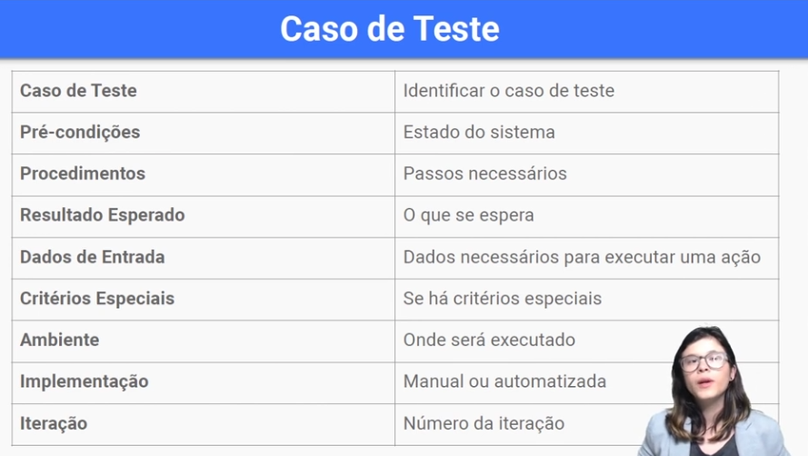
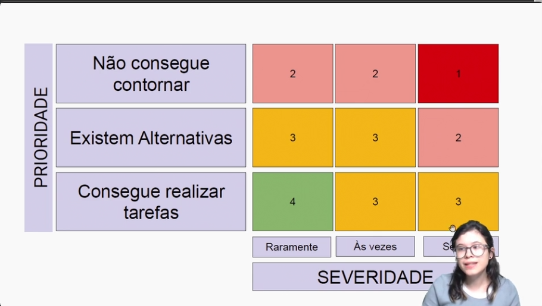

# Test Plan

BDD -> DADO, QUANDO, E, ENTAO 



## Exemplo de BDD

Durante essa aula, nós criamos um dos cenários de testes para a funcionalidade de Login. Para isso, utilizamos a metodologia BDD - Behavior Driven Development (Desenvolvimento Guiado por Comportamento).

Qual dos seguintes cenários está correto, de acordo com a semântica do BDD, para cenário de tentativa de Login com a senha incorreta?

```bdd
Dado que eu tenho um usuário no sistema 
Quando digitar meu username
E uma senha incorreta para meu usuário
E clicar no botão confirmar 
Então devo receber uma mensagem de usuário e/ou senha incorretos.
```

Resposta correta! A semântica para estruturar esse cenário de teste é utilizando as palavras chaves Dado, Quando e Então da seguinte maneira:

Dado: Quais pré-condições devem ser verdadeiras para que eu execute o teste? Quando: Qual ação será executada no sistema que fornecerá o resultado validado? Então: De acordo com a ação disparada qual o resultado esperado?

Documentacao de testes 

Comportamentos esperados - Verificacao - Criterio de aceite

## QA

Papel de fazer testes -> debug e olhar logs -> gestao de erros anotar os erros q ocorreram e garantir que nao acontecam mais (criticidade)

Com base no que estudamos sobre qualidade e metodologias de desenvolvimento, qual é o papel de um QA (Quality Assurance) em metodologias ágeis?

Alternativa correta
Participar de todo o processo de produção, visando prever defeitos e melhorar a qualidade do produto. Ser um disseminador das metodologias de testes e ferramentas e cultura de qualidade.

Resposta Correta. Em times ágeis o QA participa de todo o processo e, quanto antes achar o erro, mais barato para o time corrigir.

### QA no agile

Planejamento -> ciclo de design, build e teste -> planejamento e deploy -> ciclo de design, build e teste ...

### Criterios de aceite

Os criterios de aceite sao listas para se aprovar os testes e nao necessariamente eles sao atributos funcionais do sistema (que o sistema possa agir sobre), entao um criterio de aceite pode ser

- O nome e a senha devem ser origatorios (isso eu posso ter alguma funcao ou parte do sistema que me obriga desse comportamento)

- O sistema deve funcionar em todos os navegadores (nao funcional, afinal como se garante isso uashuahsa mas eu posso rodar um crawler que testa a aplicacao em todos os browsers para garantir)

Criterios de aceite nao devem refletir gostos pessoais de quem esta validando o sistema, como o sistema e bonito (isso eu nao posso metrificar e e relativo)

### Definicoes de pronto (para ir pra prod)

Sera considerada pronta as funcionalidades que passarem pelas verificacoes e testes descritas nestes test plan, nao apresentarem bugs com a severidade acima de minor e passarem por uma validacao de negocio de responsabilidade do time de produto

## Gesta de Erros

Bug -> testar um sistema e verificar que tem algo errado mesmo com o sistema estando aparentemente ok

A gestao de erros pode servir inclusive para prever erros e fazer com que ele nao ocorra 

Sobre o custo para corrigir um Bug/Defeito:

Aumenta à medida que caminhamos na direção de entrega de um produto.


Resposta Correta! Quanto mais próximo da versão final, mais tempo é investido e, muitas vezes, é difícil de diagnosticar o problema.

### Reporte de bugs

Um documento com algumas caracteristicas tais como:

- Resumo: Sistema nao bloqueia login ao digitar senha errada 3 vezes
- Descricao: Foi digitado o usuario e a senha marina mas com uma senha errada, e puder fazer isso umas 10 vezes, isso e um problema de seguranca
- Versao: 1.5 (a versao q encontra o bug, na versao 1.3 poderia nao ter esse erro e na 1.6 pode ser q ja se tenha corrigido)
- Plataforma: Aplicativo e desktop
- Detalhe da plataforma: navegador tal, ou tipo de versao do android e coisa do tipo

Dica: seja especifico e nao desrespeite ninguem

### Classificacao de bugs



Na coluna da esquerda e a prioridade pro cliente e na de baixo a severidade do problema, ou seja se eu nao consigo contornar esse problema e isso sempre acontece, entao ele e muito critico

Essa tabela nao e a unica forma mas ajuda a pensar

Niveis de severidade

Blocker -> bug que bloqueia o teste da funcao ou feature, crash a aplicacao, botao q clica e nao funciona acabando com a funcionalidade

Critical -> Funciona muito mal, inputs que crasham ou casam efeitos irreversiveis

Major -> Feature nao atinge certos criterios de aceitacao mas a funcionalidade nao e afetada, mensagem de erro nao sendo exibido, inout incomum causa efeitos indesejados mas de facil concerto

Minor -> Quase nenhum impacto na feature mas e um erro aceitavel, erro ortografico, pequeno erro de UI (espacamento, borda reta enquanto devia ser arredondado)

## Estrategia de teste

Arquitetura do sistema -> framework utilizado para a implementacao do front-end e react, angular, svelte, ela possui uma arquitetura orientada a componentes?

O back usa rest? graphql? retorna json? Isso importa no comeco da estrategia de testes

### Escopo de testes

Um exemplo abaixo

O plano de testes abrange todas as funcionalidades descritas na tabela acima esse plano de testes exclui a funcionalidade de upload

Testes unitarios -> o codigo tera uma cobertura de 60% de testes unitarios que sao de responsabilidade dos desenvolvedores.

Testes de integracao: serao executados testes de integracao em todos os endpoints e esses testes serao de responsabilidade do time de qualidade

Testes automatizados: serao realizados testes end-to-end na funcionalidade login

Testes manuais: todas as funcionalidades serao testadas manualmente pelo time de qualidade sequindo a documentacao de cenarios de testes e deste testplan

Versao beta: sera lancada uma versao beta para 20 usuarios pre cadastrados antes do release

### Ambiente e ferramentas

Os testes serao feitos do ambiente de homologacao e contrem as mesmas configs do ambiente de producao com uma massa de dados gerada previamente pelo time de qualidade

Ferramentas

Postman - qualidade - ferramenta para realizacao de testes de API

Jasmine - desenvolvimento - framework utiliada para testes unitarios

Selenium - qualidade - ferramenta para testes end-to-end

A melhor definição do objetivo do Teste de Aceitação é:

Garantir que o software esteja fazendo exatamente aquilo que foi solicitado nos requisitos de negócio.


Resposta Correta. Garantir que nenhuma informação foi perdida e que estamos fazendo o software certo é o objetivo do teste de aceitação.

### Testes relacionados a mudanca

Uma nova feature afeta uma parte do sistema, mas nao ele todo, entao novos testes serao colocados onde ele afetar e nao no sistema todo

Teste de regressao -> garantir que todos as features relacionadas a aquele epico estao passando

### Mais tecnicas de teste

Além do que já vimos, existem outras técnicas para executar testes no nosso sistema. Por exemplo, temos algumas especificações no cadastro de número máximo e mínimo de caracteres. Na senha, o mínimo é oito e o máximo é dezoito. Se eu digitar mais ou menos, ele não vai deixar fazer o cadastro.

[00:53] Podemos fazer a mesma coisa com o usuário. É importante ter esses máximos para não colocar um nome muito grande e sem sentido.

[01:13] Quando testamos, podemos colocar vários valores. Eu poderia escolher qualquer e-mail, nome de usuário, etc. É uma boa prática testar o valor máximo e mínimo, porque sempre que tiver um valor muito grande a chance de dar problemas é maior. Se colocarmos um valor mínimo, precisamos checar se está certo. Isso é um teste de limite.

[02:07] Outra técnica de teste que temos é o teste de estado. É quando temos um estado, um comportamento, algo acontece e esse sistema vai para o estado dois, ele deixa de fazer aquele comportamento, sofre uma ação e passa a fazer outro comportamento. Podemos usar isso na funcionalidade de curtir fotos, em que o botão pode ficar colorido quando clicado.

Quando se tem um campo temos varios valores possiveis, e pra isso podendo limitar o tamanho de caracteres, nos temos o teste de limite

Nesse teste testamos o valor inicial o do meio e o final

### Estimativa 

[00:00] Uma coisa importante para sabermos quando trabalhamos em projetos de software é quanto tempo vamos levar para fazer cada teste. Se existe uma estimativa de tempo. Nos testes que fizemos no login, é bem rápido. Não demora nem dois minutos. No Testplan, vemos que não temos muitos testes também.

[00:41] Mas como fazer isso para todo o sistema e o que temos que considerar quando fazemos essa estimativa? Para falar de estimativa de testes, precisamos saber no mínimo quanto tempo vamos demorar para fazer cada teste, quantos casos temos, qual o tamanho do sistema.

[01:21] Além disso, é importante considerar a complexidade do sistema e o domínio das pessoas que vão fazer esse teste. O conhecimento sobre as regras de negócio do sistema, quantidade de documentação. Se tem muitas regras e fluxos, provavelmente vai demorar muito mais do que um sistema mais simples. E também as ferramentas. Vamos poder utilizar ferramentas para ajudar? Vamos ter ferramentas difíceis de usar? São coisas que consideramos para fazer essa estimativa.

[02:13] Quando falamos de estimativa, também é importante considerar a quantidade de bugs e o retrabalho que você vai ter. Colocando no papel, cria-se um cronograma e você pode dar uma boa estimativa para as pessoas.

https://caelum-online-public.s3.amazonaws.com/1319-fundamentos-qa/Fundamentos+Quality+Assurance_+TestPlan+e+boas+praticas+-+TestPlan+AluraPic.pdf
