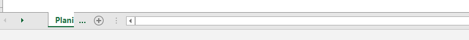

# Excel

A intenção é fazer parecer com que o Excel não tenha cara de excel, é a pessoa que está ali olhar e falar, puxa isso não parece Excel.

## Dicas Gerais

Clicar na coluna e apertar CTRL+SHIFT+ direita- seleciona todas as colunas até a última coluna XFD. Assim como se clicarmos em uma linha e apertar CTRL+SHIFT+baixo selecionamos todas as linhas para baixo que é a linha A1048576.

Ocultar as células deixa a apresentação da planilha melhor, só clicar com o botão direito e ocultar, assim como limpar as grades com Exibir> Desmarcar Linhas de Grade

Aonde tem os botões de fechar, minimizar e ampliar e minimizar a janela tem também uma guia

Para criar um botão simples basta selecionar uma forma e inserir uma imagem depois agrupar, depois para mover entre planilhas basta linkar, colocar nesse documento e selecionar a planilha que você quiser. Basta olhar a planilha Pasta3.

Você pode esconder o nome das planilhas (na parte de baixo da planilha) ao passar o mouse nos três pontinhos e arrastar a barra de navegação da seguinte forma:

