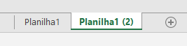
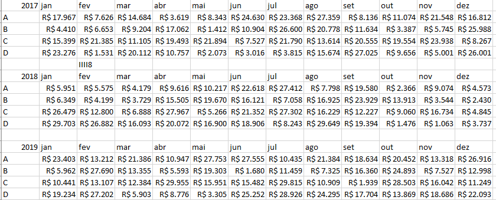
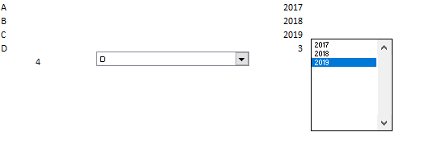

# Excel

A intenção é fazer parecer com que o Excel não tenha cara de excel, é a pessoa que está ali olhar e falar, puxa isso não parece Excel.

## Dicas Gerais

Clicar na coluna e apertar CTRL+SHIFT+ direita- seleciona todas as colunas até a última coluna XFD. Assim como se clicarmos em uma linha e apertar CTRL+SHIFT+baixo selecionamos todas as linhas para baixo que é a linha A1048576.

Ocultar as células deixa a apresentação da planilha melhor, só clicar com o botão direito e ocultar, assim como limpar as grades com Exibir> Desmarcar Linhas de Grade

Aonde tem os botões de fechar, minimizar e ampliar e minimizar a janela tem também uma guia

Para criar um botão simples basta selecionar uma forma e inserir uma imagem depois agrupar, depois para mover entre planilhas basta linkar, colocar nesse documento e selecionar a planilha que você quiser. Basta olhar a planilha Pasta3.

Você pode esconder o nome das planilhas (na parte de baixo da planilha) ao passar o mouse nos três pontinhos e arrastar a barra de navegação da seguinte forma:

Apertando  CRTRL e depois clicanda na planilha (na parte de baixo na guia de planilhas) eu consigo replicar a mesma planilha deixando da seguinte forma:

## Gráficos

Você deve ter uma planilha de dados tal como na imagem abaixo

Você vai para uma nova planilha de gráficos e vai inserir um novo gráfico de linha, lá você seleciona o eixo y Como sendo os dados de A e B com os dados de um ano qualquer e pro eixo x você seleciona os meses.

Formas de deixar o gráfico mais visual

- Tirar as linhas do gráfico, clica onde está os gráficos e aparecerá umas bolas azuis em casa linha clica em uma deles e aperte DELETE

- Tirar o contorno da forma ao clicar no contorno da forma, aba formatar e tirar o contorno em estilos de forma

## Controles

Para habilitar os botões você tem que habilitar o modo de desenvolvedor e para isso voê vai em Arquivos>Opções> Barra de Ferramentas de Acesso Rápido e vai marcar a opção desenvolvedor, nela nós poderemos habilitar macros e botões.

Nisso nós podemos clicar na guia desenvolvedor e depois inserir controles para a nossa planilha, inicialmente vamos ver os controles de formulários apenas.

Clique em caixa de combinação e selecione uma área, depois clique em formatar controle e selecione as marcas que queremos e em vínculo de controle clique numa célula qualquer e que seja fácil de lembrar. A mesma lógica para caixa de listagem o que nos deixa com a seguinte coisa:

Para criar uma célula que dependa do nome de A,B,C e D eu crio uma célula com a fórmula índice , onde a matriz será A,B,C e D e o controle da linha será a que está apontando para o número 4.

Fórmula, clique na célula com a fórmula e aperte F2 para ver a fórmula, para trancar a célula ao arrastar para a direita ou para baixo uma célula com fórmula aperta F4, assim a célula que tem que ficar fica vai ficar fixa e não ser adicionado 1 linha ou 1 coluna na hora do arraste.)
