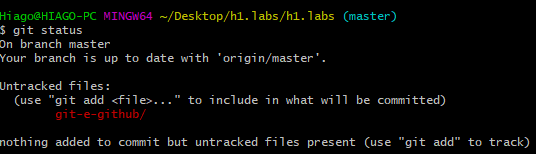
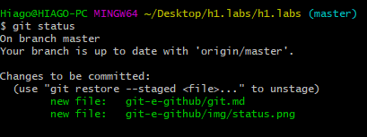
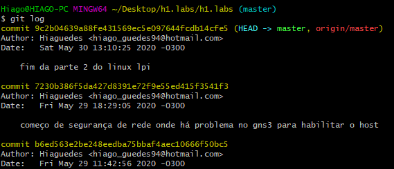
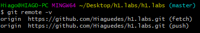
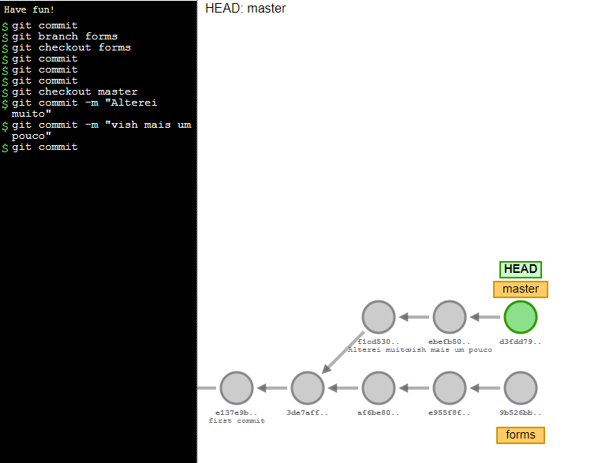
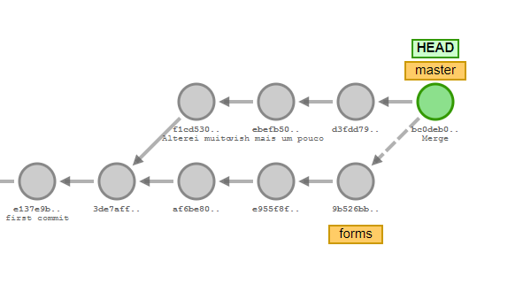
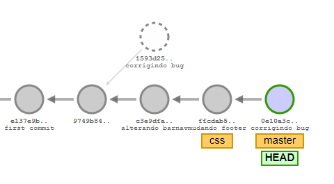
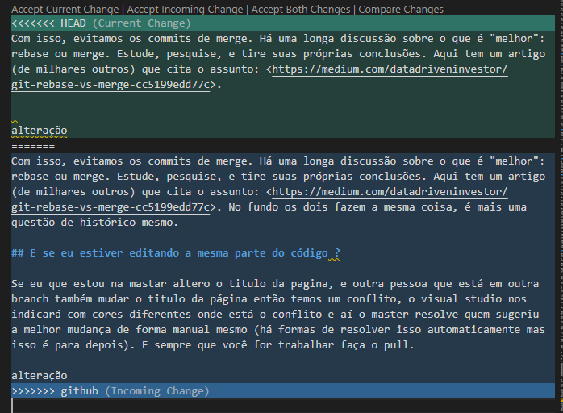
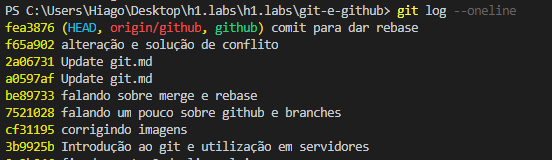
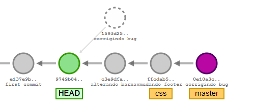

# Git e Github

O git é um sistema de controle de versões (version control system em inglês ou VCS), e é feito para que as pessoas consigam mandar seus projetos e códigos para um servidor remoto e as pessoas que estiverem trabalhando nele tem que sempre ter a versão mais atual do código na sua máquina.

Além do git existe o mercurial, o CVS e o SVN que também fazem esse trabalho para a gente e o git é o mais popular.

- O Git permite que a gente armazene as modificações feitas em cada arquivo em um servidor próprio para isso. Toda a gestão de alterações é feita pelo Git e nós só precisamos nos preocupar em criar código que funciona, e não em quem alterou o que antes.

- Cada alteração que você faz fica gravada em um histórico, podendo ser visualizada e restaurada a qualquer instante.

 Algumas distribuições linux ja vem com o git integrado, mas no windows tem que baixar no site do `git`. O melhor a se usar quando se instala é o git bash. O git bash tem  mais a cara do terminal do linux no windows.

 No ubuntu basta digitar no terminal:

 ```git
apt-get install git
 ```

Para outras distros basta ver:  <https://git-scm.com/download/linux>

Para ver a versão do git instalada nós fazemos:

```git
git --version
```

## Repositórios

Repositórios são pastas onde o github pode começar a identificar o projeto e para iniciar um repositório github eu vou na pasta onde o projeto está (com `cd %pasta%`) e escrevo

```git
git init
```

Para visualizar informações de alteração naquela pasta eu faço com:

```git
git status
```

Como pode se ver na figura abaixo:



Que mostra que criamos o arquivo na pasta git-e-github e que ela ainda não foi comitada. E estamos no master, ainda não tem nenhuma ramificação na pasta

## Salvando alterações

O bash do git nos indica que temos um track que não foi adicionado na pasta específica para isso nós damos

```git
git add <nome do aquivo com extensão>
```

Caso tivesse um monte de arquivos eu faria

```git
git add .
```

Isso muda nossa bash para



E esse add dura enquanto o arquivo não tenha sido modificado

E para que as outras pessoas saibam o que você mudou naquele arquivo eu faço um commit e nele eu digo o que eu mudei ou adicionei naquele repositório fazendo

```git
git commit -m "Mensagem de alteração"
```

Essa mensagem de alteração deve ser descritiva, e de preferencia não muito longa pois afinal ela não é uma documentação e sim somente uma alteração que pode ser alterada, apagada ou aprimorada por qq um do projeto. O git consegue saber quantas linhas foram inseridas e/ou apagadas.

Para que o git saiba quem é você faça:

```git
git config --local user.name "Seu nome aqui"
git config --local user.email "seu@email.aqui"
```

Apenas para esclarecer um pouco, visto que entenderemos melhor o funcionamento do Git durante o treinamento, seguem algumas definições interessantes:

- `HEAD`: Estado atual do nosso código, ou seja, onde o Git nos colocou
- `Working tree`: Local onde os arquivos realmente estão sendo armazenados e editados
- `index`: Local onde o Git armazena o que será commitado, ou seja, o local entre a working tree e o repositório Git em si.

## Histórico

Para ver o histórico das alteração eu digito

```git
git log
```



E nele eu vejo email, o nome do autor, a data de alteração e o local do commit, tal como anotações e coisas a mais desde a criação do repositório, enter para ir vendo linha a linha e espaço para ir mais rápido.

A estrutura de um comit é dada da seguinte forma:

```git
commit 4409f64f4d497e0b7500af4876f3c43c21864033 (hash único e proprio para cada commit) [opcional o branch tal como HEAD->master, origin/master que é a posição onde esse commit se encontra]
Author: Hiaguedes <hiago_guedes94@hotmail.com> (autor e nome do autor)
Date:   Tue Jul 30 22:12:14 2019 -0300 (data de alteração)

    JS introducao (propósito do commit, mensagem que você escreve com o propósito de informar outras pessoas o que você fez ali)

```

Outros logs podem ser dados como:

```git
git log --oneline (para dar informações resumidas dos commits em uma única linha)
git log -p (para ver o que foi modificado de fato)
git log --pretty=format"%H %s" (printo somente o hash e a mensagem do commit)
```

Algumas outras opções podem ser vistas em <https://devhints.io/git-log>, ou saiba mais digitando `git log --help`

## Ignorando arquivos

Pode acontecer de adicionarmos arquivos em uma pasta local e não queremos que esse arquivo seja monitorado, como um arquivo de configuração ou coisas do tipo, como fazer com que o git ignore isso.

O git quando você dá um init no seu repositório ele cria um arquivo de texto chamado .gitignore ou se não existe ele pode passar a ter e para isso você cria ele e depois adiciona e comita ele com as pastas e arquivos que você quer que o git ignore.

### Um passo a passo para adicionar arquivos no gitignore

1) No terminal (ou Git Bash, no Windows) navegue até a pasta recém criada (utilize o comando cd para navegar entre pastas);

2) Execute o comando git add index.html para marcar o arquivo para ser salvo (commitado);

3) Execute git status e confira que o arquivo agora mudou de estado e está pronto para ser salvo (commitado);

4) Após adicionar, execute o comando git commit -m "Criando arquivo index.html com lista de cursos". Sinta-se à vontade para alterar a mensagem de commit, se desejar;

5) Altere o arquivo index.html. Adicione o acento em "Integração Continua", por exemplo;

6) Adicione o arquivo para ser salvo, com git add .;

7) Execute o comando git commit -m "Acento adicionado no curso de Integração Contínua". Sinta-se à vontade para alterar a mensagem de commit, se desejar;

8) Execute o comando git log e analise a sua saída. Execute também git log --oneline, git log -p e outras alternativas que quiser testar;

9) Crie um arquivo vazio com o nome que quiser, por exemplo, ide-config;

10) Crie o arquivo .gitignore e adicione uma linha com o nome do arquivo recém-criado (ide-config, no exemplo acima);

11) Execute git status e verifique que o arquivo ide-config não está na lista para ser adicionado;

12) Adicione (com git add .gitignore) e realize o commit (com git commit -m "Adicionando .gitignore") o arquivo .gitignore.

## Dicas de Commit

Nunca comite coisas que não funcionam, a dica é a cada alteração válida e significativa faça um commit. A cada bug corrigido, ou  adicionamento significativo que melhore o sistema você faça o commit no projeto. Também não é legal que se faça um commit de tudo.

## Adicionando um servidor remoto

Para adicionar um servidor remoto eu posso adicionar um link da web (como o do github ou de qualquer outro site, no caso vamos focar somente em servidores empresariais que é o propósito inicial do git), ou de uma pasta no meu computador ou de qualquer outro computador na qual que consiga me comunicar.

```git
git init --bare
```

Com este comando nós criamos um repositório que não terá a working tree, ou seja, não conterá uma cópia dos nossos arquivos. Como o repositório servirá apenas como servidor, para que outros membros da equipe sincronizem seus trabalhos, poupamos espaço de armazenamento desta forma.

Para adicionar esse repositório remoto eu faço:

```git
git remote add local C:/Users/Hiago/Documents/git-e-github/servidor
```

Onde local é o nome do repositório remoto na minha máquina e que pode ser qualquer coisa.

Uma forma de inicializar um servidor remoto é com:

Lembrando que pode ser uma URL



Fetch eu busco as informações de lá e push eu jogo as informações para lá também, esses locais podem ser diferentes mas não é o caso. Então para pegar a pasta de um servidor remoto eu coloco:

```git
git clone <endereço do repositório onde a partição deve ser escrita como /c/Caminho> <nome da pasta que você quer dar no seu comoutador>
```

## Empurrando dados pro servidor remoto

Para que todas as pessoas possam ver minhas contribuições dentro de um servidor remoto eu devo empurrar esses arquivos para lá e para isso eu faço

```git
git push <para o servidor> <master ou branches>
```

E para outra pessoa trazer esses dados pro computador dela ela terá que fazer:

```git
git remote rename origin local
git pull local master
```

Sobre branches isso vai ser discutido em outro arquivo

## Github

O github é um servidor dedicado para você que quer fazer um projeto e por um acaso não tem um servidor dedicado para isso (maioria de nós). E esse site é bem legal pois no site você pode adicionar colaboradores ao seu projeto e ver em interface gráfica outras coisas também.

Por padrão o servidor do github é chamado como origin e é bom manter todo mundo com o mesmo nome para que as coisas fiquem mais alinhadas.

### Exercício

1) Crie uma pasta nova em seu computador;

2) No terminal (ou Git Bash, no Windows) navegue até a pasta recém criada (utilize o comando cd para navegar entre pastas);

3) Execute o comando git init --bare;

4) Navegue até a pasta onde se encontra o seu projeto;

5) Execute o comando git remote add local {caminho}. Substitua {caminho} pelo caminho completo da pasta recém criada;

6) Crie uma nova pasta em seu computador, para representar o trabalho de outra pessoa;

7) No terminal (ou Git Bash, no Windows) navegue até a pasta recém criada;

8) Execute o comando git clone {caminho} projeto. Substitua {caminho} pelo caminho completo da pasta que criamos no primeiro passo;

9) Observe que o repositório clonado está vazio;

10) Execute o comando 'git remote rename origin local' para renomear o repositório local da outra pessoa de "origin" para "local";

11) Navegue até a pasta onde se encontra o seu projeto original;

12) Execute o comando git push local master para enviar as suas modificações para o seu servidor;

13) Navegue até a pasta criada no passo 6;

14) Execute o comando git pull local master para baixar as modificações;

15) Abra o seu navegador e acesse <http://github.com/>

16) Crie uma conta;

17) Crie um novo repositório, clicando no símbolo de adição no canto superior direito;

18) No terminal (ou Git Bash, no Windows) adicione, ao seu projeto inicial, o repositório remoto recém criado (os comandos são mostrados pelo próprio GitHub);

19) Execute git push origin master para enviar as suas alterações para o repositório no GitHub.

## Branches

Branches ("ramos") são utilizados para desenvolver funcionalidades isoladas umas das outras. A branch master é a branch "padrão" quando você cria um repositório.

É interessante separar o desenvolvimento de funcionalidades em branches diferentes, para que as mudanças no código para uma não influencie no funcionamento de outra.

Nesta aula, entenderemos melhor como trabalhar com estes ramos, mas é muito importante que você entenda seu propósito.

Pra que não aja conflito entre pessoas trabalhando em um código eu crio uma ramificação do código e informo que aquele branch está servindo para que eu posso trabalhar em um trecho específico do meu código com

```git
git branch <nome>
git checkout <nome>
```

Com isso eu estou totalmente voltado para a ramificação e não no principal

O comando chechkout serve para eu possa justamente alterar meu desenvolvimento de modo a atuar somente na branch titulo que eu criei na primeira linha

Isso faz com que eu crie diferentes linhas de desenvolvimento



Onde eu tenho uma linha que é a master e a outra que é a forms.

Um comando direto para eu criar a branch e já passar para ela é com

```git
git checkout -b <nome>
```

Onde o comando `checkout` muda nosso `HEAD` nos fazendo olhar diretamente para o branch que criamos

Onde normalmente se trata a branch master como a principal, onde no final tudo deverá estar aqui, como junto tudo? Como mesclo essas informações

Com isso eu vou para a branch master e dou um

```git
git checkout master
git merge <nome da branch>
```



Isso cria um commit de merge no nosso projeto

Uma forma mais limpa de fazer essa mescla é trazer os commits da branch para antes do commit com a brnach master e para isso eu faço

```git
git checkout master
git rebase <nome da branch>
```

A visão é essa



O flow foi esse

```git
git commit
git branch css
git checkout css
git commit -m "alterando barnav"
git commit -m "mudando footer"
git checkout master
git commit -m "corrigindo bug"
git rebase css
```

E com isso eu coloquei todos os commits da branch css para trás da git commit e juntei tudo em uma linha de desenvolvimento só.

Com `git log --graph` eu consigo ver via terminal as linhas de desenvolvimento do meu projeto

Com isso, evitamos os commits de merge. Há uma longa discussão sobre o que é "melhor": rebase ou merge. Estude, pesquise, e tire suas próprias conclusões. Aqui tem um artigo (de milhares outros) que cita o assunto: <https://medium.com/datadriveninvestor/git-rebase-vs-merge-cc5199edd77c>. No fundo os dois fazem a mesma coisa, é mais uma questão de histórico mesmo, pois a branch com o rebase some.

## E se eu estiver editando a mesma parte do código ?

Se eu que estou na mastar altero o titulo da pagina, e outra pessoa que está em outra branch também mudar o titulo da página então temos um conflito, o visual studio nos indicará com cores diferentes onde está o conflito e aí o master resolve quem sugeriu a melhor mudança de forma manual mesmo (há formas de resolver isso automaticamente mas isso é para depois). E sempre que você for trabalhar faça o pull.



E escolho a melhor mudança (ao menos no visual code que é a incomming change, a change vinda da branch github é melhor)

### Exercício

Vimos como é simples resolver conflitos identificados pelo Git ao tentar realizar o merge.

Agora, gere um conflito e, ao invés de utilizar o merge, utilize o rebase para atualizar o master:

- Vá para a branch titulo

- Commite algo

- Vá para a branch master, commite uma alteração na mesma linha

- Execute git rebase titulo

Veja a saída do Git e utilize as informações que ela te der para, após corrigir o conflito, continuar o rebase.

## Como desfazer uma mudança

Para desfazer uma alteração no arquivo eu escrevo:

```git
git checkout -- <nome do arquivo com extensão>
```

Isso é, eu alterei o arquivo e dei add, eu posso desfazer-lo com esse comando

Agora eu dei commit mas quero desfazer-lo

```git
git reset HEAD -- <nome do arquivo com extensão>
```

Agora para retirar o commit

```git
git revert <hash do commit ou só os sete primeiros digitos do hash>
```

Isso é bom para reverter certas besteiras

## Salvando arquivo temporariamente para não comitar ele

Nem sempre eu quero dar commit em todas as coisas que eu alterei, então eu salvo ele temporariamente, faço alterações em outras linhas comitto essas outras linhas e ai sim eu me certifico de que o código que upei está ok então para isso eu uso o stash.

```git
git stash
```

Sem adicionar o arquivo

```git
git commit <outras alterações>
```

E agora não retirar ele da stash para ai sim poder adicionar e comitar

```git
git stash list (para ver as stashs armazenadas)
git stashp pop
```

Isso faz com que tenhamos o arquivo para ser adicionado de novo.

Quando precisamos pausar o desenvolvimento de alguma funcionalidade, ou correção, antes de finalizar, talvez não seja interessante realizar um commit, pois o nosso código pode não estar funcionando ainda. Nesse caso é interessante salvar o trabalho para podermos voltar a ele depois.

## Navegando entre commits

Entenda o comando checkout como um navegador (navegador de branchs, de commits, de estados), então se um commit tem um identificador o seu hash então

```git
git checkout <hash do commit ou os sete primeiros digitos>
```



ao dar o checkout no commit ele não está em nenhuma branch nem nada o head fica somente no commit em questão



E se eu quiser eu posso criar um novo branch a partir desse comit com `git checkout -b <nome de branch>`

E depois se eu quiser voltar a linha de desenvolvimento original eu dou um rebase com `git rebase master`

A descrição do comando git checkout --help, em uma tradução livre é: "Atualizar os arquivos na working tree para ficarem na versão especificada. [...]". Basicamente, podemos deixar o nosso código no estado do último commit de uma branch, de um commit específico, ou mesmo tags (que veremos adiante).

### Aprendizado

Nesta aula, aprendemos:

- Que o Git pode nos ajudar a desfazer alterações que não vamos utilizar;

- Que, para desfazer uma alteração antes de adicioná-la para commit (com git add), podemos utilizar o comando `git checkout -- <arquivos>`;

- Que, para desfazer uma alteração após adicioná-la para commit, antes precisamos executar o `git reset HEAD <arquivos>` e depois podemos desfazê-las com `git checkout -- <arquivos>`;

- Que, para revertermos as alterações realizadas em um commit, o comando `git revert` pode ser a solução;

- Que o comando `git revert` gera um novo commit informando que alterações foram desfeitas;

- Que, para guardar um trabalho para retomá-lo posteriormente, podemos utilizar o `git stash`;

- Que, para visualizar quais alterações estão na stash, podemos utilizar o comando `git stash list`;

- Que, com o comando `git stash apply <numero>`, podemos aplicar uma alteração específica da stash;

- Que o comando `git stash drop <numero> remove` determinado item da stash;

- Que o comando `git stash pop` aplica e remove a última alteração que foi adicionada na stash;

- Que o git checkout serve para deixar a cópia do código da nossa aplicação no estado que desejarmos:

- `git checkout <branch>` deixa o código no estado de uma branch com o nome `<branch>`;

`git checkout <hash>` deixa o código no estado do commit com o hash `<hash>`.

## Gerando entregas com o git

Ver alteração de um commit para o outro

```git
git diff <numero do hash inicial>..<até o numero do hash final>
```

Somente escrevendo o comando `git diff` você ve o que foi alterado no arquivo mas que ainda não foi comitado

A partir de um determinado comitt eu tenho uma release do código, uma versão é um marco, uma tag onde eu tenho um código pronto e que funciona para isso eu crio uma tag

```git
git tag -a v0.1.0 "Versão beta da página"
```

Você pode escrever o qualquer coisa para representar a versão. E aí eu dou push nos repositórios, com a versão eu posso baixar um arquivo zipado com os arquivos que tem nessa versão

### Exercício Releases

1) Execute o comando git log -p para ver, junto a cada commit, as alterações nele realizadas;

2) Execute agora o comando git log --oneline;

3) Execute o comando git diff {hash do commit de merge com lista}..{hash do último commit realizado};

4) Execute alguma (pequena) alteração no index.html;

5) Execute o comando git diff e veja esta alteração;

6) Desfaça esta última alteração;

7) Execute o comando git tag -a v0.1.0 para criar uma tag no seu código;

8) Execute o comando git push origin v0.1.0 para enviar esta tag para o GitHub;

9) Abra a página do repositório do GitHub que você criou e confira a aba de Releases
