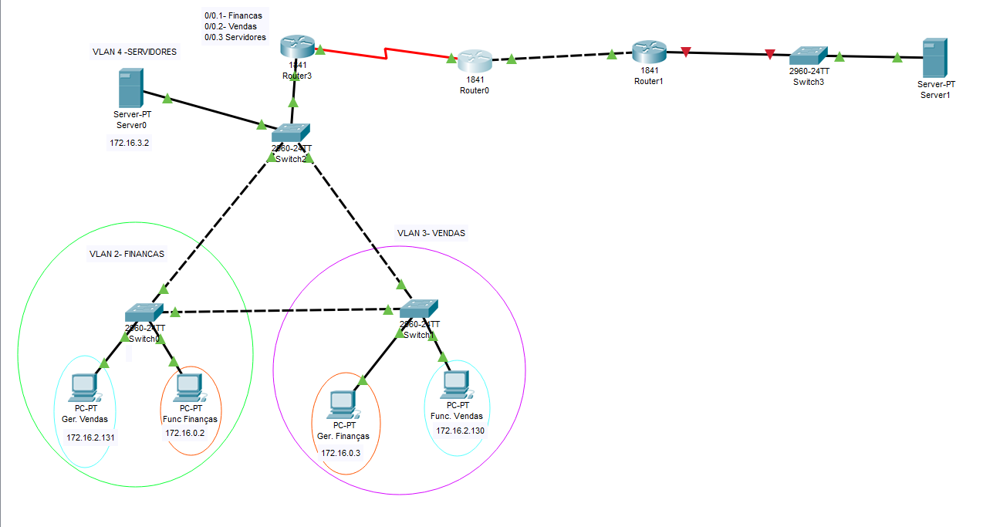
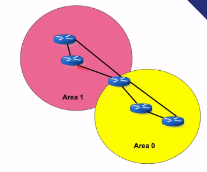
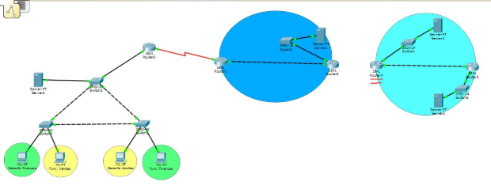

# Redes 4

Quando conectamos uma rede em um provedor de serviços acontece muita das vezes desse provedor ter redes muito extensas, percorrendo cidades e até mesmo estados para conectarmos todas as pessoas na nossa rede mundial chamada de internet. E para isso usamos a nomenclatura WAN (wide area network) diferente da rede lan (local area network) que é uma rede que pode estar no nosso domínio (empresarial ou domiciliar).

As redes LAN são redes geograficamente pequenas, que geralmente estão concentradas em apenas um local, tais redes são de responsabilidade do cliente final. As redes WAN são redes de longa extensão geográfica, redes de provedores de serviços costumam possuir suas redes em diferentes cidades e estados acomodando diversos clientes.

Então para simular a rede do provedor de serviços nós inicialmente fazemos a ligação da seguinte forma



E com isso habilitamos a sub rede desses dois roteadores com a mesma sub rede que eu criei da rede local com a do provedor, aproveitando o IP e a mascara de rede. No caso 150.1.1.5 255.255.255.252 para uma e 150.1.1.6 para a outra, lembrando de habilitar a conexão nas duas portas.

Coloco um ip para as interfaces dos roteadores e do server também, tudo em sub redes diferentes, e lógico que eu ainda não vou conseguir pingar de um dos computadores para o server lá na ponta.

Para isso nós precisamos ensinar nosso roteador a chegar naquele servidor

E com isso no roteador da empresa eu faço

```cisco
ip route 150.1.1.8 255.255.255.252 serial 0/1/0
```

Essa forma de habilitação de IP em um roteador é chamada de alocação estática de ip de roteamento

Pois é o ip de rede desse roteador com as demais. Só que ainda vai dar unreachavble , pois ele não conhece a rota para chegar no proximo roteador. Mas imagina né, configurar manualmente o caminho de um roteador ligado a mais outros 80 roteadores, não vai dar né. Tem como fazer isso automaticamente com o protocolo RIP.

### Exercício

Arraste para a área de trabalho um novo roteador modelo 1841, um Switch e um servidor. Conecte o servidor com o Switch e o Switch com esse novo roteador (conecte com a porta FastEthernet 0/1 do roteador) através do cabo direto e depois conecte esse novo roteador com o já previamente configurado usando um cabo crossover (use a porta FastEthernet 0/0 nos dois roteadores), no final devemos ter um cenário parecido com esse:
RIP

Agora precisamos configurar os endereços IP. Iremos adotar a sub-rede 150.1.1.4 255.255.255.252 entre os roteadores e a sub-rede 150.1.1.8 entre o roteador o Switch.

- Clique no roteador do provedor de serviços (o que está com a interface serial) e vá até a aba CLI

- Digite enable para entrar na parte privilegiada e na sequência digite configure terminal para entrar na parte de configuração. Entre na interface conectada ao segundo roteador, digitando interface FastEthernet 0/0 e em seguida habilite a interface digitando no shutdown

- Na sequência insira o endereço IP 150.1.1.5, digitando ip address 150.1.1.5 255.255.255.252

-Em seguida, clique no roteador interconectado com o Switch, vá até a aba CLI. Caso pergunte sobre a caixa de diálogos digite no, na sequência digite enable para entrar na parte privilegiada e depois configure terminal para entrar na parte de configuração.
Posteriormente entre na interface interconectada com o primeiro roteador, digite interface FastEthernet 0/0 e habilite a porta digitando no shutdown.

- Em seguida, insira o endereço IP para esse interface, uma vez que já usamos o endereço IP 150.1.1.5 na outra interface temos que escolher outro endereço IP disponível e o único outro endereço IP disponível nessa sub-rede seria o 150.1.1.6, então digitamos ip address 150.1.1.6 255.255.255.252

- Tente realizar o ping com a interface do outro roteador, digitamos: do ping 150.1.1.5. O ping deverá funcionar.

- Nesse mesmo roteador que está conectado com o Switch, saia da configuração da interface FastEthernet 0/0 digitando exit e depois entre na interface conectando ao Switch, digite: interface FastEthernet 0/1 e no shutdown para habilitar a porta
Na sequência, insira um endereço IP da sub-rde 150.1.1.8. Digitmos: ip address 150.1.1.9 255.255.255.252

- Por fim, clique no servidor -> Aba Desktop -> IP Configuration e insira o endereço IP 150.1.1.10, máscara 255.255.255.252 e default gateway como sendo o 150.1.1.9 (endereço IP da interface do roteador). Devemos ter a seguinte configuração:
servidor_RIP

- Tente realizar o ping entre o servidor e a interface do roteador, abra o Command Prompt do servidor e digite: ping 150.1.1.9. O ping deverá ser estabelecido com sucesso.

- Em seguida, configure a rota estática no roteador da Mutillidae digitando enable para entrar na parte privilegiada, configure terminal para entrar na parte de configuração e por fim ip route 150.1.1.8 255.255.255.252 serial 0/1/0
Por fim, tente desse servidor realizar o ping com a interface serial do Roteador da Multillidae, digite no command prompt do servidor: ping 150.1.1.2. Qual o resultado? Porque isso ocorre?

Resposta: Nós teremos uma resposta que o destino é inacessível. Isso acontece porque uma vez que o roteador receber esse pacote, o roteador irá procurar em sua tabela de roteamento como ele poderá chegar até a rede de destino, por padrão o roteador conhece as redes que estão diretamente conectadas as suas interfaces e sub-interfaces. Porém esse roteador interno do provedor de serviços não tem conhecimento sobre a sub-rede 150.1.1.0. Dessa forma, o roteador não sabe como entregar esse pacote e com isso teremos a mensagem de destino inacessível.

## RIP

Por terem dimensões muito longas os fornecedores de serviço acabam precisando ter uma série de roteadores ligadas uma após a outra, para que assim seja possível acessar um site da google por exemplo, e para não ficar alocando cada IP de forma manual em uma extensão geográfica extensa nós precisamos de um protocolo inteligentinho que faça isso.

Então supondo que temos dois roteadores que se comunicam por uma rede qualquer em uma interface tanto para um tanto para outra. Se um roteador conhece rotas específicas para 172.10.x.x e 172.11.x.x ele "fala" pro outro roteador que conhece essas rotas, então o outro roteador que conhece as rotas 10.0.x.x e 10.1.x.x "troca" a informação de que conhece essas rotas para o outro roteador.

Com isso fazemos nos dois roteadores

```cisco
Router#configure terminal
Router(config)#router rip
Router(config)#version 2
Router(config-router)#no auto-summary
Router(config-router)#network 150.1.1.4
Router(config-router)#network 150.1.1.8
```

Configuração feita para o router1 na imagem que conhecem os IPs de rede de comunicação com o server e com o roter0

É mais fácil fazer isso via interface gráfica, visitando o CLI so para mudar a versão do RIP (que trabalha com submascaras diferentes da padrão), e pro no auto-summary

E nisso os dois roteadores chegam numa rota comum para comunicação. no caso 150.1.0.0


Para verificar as rotas dos roteadores vemos em

```cisco
show ip rout
```

O rip funciona é bacana e bem didática, mas ela funciona para redes pequenas. Até por esse protocolo ser antiga.

O rip ele analisa quantos saltos eu terei que dar para chegar até meu destino então dada a situação abaixo


Mesmo que a rota da esquerda sendo mais rápida (porém passando por dois roteadores) ele preferirá passat pela rota de 10Mbps. Pois são menos saltos que a informação passa. E isso é ineficiente.

O protocolo de roteamento RIP é um dos mais antigos protocolos de roteamento e tem como métrica a quantidade de saltos (hops) para definir a melhor rota. O protocolo RIP vai definir como a melhor rota aquela onde apresentar a menor quantidade de saltos (hops) para chegar até o destino.

O protocolo RIP utiliza como métrica a quantidade de saltos (hops) para definir a melhor rota. Dessa forma, parâmetros como velocidade do link não é analisada por esse protocolo e com isso podemos ter a escolha de uma rota menos eficiente.

### Exercício

ós tivemos que o resultado do ping para a interface serial do roteador da Mutillidae não foi estabelecido com sucesso, isso porque os roteadores só conhecem por padrão as redes interconectadas em suas interfaces.

Devemos agora realizar a comunicação entre esses roteadores para que eles possam assim informar uns aos outros as redes que cada roteador conhece, iremos utilizar o protocolo RIP para realizar essa comunicação:

Vamos iniciar a configuração no primeiro roteador do provedor de serviços (o que possui interface serial com o roteador da Mutillidae):

- Clique no roteador e vá até a aba CLI. Na sequência, digite enable para entrar na parte privilegiada e depois digite configure terminal para entrar na parte de configuração.

- Devemos habilitar o protocolo rip, digitamos: router rip. Na sequência devemos informar que iremos usar a segunda versão do protocolo RIP, versão que trabalha com redes classless, digitamos: version 2

- Em seguida, informarmos ao RIP para considerar as sub-redes que criamos como sub-redes distintas e não faça um "resumo" entre elas pensando que são todas da mesma rede. Digitamos: no auto-summary

- Depois devemos informar as sub-redes que queremos divulgar através do protocolo RIP, iremos informar as duas sub-redes que esse roteador conhece, a sub-rede 150.1.1.0 e a sub-rede 150.1.1.4. Digitamos: network 150.1.1.0 e depois digitamos network 150.1.1.4.
A configuração do primeiro roteador foi realizada, devemos agora configurar o segundo roteador do provedor de serviços (o que está conectado com o Switch):

- Clique no segundo roteador e posteriormente digite enable para entrar na parte privilegiada e digite configure terminal para entrar na parte de configuração

- Devemos habilitar o roteamento rip, versão 2 porque estamos trabalhando com redes classless e devemos pedir para que o resumo não seja executado, digitamos: router rip, em seguida digitamos version 2 e depois digitamos no auto-summary

- Por fim, devemos informar as redes que queremos que esse roteador divulgue no protocolo RIP. Seria a rede 150.1.1.4 e a rede 150.1.1.8 que está conectada com o servidor. Digitamos network 150.1.1.4 e depois digitamos network 150.1.1.8

## OSPF

Para começar a ver esse protocolo de roteamento temos que montar o circuito abaixo


E para isso fazemos:

O primeiro provedor de serviços foi configurado com o protocolo RIP. Vimos algumas desvantagens que o protocolo RIP possui. Sabendo disso, vamos configurar a rede de um segundo provedor que irá trabalhar com o protocolo OSPF.

Arraste para a área de trabalho dois roteadores e interconecte os dois nas interfaces FastEthernet 0/0. Posteriormente conecte cada roteador a um Switch e cada Switch a um servidor. Teremos uma imagem parecida com o cenário abaixo:
rede_OSPF

Temos que agora configurar os endereços IP nessa rede.

- Clique no primeiro roteador desse segundo provedor de serviço, iremos colocar o endereço IP da interface interconectada com o servidor 170.1.1.0 e o endereço IP da interface interconectada com o outro roteador 180.1.1.0.

- Digite enable para entrar na parte privilegiada e na sequência digite configure terminal para entrar na parte de configuração. Na sequência entre na interface conectando ao servidor, digitando interface FastEthernet 0/1 e habilite a interface digitando no shutdown.

- Em seguida, configure o endereço IP 170.1.1.1, digitando: ip address 170.1.1.1 255.255.255.252

- Na sequência, saia da configuração dessa interface digitando exit e entre na interface interconectada ao segundo roteador, digitamos: interface FastEthernet 0/0 e habilitamos essa interface digitando no shutdown

- Devemos agora, inserir o endereço IP para essa interface, digitamos: ip address 180.1.1.1 255.255.255.252.

- Agora clique no primeiro servidor e insira o endereço IP 170.1.1.2, máscara 255.255.255.252 e default-gateway 170.1.1.1

- Abra a aba Command Prompt no servidor e depois tente realizar o ping para a interface do roteador, digitando: ping 170.1.1.1. A comunicação deverá ser estabelecida com sucesso.

- Clique agora no segundo roteador e vá até a aba CLI, entre na parte privilegiada digitando enable e posteriormente entre na parte de configuração digitando configure terminal

- Em seguida entre na interface conectada ao primeiro roteador, digitando: interface FastEthernet 0/0 e habilitamos a interface digitando: no shutdown.

- Em seguida devemos inserir o endereço IP para essa interface. Como o endereço IP 180.1.1.1 já foi usado na outra interface, só podemos escolher o endereço IP 180.1.1.2. Então digitamos ip address 180.1.1.2 255.255.255.252

- Depois precisamos configurar o endereço IP da interface conectado ao servidor, saímos primeiro da interface que estamos, digitando: exit

- Na sequência, entramos na interface conectada ao servidor, digitamos: interface FastEthernet 0/1 e na sequência habilitamos a porta digitando no shutdown

- Por fim, devemos inserir o endereço IP, colocamos ip address 190.1.1.1 255.255.255.252
Na sequência, devemos clicar no segundo servidor e colocar o endereço IP 190.1.1.2, máscara 255.255.255.252 e default-gateway 190.1.1.1

### Vantagens



O protocolo OSPF utiliza a velocidade do link como métrica para definição da melhor rota. A fórmula para o cálculo dessa métrica seria chamada de custo e utiliza a velocidade padrão de 100 Mbps dividida pela velocidade do link. Por exemplo, caso a velocidade do link seja de 10 Mbps nós termos o custo de 100 Mbps / 10 Mbps = 10, dessa forma quanto maior a velocidade do link menor será o resultado dessa divisão e consequentemente será uma rota melhor de acordo com o OSPF.

Uma das vantagens desse protocolo é que ele permite conectar áreas de conexões, pois imagine que você no Rio de Janeiro (área 0 e área principal) esteja conectando sua rede com Niterói (área 1) o protocolo OSBF consegue detectar se houve um desligamento de um desses roteadores e deixar somente com que a área 1 saiba disso, não precisando repassar essa informação para todo o sistema. Se uma área como Rio das Ostras quiser entrar nessa rede ela deverá ter uma conexão com o Rio de Janeiro de alguma forma.

Através da divisão por áreas conseguimos isolar possíveis problemas e instabilidades que possam ocorrer em uma área, não necessitando assim informar todos esses detalhes para outras áreas

O roteador que interconecta as áreas deverão ter um roteador com maior poder processamento que os marginais a ele, até por que ele estará lidando com duas áreas.

O OSPF trabalho com resumos, então quando um link cai na área 1 nós temos um resumo sendo gerado e compartilhado entre os roteadores da área 1 e assim sendo transmitidos para a área 0 em sequência.

Tanto o OSPF e o RIP são usados para intercomunicação dentro da mesma área mas nunca para uma área e um provedor de serviços.

IA (INTER AREA, áreas diferentes) O protocolo OSPF permite que tenhamos uma divisão de nossa rede separada por áreas, possuindo dentre outras vantagens a possibilidade de isolar possíveis problemas. Quando rotas são informadas de uma área para a outra damos o nome de inter area

#### Exercício

Devemos agora realizar a comunicação entre esses roteadores para que eles possam assim informar uns aos outros as redes que cada roteador conhece, usaremos para isso o protocolo OSPF.



Clique no primeiro roteador do segundo provedor de serviços
rede_segundo_provedor

- Em seguida vá até a aba CLI, digite enable para entrar na parte privilegiada e em seguida digite configure terminal para entrar na parte de configuração.
Devemos habilitar o protocolo OSPF, digitamos router ospf 1.

- Na sequência, devemos informar as sub-redes e os endereços IP das sub-redes que queremos divulgar com o protocolo OSPF, esse primeiro roteador tem conhecimento da sub-rede 170.1.1.0 e 180.1.1.0 e devemos divulgar os endereços IP dessas sub-redes. Digite network 170.1.1.0 0.0.0.255 area 0 e na sequência digite network 180.1.1.0 0.0.0.255 area 0

- Clique no segundo roteador do segundo provedor de serviços e vá até a aba CLI. Digite enable para entrar na parte privilegiada e na sequência digite configure terminal para entrar na parte de configuração.

- Devemos habilitar agora esse roteador para trabalhar com o protocolo OSPF, digitamos router ospf 1

- Devemos agora informar as redes que queremos divulgar no via protocolo OSPF, digitamos network 180.1.1.0 0.0.0.255 area 0 e o segundo servidor, vamos configurá-lo como estando presente na área 1. Digitamos network 190.1.1.0 0.0.0.255 area 1

- Volte ao primeiro roteador, certifique-se de estar na parte privilegiada. Caso esteja na parte de configuração, digite CTRL+Z e na sequência digite show ip route para verificar a tabela de roteamento. Qual o resultaodo? O roteador possui em sua tabela a rota para a sub-rede 190.1.1.0?

Faça o mesmo teste no segundo roteador, ele possui em sua tabela a rota para a sub-rede 170.1.1.0?

## BGP

Ficou faltando a conexão entre os dois provedores de serviço, um com protocolo RIP e outro com OSPF e o protocolo usado para conectar empresas diferentes é o BGP e toda provedora de internet (brasileira) tem a sua cadastrada em <https://bgp.he.net/country/BR>, toda empresa tem seu numero de sistema autonomo (autonomous system como a sumicity <https://bgp.he.net/AS28210>)

A internet seria formada por uma série de provedores de serviços informando as rotas que cada um conhece para outro provedor de serviço, essa comunicação feita entre vários provedores é normalmente feita pelo protocolo BGP

Os números de Autonomous System são números usados para identificar redes de provedores de serviços e que permitem que um provedor de serviço troque informações com outros provedores de serviços vizinhos.

E com esse protocolo eu interconecto duas provedoras de serviços, então mesmo que o google não esteja fazendo parta da telefônica eu consigo chegar lá passando de serviço em serviço.

Só que o protocolo BGP aprende as redes que estão somente interconectando duas provedoras, as marginais acabam não recebendo essas informações.

#### Exercícios

Devemos agora configurar o protocolo BGP nos dois roteadores interconectados com a rede do outro provedor. Vamos inicialmente configurar o roteador do primeiro provedor.

- Clique no roteador do primeiro provedor que está conectado com a rede do segundo provedor. Digite enable e na sequência digite configure terminal para entrar na parte de configuração

- Devemos informar qual será o Autonomous System desse provedor, iremos definir que o AS do primeiro provedor será 1.000 e o AS do segundo provedor será 2.000. Vamos habilitar o BGP e informar qual é o nosso número AS. Digitamos router bgp 1000
Na sequência temos que informar com quem estaremos nos conectando, devemos informar que será o endereço IP 160.1.1.2 que é o endereço IP do roteador que está na rede do segundo provedor. Digitamos: neighbor 160.1.1.2 remote-as 2000

- Vamos informar agora quais são as redes que vamos querer divulgar com o protocolo BGP. Digitamos: network 150.1.1.0 mask 255.255.255.252, na sequência digitamos network 150.1.1.4 mask 255.255.255.252 e por fim, digitamos network 150.1.1.8 mask 255.255.255.252

- Devemos fazer essa mesma configuração no roteador do segundo provedor que vai conectado a rede do primeiro provedor de serviços. Clique nele, digite enable e configure terminal para entrar na parte de configuração.

- Devemos habilitar o roteamento via BGP e informaremos que esse roteador possui número AS igual a 2000. Digitamos router bgp 2000

- Informarmos que esse roteador está conectado ao endereço IP 160.1.1.1 que é o endereço IP da interface do roteador do primeiro provedor de serviços. Digitamos neighbor 160.1.1.1 remote-as 1000

- Por fim, informamos quais as redes queremos divulgar via protocolo BGP. Digitamos network 170.1.1.0 mask 255.255.255.252, network 180.1.1.0 mask 255.255.255.252 e por fim a última rede a ser divulgada network 190.1.1.0 mask 255.255.255.252
Qual o resultado? Os roteadores conseguiram aprender as redes do outro provedor?

Dica: utilize o comando show ip route para ver as rotas aprendidas por cada roteador.

Os roteadores que se comunicam com a rede do outro provedor conseguiram aprender as redes divulgadas pelo protocolo BGP. Porém, os roteadores internos utilizam outro protocolo de comunicação (RIP no primeiro provedor e OSPF no segundo provedor). Devemos então distribuir essas rotas aprendidas pelo protocolo BGP para os protocolos de comunicação interna.

Iremos configurar essa redistibuição na sequência.

### Redistribuições de rotas

Os protocolos de roteamento são como se fossem idiomas, diferentes protocolos de roteamento não informam uns aos outros por padrão as rotas que cada um conhece

Agora temos que redistribuir as rotas nos provedores de serviço utilizando como base i fato que os roteadores entre os provedores estão com os endereços IP de todos os servers e caminhos.

Devemos agora fazer a redistribuição das redes aprendidas com o protocolo BGP para os roteadores que falam protocolo RIP e o protocolo OSPF.

- Clique no roteador do segundo provedor que está interconectado com a rede do primeiro provedor de serviços. Digite enable e configure terminal para entrar na parte de configuração. Na sequência, entre no protocolo ospf, digitando router ospf 1

- Devemos redistribuir as redes aprendidas pelo protocolo BGP, digitamos: redistribute bgp 2000 subnets

Uma vez configurada a redistribuição na rede do segundo provedor, precisamos configurar a redistribuição na rede do primeiro provedor. Clicamos no roteador do primeiro provedor que está interconectando com a rede do segundo provedor.

- Digitamos enable e na sequência digitamos configure terminal para entrar na parte de configuração

- Entramos na configuração do protocolo RIP, digitamos router rip

- No protocolo RIP não temos a opção de distribuir as rotas aprendidas via protocolo BGP, vamos então informar os demais roteadores que esse roteador interconectado com a rede do segundo provedor que ele é o ponto de saída da rede. Digitamos default-information originate

Clique em um dos servidores na rede do segundo provedor, abra o Command Prompt e digite ping 150.1.1.2 que é o endereço IP da interface do roteador da Mutillidae. Qual é o resultado?
