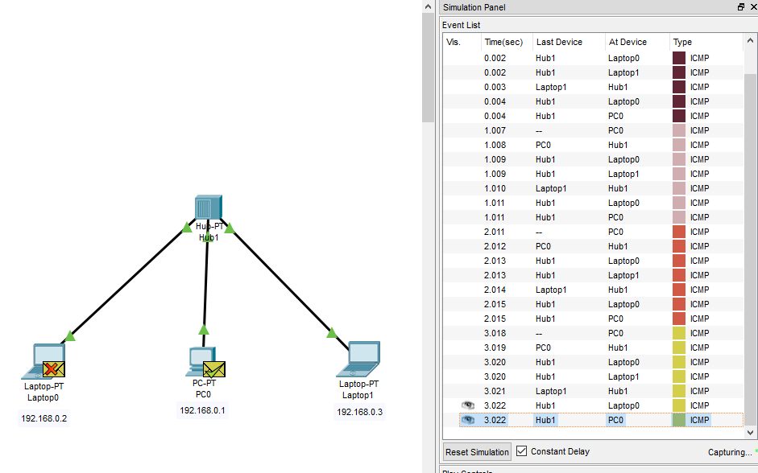
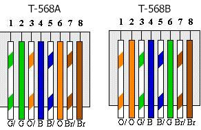
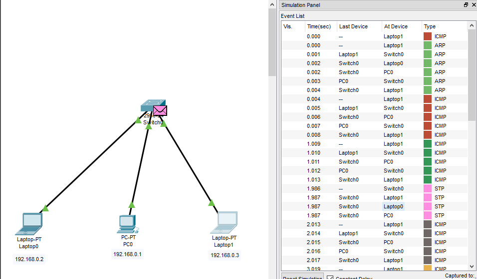

# Redes

Códigos úteis para o cmd do windows

```
ipconfig
```
* Endereço IPV4

Aparece rede de Virtual Box, Rede sem fio, Rede Ethernet

```
ping www.google.com
```

Nome do Protocolo: ICMP- o responsável por mandar uma requisição (Echo Request) para máquina remota e esperar um retorno dessa máquina remota (Echo Reply).

Dicas: não pode conter https:// e nem o nome do site /alguma coisa. Ele precisa ser www.qqcoisa.com ou .com.br

Dica para saber se tudo está bem com sua placa de rede

```
ping 127.0.0.1
ping ::1
```

Esse começo com 127. é reservado para testes como esse. E em específico esse IP é chamado de IP de loopback e pode ser visto em C:Windows/System32/drivers/etc/hosts e é o localhost da programação Web

* DNS (Domain Name Servers)- ele pega o nome do site (no caso o google) e transforma ele em número de endereço IPV4 (ou o IP da máquina) que é  172.217.30.100, inclusive se você pegar esse número e colar no navegador o navegador vai pro site do Google mesmo assim.


* tempo em milisegundos de uma informação genérica de 32 bytes sair daqui e chegar lá (quanto mais rápido melhor)


* TTL (time to live)- O TTL (ou tempo de vida útil) seria uma informação dentro do pacote do IP que informa qual é a máxima quantidade de hops que minha informação pode passar antes de ser descartada. É a quantidade de máquinas que ela vai poder passar no caminho. Se ela passar pelo número máximo de máquinas necessário para concluir o teste de ping a informação é jogada fora.

Esgotado o tempo limite do pedido.

```
Windows: tracert
Linux ou Mac: traceroute
Sufixo -d (não mostrar a tradução do DNS, deixa o processo um pouco mais rápido)
```
Exemplo de código para Windows:

```
tracert -d www.google.com
```
Resultado possível
```
  1     3 ms     2 ms     1 ms  192.168.0.1
  2     6 ms     7 ms    10 ms  10.20.255.254
  3    32 ms    20 ms    15 ms  10.10.10.5
  4     *       14 ms     *     177.36.96.1
  5     *       25 ms    14 ms  10.10.1.1
  6    12 ms    11 ms    18 ms  45.6.52.32
  7    48 ms    14 ms    14 ms  108.170.251.65
  8    16 ms     *        *     216.239.50.155
  9    14 ms    14 ms    16 ms  172.217.29.100
```
A primeira linha se refera  192.168.0.1 que é meu gateway e é o endereço onde minha máquina se comunica com o mundo.

Mas por que tem três tempos mostrados? Pois ele analisa qual o melhor caminho para esse pacote poder seguir em três rotas diferentes. Onde * é um tempo que somente a máquina sabe mas que o adminstrador da máquina resolveu deixar como privado, aí o protocolo vai para a rota que leva menos tempo.

Dando tracert de novo no terminal posso encontrar uma rota diferente, como:

```
  1     3 ms     1 ms     1 ms  192.168.0.1
  2     6 ms    10 ms    11 ms  10.20.255.254
  3    15 ms    12 ms    16 ms  10.10.10.5
  4     9 ms    13 ms     *     177.36.96.1
  5    11 ms    12 ms    16 ms  10.10.1.1
  6     *       10 ms    13 ms  45.6.52.32
  7     *       12 ms    12 ms  108.170.251.66
  8    20 ms    22 ms    20 ms  172.253.79.164
  9    22 ms     *       20 ms  172.253.67.192
 10    19 ms    19 ms    22 ms  108.170.245.161
 11    18 ms    18 ms     *     108.170.229.183
 12    20 ms    19 ms    20 ms  172.217.30.100
```
Onde ele utiliza a mesma rota inicial mas para chegar no Gloogle ele utilizou uma porta alternativa como 172.217.30.100

A principal funcionalidade do traceroute é verificar a rota que a minha informação levou para chegar até a máquina de destino. Isso porque, em redes de computadores temos o que chamamos de rede não determinística, ou seja, não necessariamente um pacote de informação vai ser transferido pela mesma rota do anterior com o mesmo intervalo de tempo. Isto se deve a muitos fatores, por exemplo, uma máquina que pode estar congestionada ou um problema no link de comunicação, etc.

Porém poderia ter dado uma reposta em uma máquina igual a:

```
  2    *     *       *  Esgotado o tempo limite do pedido.
```

Quando nós temos uma máquina que retornou (*) e passou a informação para uma próxima máquina, isso provavelmente indica que o administrador dessa máquina desabilitou a resposta ao nosso chamado. O que acontece seria que esse tipo de teste pode ser interpretado como uma tentativa de “scanear” possíveis portas abertas e vulnerabilidades que possam existir, caso seja usado por um usuário malicioso, pode ser usada como uma forma de reconhecimento da rede dessa possível vítima para que assim possa explorar possíveis falhas.

```
nslookup www.google.com
```

Isso nos dá como reposta:

```
Servidor:  UnKnown
Address:  192.168.0.1

Nao é resposta autoritativa:
Nome:    www.google.com
Addresses:  2800:3f0:4004:805::2004
          172.217.30.100
```
Esse comando nos dá uma série de coisas legais, tais como endereço IP (IPV4 e IPV6) desse site e Nao é resposta autoritativa e isso quer dizer que a nossa máquina já conhece esse endereço e não teve que ir no servidor e pedir. Dessa forma, a minha máquina que respondeu não tem autoridade sobre esse domínio, não é minha máquina que possui o registro do www.google.com.


Alguns termos para rede
* O Hub é um equipamento utilizado para interconectar diversos dispositivos finais. Para conectar dois computadores em rede basta apenas um cabo de rede, para conectar mais de um aí sim precisa-se de um hub. Ou um roteador.



* NAT é um método de tradução de endereços privados e públicos.
* Servidor é uma máquina centralizada que oferece serviços a um cliente (ex: computador)
* Máscara de rede é usado para determinar se dois equipamentos estão na mesma rede

## Cabo de Rede

8 fiozinhos que um cabo de rede tem

Padrão T568A
* Branco e Verde (T)
* Verde(T)
* Branco e Laranja( R )
* Azul( R )
* Branco e Azul
* Laranja
* Branco e Marrom
* Marrom

Se temos um fio que liga um computador ao hub nessa posição acima e outro fio do hub a outro computador nós temos um ***Cabo Direto*** e a informação nos dois lados vão se colidir, pois se eu transmito uma informação do 1 pro 2 e do 2 pro 1, simplesmente essa informação se colide com a outra e a informação (que é energia) é perdida. E para isso temos o padrão T568B

Padrão T568B
* Branco e Laranja( R )
* Laranja( R )
* Branco e Verde(T)
* Azul(T)
* Branco e Azul
* Verde
* Branco e Marrom
* Marrom

Os dois padrão chamados de padrão feito pela TIA




Basicamente inverte o laranja com o verde (a transmissão ocorre de uma cor para a mesma cor), e para esse sentido de cabo com um lado seguindo o padrão T568A  e o outro lado do cabo com padrão T568B nós temos um ***Cabo Cruzado***. A transmissão ocorre somente com os fios verdes e laranjas.

Algumas placas de rede tem via software uma forma de corrigir eventuais erros de padrão mas isso tem que ser verificado se há um padrão **auto-MDIX**.

Uma ligação válida seria:

Comutador-> T568A-TS68A->HUB-> T568B-T568B->Computador

## Packet Tracer da Cisco

Software criado pela cisco que permite criar e simular topologias para a nossa rede interna.

Protocolo ARP- O computador na primeira vez que executa o ping ele não conhece onde está o endereço de outra máquina então ele procura internamente e na internet, depois que aprende ele armazena na máquina

O ARP é o protocolo utilizado para fazer o mapeamento entre o endereço IP e o endereço MAC de um dispositivo. Isso é necessário porque o MAC encontra-se um nível abaixo do IP e eu preciso dele para poder transmitir as informações.

Em redes de computadores, temos protocolos que possuem hierarquias diferentes. Para poder chegar até o IP que está na camada 3, eu preciso passar pelo MAC que está na camada 2, pense como se fosse escalar uma pirâmide, não dá pra chegar ao topo sem passar pelo meio dela!

O hub não aprende nunca onde uma máquina de determinado endereço está então ele manda uma informação para todo mundo ligada a ela, causando lentidão no sistema e uma vulnerabilidade.

## Wireshark

Programa onde consigo identificar todos os protocolos e processos de rede que a minha máquina esteja recebendo, isso pode ser útil para ver a vulnerabilidade do sistema de rede que estou projetando. Tal como falta de criptografia e informações pessoais.

O Wireshark tem como principal utilização analisar protocolos que trafegam na rede com o intuito de verificar problemas que possam existir.

A forma de filtrar no wireshark os protocolos sendo trocados entre um site qq é:

```
ip.addr== IP do site
```

Depois para eu ver o que tem nele é só clicar dar Follow/TCP Stream

E é para isso que significa o s no final do https de alguns sites pois isso significa uma camada de criptografia que o site e quando formos analisar o um protocolo de TCP que a minha máquina faz com o site não consigamos entender nada. Enquanto num site http podemos ver certas informações.

### Camadas de Protocolo

Os protocolos em redes de telecomunicações seguem uma hierarquia e cada um é responsável por determinada função na comunicação.

O que acontecia antigamente no início do desenvolvimento das redes de telecomunicações é que cada fabricante desenvolvia protocolos proprietários e não era possível assim se comunicar com equipamentos de redes de outros fabricantes, criando assim o chamado "vendor lock-in".

Dessa forma, foi criado um modelo que tinha como intuito padronizar o desenvolvimento de hardware e software dos mais variados tipos de fabricantes para que pudessem assim se comunicar, mesmo que um tivesse alguns recursos a mais que o do outro fabricante, a comunicação deveria ser estabelecida. Para isso, foi definido que esses protocolos de comunicação seriam divididos em 7 camadas de comunicação, o chamado modelo OSI (Open System Interconnection) . O protocolo TCP por exemplo, encontra-se na camada 4 que é conhecida como camada de transporte, o protocolo IP encontra-se na camada 3 que é conhecida como camada de rede.

O protocolo TCP encontra-se acima da camada onde o IP está localizado e ele é responsável por realizar o transporte da minha informação. Além do protocolo TCP, essa camada possui também outro protocolo bastante conhecido, o UDP.

## Switch

Agora temos um dispositivo que conecta os três laptops e ''aprende'' onde está o endereço da máquina que eu quero mandar a informação 

Endereço MAC é único e é válido para uma rede local enquanto o IP é um identificador global a analogia seria que o MAC é o RG e o IP o passaporte. E o switch grava esse MAC do dispositivo com IP específico. E é por isso que quando acesso um site que já acessei antes que sabemos o endereço IP dele.



Problema do Switch, o switch tem capacidade de gravar o endereço MAC dos dispositivos, mas e se ele lotar? Então o carinha malicioso lota o switch de endereço falso lotando a memória do sistema e fazendo com que o switch aja como um hub e assim ele se conecta a uma das portas e rastreie o que você está fazendo. Bad Bad. Mas aí você faz a segurança da porta de modo que somente alguns MACs específicos tenham acesso a essas portas, se o hacker quiser fazer a enxurrada de MACs a porta se desliga sozinha.

## Máscara de Rede

Como dito anteriormente máscara de rede serve para determinar se dois equipamentos estão na mesma rede, pois podemos ter vários computadores ligados a um mesmo switch porém com redes de Internet diferentes.

Então para isso ele divide o IP em duas partes 255 para a rede e 0 para a máquina.

Então pega o IP 192.168.3.2 para isso a mascara de rede deverá ser 255.255.255.0 (os três primeiros octetos para rede e o último para máquina), então para que esteja na mesma rede o IP dessa outra máquina deverá ser 192.168.3.x onde x é qualquer coisa que é o número da máquina dentro da rede.

No exemplo de três conectores conectados a um switch/hub se colocarmos um computador com IP 191.168.3.1 e outros dois computadores com IPs iguais a 192.168.1.1 e 192.168.1.2 esse computador com IP que começa com 191 não conseguirá se comunicar com os demais, pois está em rede diferente.

## Roteador

Equipamento feito para conectar equipamentos com redes diferentes. É bom para segmentar o projeto de rede de uma empresa em redes menores, como dois setores.

A função do roteador é interconectar redes encaminhando seus pacotes de dados, os Switches e hubs são usados somente para conexão na minha rede local.

Lembre-se da regra: - Dois equipamentos iguais estão interconectados? Se sim, eles tem o mesmo tipo de placa, então devo usar o cabo crossover. Se não, faço a pergunta abaixo - Dois equipamentos diferentes estão conectados? Essa conexão representa o que naturalmente o equipamento foi desenvolvido para fazer?

Por exemplo ao interconectar o computador ao hub e o computador ao switch, o computador foi feito para se comunicar com várias máquinas e o hub e switch foram feitos para interconectar diversas máquinas. Dessa forma ao conectarmos os dois, vamos estar explorando o que os dois foram fabricados para fazer naturalmente. Porém o roteador foi feito para interconectar redes, se eu coloco somente um dispositivo, não terei como inserir outros dispositivos para o roteador encaminhar os pacotes e então a totalidade de sua função não está sendo explorada. Devemos usar cabo crossover.

Para que possamos configurar um roteador nós deveremos conectar um cabo de console do roteador (usb-RJ45) a um laptop qualquer e fazer os códigos necessários. Os roteadores da nossa casa vem com roteador e switch integrado, já os de empresa tem que ter uma separação por que normalmente você quer um switch com muitas portas, o de casa normalmente nem se usa o switch hahahah.
