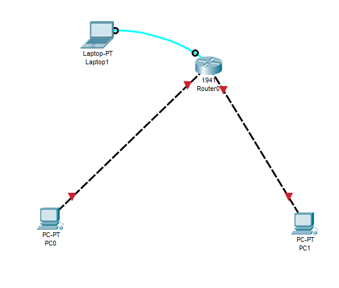
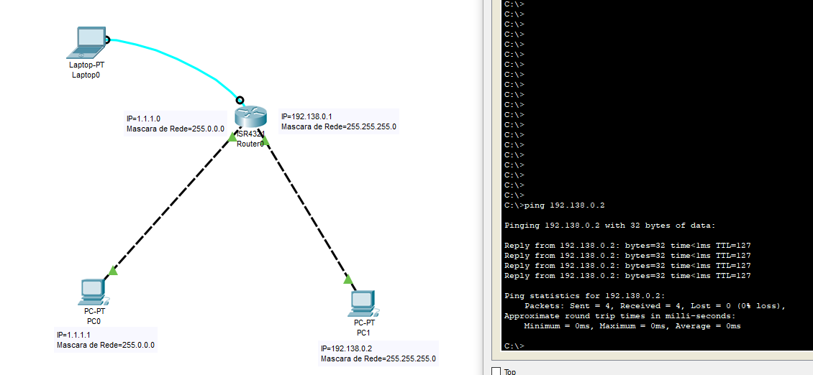
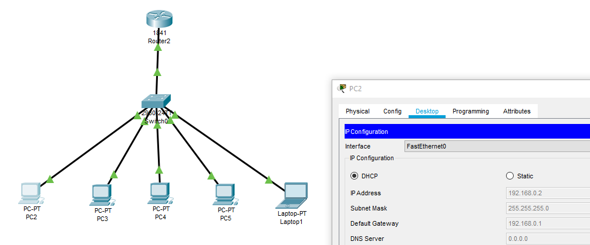
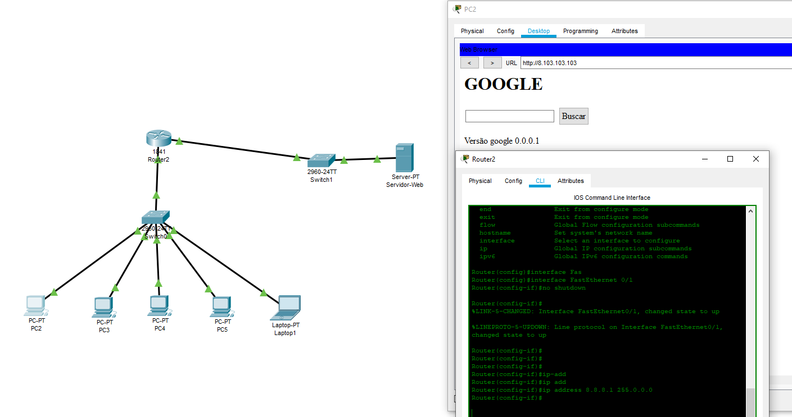
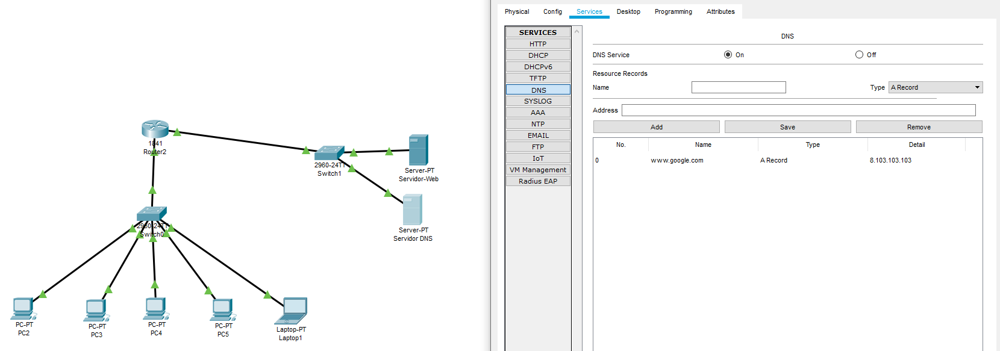
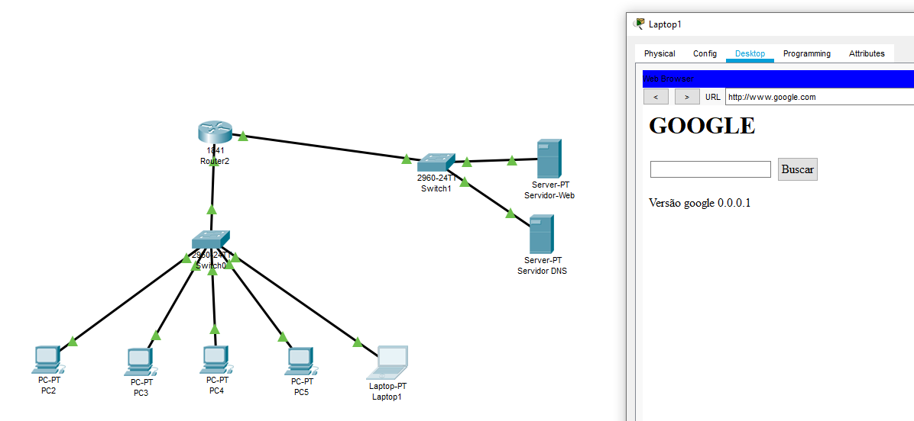

# Redes

Códigos úteis para o cmd do windows

```
ipconfig
```

* Endereço IPV4

Aparece rede de Virtual Box, Rede sem fio, Rede Ethernet

```
ping www.google.com
```

Nome do Protocolo: ICMP- o responsável por mandar uma requisição (Echo Request) para máquina remota e esperar um retorno dessa máquina remota (Echo Reply).

Dicas: não pode conter https:// e nem o nome do site /alguma coisa. Ele precisa ser www.qqcoisa.com ou .com.br

Dica para saber se tudo está bem com sua placa de rede

```
ping 127.0.0.1
ping ::1
```

Esse começo com 127. é reservado para testes como esse. E em específico esse IP é chamado de IP de loopback e pode ser visto em C:Windows/System32/drivers/etc/hosts e é o localhost da programação Web

* DNS (Domain Name Servers)- ele pega o nome do site (no caso o google) e transforma ele em número de endereço IPV4 (ou o IP da máquina) que é  172.217.30.100, inclusive se você pegar esse número e colar no navegador o navegador vai pro site do Google mesmo assim.

* tempo em milisegundos de uma informação genérica de 32 bytes sair daqui e chegar lá (quanto mais rápido melhor)

* TTL (time to live)- O TTL (ou tempo de vida útil) seria uma informação dentro do pacote do IP que informa qual é a máxima quantidade de hops que minha informação pode passar antes de ser descartada. É a quantidade de máquinas que ela vai poder passar no caminho. Se ela passar pelo número máximo de máquinas necessário para concluir o teste de ping a informação é jogada fora.

Esgotado o tempo limite do pedido.

```
Windows: tracert
Linux ou Mac: traceroute
Sufixo -d (não mostrar a tradução do DNS, deixa o processo um pouco mais rápido)
```

Exemplo de código para Windows:

```
tracert -d www.google.com
```

Resultado possível:

```
  1     3 ms     2 ms     1 ms  192.168.0.1
  2     6 ms     7 ms    10 ms  10.20.255.254
  3    32 ms    20 ms    15 ms  10.10.10.5
  4     *       14 ms     *     177.36.96.1
  5     *       25 ms    14 ms  10.10.1.1
  6    12 ms    11 ms    18 ms  45.6.52.32
  7    48 ms    14 ms    14 ms  108.170.251.65
  8    16 ms     *        *     216.239.50.155
  9    14 ms    14 ms    16 ms  172.217.29.100
```

A primeira linha se refere  192.168.0.1 que é meu gateway (meu roteador no caso) e é o endereço onde minha máquina se comunica com o mundo.

Mas por que tem três tempos mostrados? Pois ele analisa qual o melhor caminho para esse pacote poder seguir em três rotas diferentes. Onde * é um tempo que somente a máquina sabe mas que o adminstrador da máquina resolveu deixar como privado, aí o protocolo vai para a rota que leva menos tempo.

Dando tracert de novo no terminal posso encontrar uma rota diferente, como:

```
  1     3 ms     1 ms     1 ms  192.168.0.1
  2     6 ms    10 ms    11 ms  10.20.255.254
  3    15 ms    12 ms    16 ms  10.10.10.5
  4     9 ms    13 ms     *     177.36.96.1
  5    11 ms    12 ms    16 ms  10.10.1.1
  6     *       10 ms    13 ms  45.6.52.32
  7     *       12 ms    12 ms  108.170.251.66
  8    20 ms    22 ms    20 ms  172.253.79.164
  9    22 ms     *       20 ms  172.253.67.192
 10    19 ms    19 ms    22 ms  108.170.245.161
 11    18 ms    18 ms     *     108.170.229.183
 12    20 ms    19 ms    20 ms  172.217.30.100
```

Onde ele utiliza a mesma rota inicial mas para chegar no Gloogle ele utilizou uma porta alternativa como 172.217.30.100

A principal funcionalidade do traceroute é verificar a rota que a minha informação levou para chegar até a máquina de destino. Isso porque, em redes de computadores temos o que chamamos de rede não determinística, ou seja, não necessariamente um pacote de informação vai ser transferido pela mesma rota do anterior com o mesmo intervalo de tempo. Isto se deve a muitos fatores, por exemplo, uma máquina que pode estar congestionada ou um problema no link de comunicação, etc.

Porém poderia ter dado uma reposta em uma máquina igual a:

```
  2    *     *       *  Esgotado o tempo limite do pedido.
```

Quando nós temos uma máquina que retornou (*) e passou a informação para uma próxima máquina, isso provavelmente indica que o administrador dessa máquina desabilitou a resposta ao nosso chamado. O que acontece seria que esse tipo de teste pode ser interpretado como uma tentativa de “scanear” possíveis portas abertas e vulnerabilidades que possam existir, caso seja usado por um usuário malicioso, pode ser usada como uma forma de reconhecimento da rede dessa possível vítima para que assim possa explorar possíveis falhas.

```
nslookup www.google.com
```

Isso nos dá como reposta:

```
Servidor:  UnKnown
Address:  192.168.0.1

Nao é resposta autoritativa:
Nome:    www.google.com
Addresses:  2800:3f0:4004:805::2004
          172.217.30.100
```

Esse comando nos dá uma série de coisas legais, tais como endereço IP (IPV4 e IPV6) desse site e Nao é resposta autoritativa e isso quer dizer que a nossa máquina já conhece esse endereço e não teve que ir no servidor e pedir. Dessa forma, a minha máquina que respondeu não tem autoridade sobre esse domínio, não é minha máquina que possui o registro do www.google.com.

Alguns termos para rede:

* O Hub é um equipamento utilizado para interconectar diversos dispositivos finais. Para conectar dois computadores em rede basta apenas um cabo de rede, para conectar mais de um aí sim precisa-se de um hub. Ou um roteador.


* NAT é um método de tradução de endereços privados e públicos.
* Servidor é uma máquina centralizada que oferece serviços a um cliente (ex: computador)
* Máscara de rede é usado para determinar se dois equipamentos estão na mesma rede

## Cabo de Rede

8 fiozinhos que um cabo de rede tem

Padrão T568A:

* Branco e Verde (T)
* Verde(T)
* Branco e Laranja( R )
* Azul( R )
* Branco e Azul
* Laranja
* Branco e Marrom
* Marrom

Se temos um fio que liga um computador ao hub nessa posição acima e outro fio do hub a outro computador nós temos um ***Cabo Direto*** e a informação nos dois lados vão se colidir, pois se eu transmito uma informação do 1 pro 2 e do 2 pro 1, simplesmente essa informação se colide com a outra e a informação (que é energia) é perdida. E para isso temos o padrão T568B

Padrão T568B:

* Branco e Laranja( R )
* Laranja( R )
* Branco e Verde(T)
* Azul(T)
* Branco e Azul
* Verde
* Branco e Marrom
* Marrom

Os dois padrões são feitos pela TIA e podem ser vistos abaixo:


Basicamente inverte o laranja com o verde (a transmissão ocorre de uma cor para a mesma cor), e para esse sentido de cabo com um lado seguindo o padrão T568A  e o outro lado do cabo com padrão T568B nós temos um ***Cabo Cruzado***. A transmissão ocorre somente com os fios verdes e laranjas.

Algumas placas de rede tem via software uma forma de corrigir eventuais erros de padrão mas isso tem que ser verificado se há um padrão **auto-MDIX**.

Uma ligação válida seria:

Comutador-> T568A-TS68A->HUB-> T568B-T568B->Computador

## Packet Tracer da Cisco

Software criado pela cisco que permite criar e simular topologias para a nossa rede interna.

Protocolo ARP- O computador na primeira vez que executa o ping ele não conhece onde está o endereço de outra máquina então ele procura internamente e na internet, depois que aprende ele armazena na máquina

O ARP é o protocolo utilizado para fazer o mapeamento entre o endereço IP e o endereço MAC de um dispositivo. Isso é necessário porque o MAC encontra-se um nível abaixo do IP e eu preciso dele para poder transmitir as informações.

Em redes de computadores, temos protocolos que possuem hierarquias diferentes. Para poder chegar até o IP que está na camada 3, eu preciso passar pelo MAC que está na camada 2, pense como se fosse escalar uma pirâmide, não dá pra chegar ao topo sem passar pelo meio dela!

O hub não aprende nunca onde uma máquina de determinado endereço está então ele manda uma informação para todo mundo ligada a ela, causando lentidão no sistema e uma vulnerabilidade.

## Wireshark

Programa onde consigo identificar todos os protocolos e processos de rede que a minha máquina esteja recebendo, isso pode ser útil para ver a vulnerabilidade do sistema de rede que estou projetando. Tal como falta de criptografia e informações pessoais.

O Wireshark tem como principal utilização analisar protocolos que trafegam na rede com o intuito de verificar problemas que possam existir.

A forma de filtrar no wireshark os protocolos sendo trocados entre um site qq é:

```
ip.addr== IP do site
```

Depois para eu ver o que tem nele é só clicar dar Follow/TCP Stream

E é para isso que significa o s no final do https de alguns sites pois isso significa uma camada de criptografia que o site e quando formos analisar o um protocolo de TCP que a minha máquina faz com o site não consigamos entender nada. Enquanto num site http podemos ver certas informações.

### Camadas de Protocolo

Os protocolos em redes de telecomunicações seguem uma hierarquia e cada um é responsável por determinada função na comunicação.

O que acontecia antigamente no início do desenvolvimento das redes de telecomunicações é que cada fabricante desenvolvia protocolos proprietários e não era possível assim se comunicar com equipamentos de redes de outros fabricantes, criando assim o chamado "vendor lock-in".

Dessa forma, foi criado um modelo que tinha como intuito padronizar o desenvolvimento de hardware e software dos mais variados tipos de fabricantes para que pudessem assim se comunicar, mesmo que um tivesse alguns recursos a mais que o do outro fabricante, a comunicação deveria ser estabelecida. Para isso, foi definido que esses protocolos de comunicação seriam divididos em 7 camadas de comunicação, o chamado modelo OSI (Open System Interconnection) . O protocolo TCP por exemplo, encontra-se na camada 4 que é conhecida como camada de transporte, o protocolo IP encontra-se na camada 3 que é conhecida como camada de rede.

O protocolo TCP encontra-se acima da camada onde o IP está localizado e ele é responsável por realizar o transporte da minha informação. Além do protocolo TCP, essa camada possui também outro protocolo bastante conhecido, o UDP.

## Switch

Agora temos um dispositivo que conecta os três laptops e ''aprende'' onde está o endereço da máquina que eu quero mandar a informação.

Endereço MAC é único e é válido para uma rede local enquanto o IP é um identificador global a analogia seria que o MAC é o RG e o IP o passaporte. E o switch grava esse MAC do dispositivo com IP específico. E é por isso que quando acesso um site que já acessei antes que sabemos o endereço IP dele.


Problema do Switch, o switch tem capacidade de gravar o endereço MAC dos dispositivos, mas e se ele lotar? Então o carinha malicioso lota o switch de endereço falso lotando a memória do sistema e fazendo com que o switch aja como um hub e assim ele se conecta a uma das portas e rastreie o que você está fazendo. Bad Bad. Mas aí você faz a segurança da porta de modo que somente alguns MACs específicos tenham acesso a essas portas, se o hacker quiser fazer a enxurrada de MACs a porta se desliga sozinha.

## Máscara de Rede

Como dito anteriormente máscara de rede serve para determinar se dois equipamentos estão na mesma rede, pois podemos ter vários computadores ligados a um mesmo switch porém com redes de Internet diferentes.

Então para isso ele divide o IP em duas partes 255 para a rede e 0 para a máquina.

Então pega o IP 192.168.3.2 para isso a mascara de rede deverá ser 255.255.255.0 (os três primeiros octetos para rede e o último para máquina), então para que esteja na mesma rede o IP dessa outra máquina deverá ser 192.168.3.x onde x é qualquer coisa que é o número da máquina dentro da rede.

No exemplo de três conectores conectados a um switch/hub se colocarmos um computador com IP 191.168.3.1 e outros dois computadores com IPs iguais a 192.168.1.1 e 192.168.1.2 esse computador com IP que começa com 191 não conseguirá se comunicar com os demais, pois está em rede diferente.

## Roteador

Equipamento feito para conectar equipamentos com redes diferentes. É bom para segmentar o projeto de rede de uma empresa em redes menores, como dois setores (como uma rede para o setor de marketing e outra rede do financeiro).

A função do roteador é interconectar redes encaminhando seus pacotes de dados, os Switches e hubs são usados somente para conexão na minha rede local.

Lembre-se da regra: - Dois equipamentos iguais estão interconectados? Se sim, eles tem o mesmo tipo de placa, então devo usar o cabo crossover. Se não, faço a pergunta abaixo - Dois equipamentos diferentes estão conectados? Essa conexão representa o que naturalmente o equipamento foi desenvolvido para fazer?

Por exemplo ao interconectar o computador ao hub e o computador ao switch, o computador foi feito para se comunicar com várias máquinas e o hub e switch foram feitos para interconectar diversas máquinas. Dessa forma ao conectarmos os dois, vamos estar explorando o que os dois foram fabricados para fazer naturalmente. Porém o roteador foi feito para interconectar redes, se eu coloco somente um dispositivo, não terei como inserir outros dispositivos para o roteador encaminhar os pacotes e então a totalidade de sua função não está sendo explorada. Devemos usar cabo crossover.

Para que possamos configurar um roteador nós deveremos conectar um cabo de console do roteador (usb-RJ45 ou RS232-RJ45) a um laptop qualquer e fazer as configuração  necessárias. Os roteadores da nossa casa vem com roteador e switch integrado, já os de empresa tem que ter uma separação por que normalmente você quer um switch com muitas portas, o de casa normalmente nem se usa o switch hahahah. No programa da cisco não precisa representar esse pc com cabinho azul na figura abaixo mas na vida real sim.



Programa terminal para comunicação com Roteador (PUTTY) é um programa simples e muito bom para acesso remoto com o roteador. E pra poder me comunicar com o roteador preciso de uma ligação entre meu roteador e uma máquina qualquer.

Para congigurar duas redes de dois setores diferentes em um roteador nós devemos fazer no software da Cisco (para um roteador GigaEternet e talvez sendo válido somente para os roteadores da Cisco)

```
enable (para ter um privilégio a mais), ENTER

configure terminal, ENTER

interface GigabitEthernet (Numero da porta que pode ser 0/0/0, ver o roteador que se está usando), ENTER

ip address (numero do IP da máquina conectado na porta como 1.1.1.1) (submáscara como 255.0.0.0)
```

Esses números IP serão os IPs do roteador. Então se a submascara é 255.255.255.0 e o ip da máquina é 1.1.1.0 então um IP válido para o roteador nessa porta de comunicação entre os dois é 1.1.1.1 .

Sabendo que se precionarmos ''?'' para qualquer passo abre-se uma guia de ajuda.

Conexão feita com sucesso, porém se fizermos o mesmo com a outra porta do roteador nós não teremos uma conexão estabelecida entre as duas máquinas. (Fazendo ping de uma máquina para outra) e para isso nós precisamos informar ao computador o IP do roteador que ele é que vai resolver esse problema pra gente. E para isso temos que colocar endereço no Default Gateway. Para saber quais são os endereços do defaul gateway basta digitar

```
show ip interface brief
```

Então temos todos os IPs configurados para o roteador por interface (no caso gigabit interface).

Agora conseguiremos comunicar as duas máquinas e isso irá decrementar uma unidade no TTL (de 128 cai para 127).



E para configurar a internet doméstica basta copiar o endereço do Defaul Gateway e colocar no seu navegador, isso irá abrir a página do seu roteador, as linhas de código interessam mais para roteadores empresariais.

# Sobre os IPs

Nem todos os IPs podem ser utilizados, pois existe um padrão internacional a ser seguido. Então não posso simplesmente,na prática, nomear minha máquina a meu bel prazer (mesmo que valha na simulação).

Considerando um IP como A.B.C.D, temos o primeiro octeto é o valor de A, o segundo octeto o valor de B e por aí vai.

* Classe A- primeiro octeto de 1-126 e terá uma máscara de rede padrão igual a 255.0.0.0

* Classe B- primeiro octeto entre 128 e 191, e terá uma máscara de rede padrão de 255.255.0.0

* Classe C- primeiro octeto tem que estar entre 192 e 223 e terá uma máscara de rede padrão igual a 255.255.255.0

* Classe D- primeiro octeto tem que estar entre 224 a 239 e não terá uma máscara de rede e ela é usada pra dispositivos de multicast, ela é uma classe reservada.

* Classe E- primeiro octeto tem que estar entre 240 e 255 e não terá uma máscara de rede e ela é reservada e não se usa para máquinas, cabe o estudo da classe D e da classe E mais tarde.

A IETF (Internet Engineering Task Force) determinou que existiriam ao todo 5 classes de endereços IP, indo de ordem alfabética da classe A até a classe E. Porém as duas últimas classes não são usadas para serem endereçadas as máquinas. A classe D seria usada para multicast (termo usado quando queremos nos comunicar com somente algumas máquinas de nossa rede) e a classe E seria uma classe experimental. Portanto as classes de IP que podem ser endereçadas para máquinas seriam a classe A, B e C.

O endereço 127.0.0.1 seria uma faixa de endereço IP reservada, esse seria um endereço interno da placa de rede para realizar testes e verificar se ela está de fato validando os protocolos TCP/IP. A gente no começo do curso usava esse IP para ver se estava tudo bem como nossa placa de rede, aplicando o ping nela mesma.

## IP privado

Classes de IP que não podem se comunicar com a Internet diretamente somente com a sua rede local (switches, hubs e roteadores).

* Classe A- 10.x.x.x -> IP privado para essa clase

* Classe B- 172.16.x.x até 172.31.x.x -> IP privado para essa clase

* Classe C- 192.168.x.x -> IP privado para essa clase

E note que muito provavelmente o IP da sua máquina bate com esse IP privado da classe C. E como que eu acesso a internet então? Pela provedora de internet que tem acesso a vários IPs públicos e atribui um desses IPs a minha pessoa. Então há uma tradução entre meu IP privado praquilo que é de fato acessível a internet. E isso é devido ao protocolo dentro do roteador chamado de NAT (Tradução de endereços de rede).

## IPV6

Com a populariação da internet os endereços IP versão 4 (ou IPV4) passaram a se tornar repetitivos e aí tínhamos que evoluir as versões IP de nossas máquinas, surgindo então o IPV6.

Com o comando nslookup conseguimos descobrir o IPV6 de qq site tal como:

```
nslookup www.google.com

Servidor:  UnKnown
Address:  192.168.0.1

Nao é resposta autoritativa:
Nome:    www.google.com
Addresses:  2800:3f0:4004:808::2004
          172.217.29.100
```

O IPV6 do google é igual a 2800:3f0:4004:808::2004 e se colocarmos no navegador não encontraremos o site do google. E todos os sites são desenvolvidos com o IPV6 pois o endereço IPV4 não tem mais IPs públicos disponíveis.

### Endereços Reservados Classe A

Se você notou bem existe um limite para cada octeto para o meu IP e que vai de 0 até 255.

A máscara de rede para essa classe é 255.0.0.0 e para identificarmos os IPs de rede e de broadcast reservados nós teremos:

|Endereço IP da máquina|Endereço de Rede|Endereço de Broadcast|
|---|---|---|
|123.1.2.0|123.0.0.0|123.255.255.255|
|1.2.3.4|1.0.0.0|1.255.255.255|

Não posso usar esses endereços de Rede e de Broadcast pra nenhuma máquina conectada a rede.

### Endereços Reservados Classe B

Classe B tem o primeiro octeto indo de 128 até 191

A máscara de rede para essa classe é 255.255.0.0 e para identificarmos os IPs de rede e de broadcast reservados nós teremos:

|Endereço IP da máquina|Endereço de Rede|Endereço de Broadcast|
|---|---|---|
|129.1.2.0|129.1.0.0|129.1.255.255|
|168.2.3.4|168.2.0.0|168.2.255.255|

Ou seja repito o octeto que bate 255 e atribuo 0 para a rede e 255 para broadcast nos octetos onde temos 0 para a máscara de rede.

Não posso usar esses endereços de Rede e de Broadcast pra nenhuma máquina conectada a rede.

### Endereços Reservados Classe C

Classe C tem o primeiro octeto indo de 192 até 223

A máscara de rede para essa classe é 255.255.255.0 e para identificarmos os IPs de rede e de broadcast reservados nós teremos:

|Endereço IP da máquina|Endereço de Rede|Endereço de Broadcast|
|---|---|---|
|195.1.2.0|195.1.2.0|129.1.2.255|
|200.2.3.4|200.2.3.0|200.2.3.255|

Não posso usar esses endereços de Rede e de Broadcast pra nenhuma máquina conectada a rede.

Entenda broadcast como: Broadcast seria um termo usado quando a comunicação é feita para todos os dispositivos que estão na mesma rede.


## DHCP (Dynamic Host Configuration Protocol)

Em todo esse tempo nós nos preocupamos apenas com IPs estáticos, mas sempre tinha uma opção de configuração escrito DHCP o que é isso? Imagina você ter que atualizar manualmente o IP de um setor de empresa com 50 máquinas, um tanto chato né? Para isso existe uma forma mais automatizada de fazer isso e para isso existe o servidor DHCP. E essa função pode ser responsável pelo roteador.

Para ativar o roteador da Cisco basta fazer no Packet Tracer:

```
enable (para ter um privilégio a mais), ENTER

configure terminal, ENTER

interface GigabitEthernet (Numero da porta que pode ser 0/0/0, ver o roteador que se está usando), ENTER

ip address (numero do IP da máquina conectado na porta como 1.1.1.1) (submáscara como 255.0.0.0)
```

Agora para habilitar o DHCP teremos que fazer:

```
exit (tenho que sair do modo de interface)

ip dhcp pool NOMEDAEMPRESA, ENTER

network 192.168.0.0(qualquer endereço de rede de IP) 255.255.255.0(máscara de rede), ENTER

Em dhcp-config fazer: default-router 192.168.0.1 (ou o IP que você quiser pro roteador desde que não seja o endereço de rede configurado anteriormente)

E depois dar o nome do IP do roteador

interface FastEthernet 0/0
ip address 192.168.0.1

Depois no ipconfig de cada máquina habilitar o DHCP de todo mundo
```



Quando um endereço IP é atribuído a uma máquina (cliente), dizemos que a configuração foi dinamicamente alocado. Os servidores DHCP normalmente possuem o que chamamos de “lease time”, ou seja possui um tempo de alocação de um endereço IP a uma máquina, quando esse tempo é expirado é preciso ocorrer uma renovação de endereço IP. Por isso ele é dinamicamente alocado :)

## Acessando site da empresa

Nessa parte vamos colocar um servidor Web, junto com um switch e ligar-lo na outra porta do roteador. Configuraremos o IP de saída para o roteador (no caso 8.8.8.1) e o IP estático do servidor (no caso 8.103.103.103), colocaremos o estilo do site (html,css e js) pro servidor web e o gateway pro servidor (mesmo IP do roteador), o resultado será o seguinte



Só que é feião né ter que digitar o nome do IP do server onde está o site para acessar o mesmo não é? Ninguém faz isso, então temos que configurar o servidor DNS. Para isso eu crio um outro servidor linko o IP do server onde está hospedado o site com o nome do site que eu quero.



E no caso demos o IP desse server de 8.103.103.100 e já linkamos ele com o gateway do roteador. Agora falta dizer pro roteador que esse é o server do DNS. Para isso no CLI do roteador fazemos:

```
enable
configure terminal
ip dhcp pool EMPRESA

dns-server (IP estático que você escolheu pro Servidor DNS)8.103.103.100
```

Como colocamos o nome EMPRESA então temos que usar esse nome na hora da configuração. Agora precisamos  atualizar o dhcp das máquinas da nossa rede com o novo DNS  pois agora temos um número de DNS server para todo mundo poder acessar.



Agora todos os computadores ligados no roteador conseguem acessar o site na sua rede local. 

Nome do arquivo: acessando_site_redelocal.pkt
