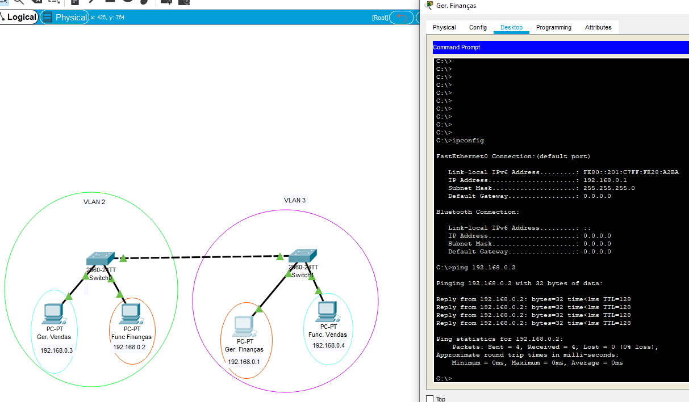
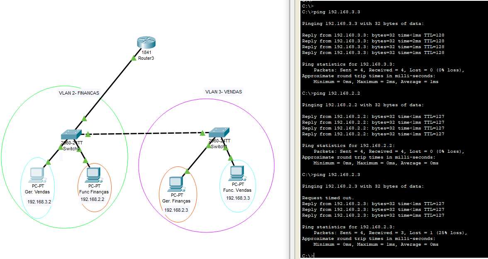
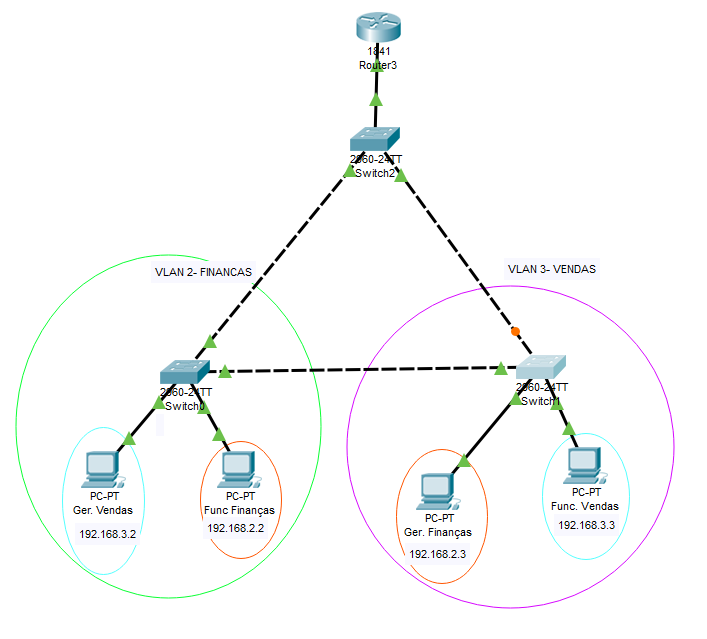
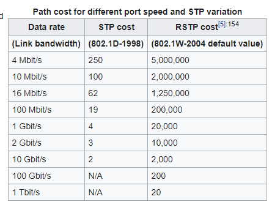

# Redes parte 2

Intenção criar uma rede corporativa que linka diferentes setores de uma empresa e que se conectam com diferentes provedoras de internet, todas com seus protocolos de acesso. Onde somente os gerentes acessam determinandos arquivos e sites.

Hoje em dia os hubs estão cada vez mais em desuso então ignore eles, saiba mais que ele fez parte da história e que deve-se respeito a eles.

Ligação entre switches usa-se o cabo crossover (já que eles são o mesmo equipamento). E liga eles serve para que possamos fazer uma comunicação direta entre setores diferentes.


## VLAN

VLAN (Virtual Local Area Network), afim de não mandar broadcast para todo mundo (no caso do protocolo ARP dentro do ping) nós podemos configurar os switchs de forma a separar nossa rede em segmentos menores e assim não poluir a rede de informações desnecessárias (no caso de uma grande empresa com mais de 200 computadores todos fazendo milhares de requisições ao mesmo tempo e sobrecarregando o sistema).

As Vlans (Virtual Lans) são usadas para segmentação de redes e priorização de tráfego. Hoje em dia as redes corporativas trafegam diferentes tipos de dados em suas redes, como por exemplo, podemos ter tráfego de dados, vídeo e voz e acaba sendo necessário lidar com esses diferentes tipos de tráfego de uma maneira a priorizar um sobre o outro.

Switches são mais baratos que roteadores e podem ser configurados de maneira igual.

Para configurar uma VLAN eu uso a CLI do switch e digito:

```
enable
configure terminal
vlan 2
name FINANCAS
CTRL+Z

configure terminal
interface fastEthernet 0/1
switchport mode access
switchport access vlan 2
exit
interface fastEthernet 0/2
switchport mode access
switchport access vlan 2

CTRL+Z
show vlan brief (para ver as nossas vlan)
```
Os números vlan 1,1002,1003, 1004 e 1005 são números reservados e não se usam mais. E basicamente configuramos uma vlan para as duas portas do switch de Finanças no projeto.


Aí vamos fazer a VLAN de vendas para isso vamos configurar a CLI do switch da máquina de vendas

```
enable
configure terminal
vlan 3 (pra não confundir mude o numero da vlan)
name FINANCAS
CTRL+Z (ou exit, exit sobe uma na casa de prioridade)

configure terminal 
interface range fastEthernet 0/1 - 2 (macetinho aqui!)
switchport mode access
switchport access vlan 3
exit

CTRL+Z
show vlan brief (para ver as nossas vlan)
```


Pingando as máquinas vemos que os computadores de mesmo setor se comunicam mas de setores diferentes não se comunicam. Como se as duas redes estivessem completamente isoladas, sendo de redes diferentes sem um uso de roteador.


## Portas Trunk

Agora imagine que queremos trocar o computador dos gerentes, ou seja nós queremos tirar o computador do gerente de vendas que está na vlan específica de vendas e botar na sala da de finanças e vice-versa. A principio o gerente de vendas ficaria incomunicável com sua equipe, isso mesmo habilitando a vlan de vendas no switch onde toda a equipe de finanças está. Para isso que existe as portas trunk. Com elas e com a conexão entre os switches eu posso habilitar diversas vlans de operarem.

Então para habilitar a porta trunk eu preciso estar na interface da conexão entre os switchs.

```
configure terminal
interface fastEthernet(ou Giga) 0/3(ou qq conexão que voê colocou)
switchport mode trunk
```

Isso habilita a comunicação entre membros da mesma vlan mesmo estando em switches diferentes.



As portas trunk são portas configuradas para realizar o transporte de múltiplas Vlans entre Switches ou entre Switches e roteadores. Se você tentar comunicar os dois computadores sem habilitar a porta trunk você não vai conseguir comunicar com ninguém na real.

Agora o problema está em comunicar as duas VLANS, pois mesmo estando na mesma switch o gerente de finanças não consegue conversar com o funcionários de vendas.

## Comunicando VLANS

E como VLANS diferentes são de certa forma redes diferentes então eu preciso rotear essas redes, então precisaremos de um roteador para ajudar a conversar com essas redes.

E para isso preciso habilitar subinterfaces com as portas do roteador, para isso habilitamos as portas

Isso é obtido com equipamentos Switches Layer 3 ou no nosso caso através da criação de sub-interfaces no roteador. Essa configuração realizada no roteador é conhecida como Router on a Stick


Configuramos o DHCP das VLANS e fazemos:

```
ip dhcp pool VLAN2
network 192.168.2.0
exit
ip dhcp pool VLAN3
network 192.168.3.0
```

```
interface fastEthernet 0/0.1 (isso cria uma subinterface)
encapsulation dot1Q (numero da vlan no caso 2)

ip address 192.168.2.1 (aqui tem que ter a inteligicencia de configuar o dhcp da vlan 2 com 192.168.2.0)
```

Falta habilitar o switch para se comunicar com o roteador, e para ver todas as ligações do switch basta digitar o código

```
show running-config (sem estar no modo de configuração)
```
Então eu tenho que habilitar a interface do switch com o roteador de modo a trabalhar com o modo trunk, para isso basta fazer no CLI do switch

```
interface fastEthernet (ligação do switch com o roteador, no caso 0/5)

switchport mode trunk
```

Com isso conseguirei um IP DHCP para cada VLAN isso é útil para caso queira escalar o número de máquinas para cada setor. Porém ainda não me comunico com alguém do meu switch ou da minha sala, pois falta habilitar o default gateway. Então vamos fazer:

```
configure terminal
ip dhcp pool VLAN2
DEFAULT-ROUTER 192.168.2.1
exit
ip dhcp pool VLAN3
DEFAULT-ROUTER 192.168.3.1
```



Com isso consigo pingar entre todas as máquinas. Essa é a inportância de habilitar subinterfaces no roteador para poder trabalhar com diversas VLANS.

## Redundâncias

Shit happens! Nem sempre as pessoas tem o devido cuidado com os cabos que passam na sua empresa (e nem nos cabos que chegam a sua empresa também), então precisamos habilitar algumas redundâncias que ligam diferentes setores na sua rede.

Supondo que alguém desconecte o cabo que liga os switchs entre os setores e acabe desconectando uma sala importante da sua empresa com o roteador, isso causará prejuízos a toda a empresa então devemos fazer a seguinte ligação no sistema



Assim eu garanto que se uma das linhas do triângulo for cortada eu ainda tenho um caminho pro nosso dado seguir. Isso quebre a nossa transmissão um pouco, mas é só habilitar o modo trunk em todas as linhas do novo switch. Porém note que há um ponto laranja em um switch, isso quer dizer que o dado do switch novo com esse não será transmido.

## STP

Quando estabelecemos a comunicação com sucesso com uma máquina e o TTL não se zera é capaz de termos um looping da informação rodando entre os nossos switchs, e como temos uma redundância é capaz de termos essa informação para sempre guardada no looping formada entre elas, e é aí que temos o protocolo STP que quebra a informação de um desses links entre os switches, fazendo com que nosso sistema não se sobrecarregue quando vem uma nova requisição do nosso sistema.

Por isso que temos um switch desconectado do loop que criamos, mas por que exatamente esse? Por ele ter o maior endereço MAC de todos os três e ter um maior custo de mandar uma informação, então ele foi eleito pelo STP.

A velocidade da minha internet determina um custo para o meu switch poder se comunicar, e quanto maior a minha internet menor esse custo



E as portas ligadas a meu switch root são chamadas de **portas root**, por terem o menor custo para o switch root. E as portas do switch root que estão ligadas aos outros switches são chamadas de **portas designadas**. E o switch principal (o que tem o menor endereço MAC) é o **switch root**


O menor é que manda e esse protocolo é bem complexo. Pois imagine que uma rede corporativa tem diversos switches interligados e ele tem que escolher um switch que seja o mais importante da nossa rede e se ele escolher um que tenha baixo processamento de dados nossa rede se sobrecarregará muito, então a complexidade do nosso STP aumenta muito.

A análise que o protocolo STP realiza para eleger o Switch Root seria através dos valores de prioridade e endereço MAC presentes dentro do protocolo BPDU. Esse conjunto de valores de prioridade e endereço MAC é conhecido como Bridge-ID.

O primeiro critério que o STP irá analisar será o valor de prioridade, o Switch que apresentar menor prioridade será eleito como Root. Caso ocorra um empate entre as prioridades, o Switch irá analisar os endereços MAC e o que apresentar o menor endereço MAC é que será eleito como Root.

Então se uma dessas linhas cair a linha que está laranja (linha de backup) que é uma linha que está como modo alternativo (nem designado e nem root) passa a atuar e a ajudar a nossa rede.

Para verificar o estado de nossa STP nos switches nós temos o comando:

```
show spanning-tree (filtro de vlan- no caso pode ser vlan 2)
```
