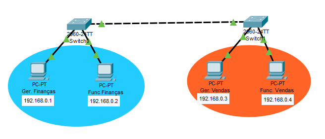
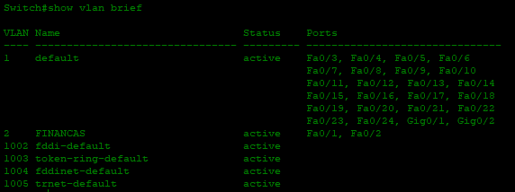
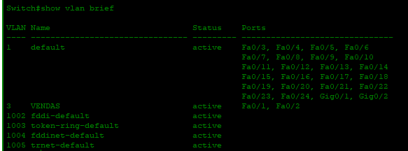
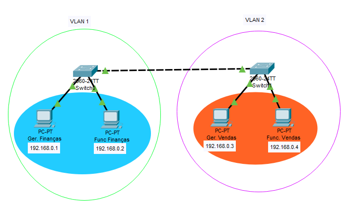

# Redes parte 2

Intenção criar uma rede corporativa que linka diferentes setores de uma empresa e que se conectam com diferentes provedoras de internet, todas com seus protocolos de acesso. Onde somente os gerentes acessam determinandos arquivos e sites.

Hoje em dia os hubs estão cada vez mais em desuso então ignore eles, saiba mais que ele fez parte da história e que deve-se respeito a eles.

Ligação entre switches usa-se o cabo crossover (já que eles são o mesmo equipamento). E liga eles serve para que possamos fazer uma comunicação direta entre setores diferentes.



## VLAN

VLAN (Virtual Local Area Network), afim de não mandar broadcast para todo mundo (no caso do protocolo ARP dentro do ping) nós podemos configurar os switchs de forma a separar nossa rede em segmentos menores e assim não poluir a rede de informações desnecessárias (no caso de uma grande empresa com mais de 200 computadores todos fazendo milhares de requisições ao mesmo tempo e sobrecarregando o sistema).

As Vlans (Virtual Lans) são usadas para segmentação de redes e priorização de tráfego. Hoje em dia as redes corporativas trafegam diferentes tipos de dados em suas redes, como por exemplo, podemos ter tráfego de dados, vídeo e voz e acaba sendo necessário lidar com esses diferentes tipos de tráfego de uma maneira a priorizar um sobre o outro.

Switches são mais baratos que roteadores e podem ser configurados de maneira igual.

Para configurar uma VLAN eu uso a CLI do switch e digito:

```
enable
configure terminal
vlan 2
name FINANCAS
CTRL+Z

configure terminal
interface fastEthernet 0/1
switchport mode access
switchport access vlan 2
exit
interface fastEthernet 0/2
switchport mode access
switchport access vlan 2

CTRL+Z
show vlan brief (para ver as nossas vlan)
```
Os números vlan 1,1002,1003, 1004 e 1005 são números reservados e não se usam mais. E basicamente configuramos uma vlan para as duas portas do switch de Finanças no projeto.



Aí vamos fazer a VLAN de vendas para isso vamos configurar a CLI do switch da máquina de vendas

```
enable
configure terminal
vlan 3 (pra não confundir mude o numero da vlan)
name FINANCAS
CTRL+Z

configure terminal
interface range fastEthernet 0/1 - 2 (macetinho aqui!)
switchport mode access
switchport access vlan 3
exit

CTRL+Z
show vlan brief (para ver as nossas vlan)
```



Pingando as máquinas vemos que os computadores de mesmo setor se comunicam mas de setores diferentes não se comunicam. Como se as duas redes estivessem completamente isoladas, sendo de redes diferentes sem um uso de roteador.



## Portas Trunk
