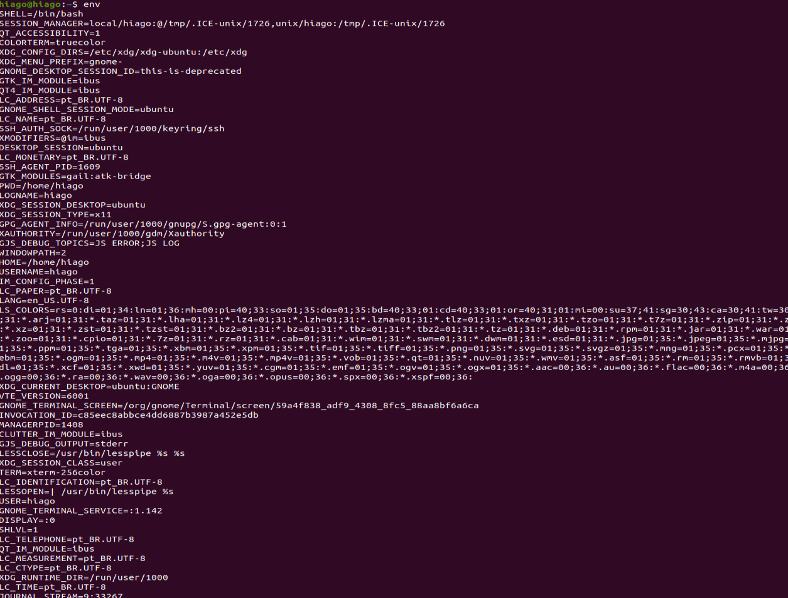
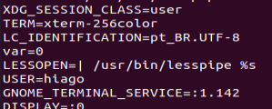
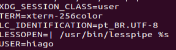
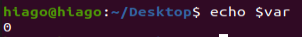
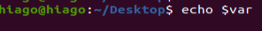
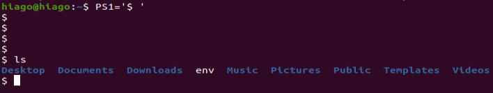

# Linux 3

Aqui a gente vai falar sobre as linhas de comando básicas, sobre o shell a sintaxe geral da linha de comando, variáveis, comentários e alguns termos e utilitários

## Terminais e shell

Terminais rodam um console e que os consoles se conectam a um teclado e o console me liga com a saída que é a janela e os terminais linux rodam um shell, e esse shell me dá comportamentos. Eu digo a ele para listar os arquivos dentro de uma pasta com `ls` e ele me manda o comportamento disso na tela e ele fez o que foi pedido, vai para a próxima e cada shell vem com uma dezena de comandos (a maioria segue um padrão)

O shell é um interpretador de comandos que traduz os comandos digitados em tarefas que o sistema Linux deve realizar. Ele pode devolver alguma resposta para nós.

O bash é o tipo mais comum de shell, que geralmente vem nas distribuições Linux.

O terminal é um programa que nos permite interagir com o shell. No caso do Ubuntu, esse programa é o GNOME Terminal. Se estivéssemos utilizando o Kde, por exemplo, seria provável encontrarmos outro programa para interagir com o shell, como o konsole.

## Bash (bourne-again shell)

O bash é um shell e uma linha de comando feita para rodar diversos. E o nome vem de acordo com a história que o shell foi tendo a partir do unix.

Sua história pode ser vista em <https://developer.ibm.com/technologies/linux/tutorials/l-linux-shells/> e ele está presente no MAC OSX também, o bash é a mais popular entre as distros do Linux.

E com isso vemos com o comando `type` quais comandos são construídos internamente com o shell ou não, como o `echo` que se ditarmos `type echo` nós temos como resultado `echo is a shell builtin`.

Enquanto o `ls` é na verdade um apelido (alias) de `ls --color=auto` (que deixa tudo coloridinho para a gente) o que nos diz que temos como criar apelido para comandos no shell.

E sabemos que o comando `zip` é um programa pertencente em `/usr/bin/zip` e não é nativo do shell. E quando executamos um comando o bash é espertinho e coloca o endereço desse programa no cache então ele aparece como hashed quando damos o type para esse programa.

### Sintaxe

Com man ou help eu consigo ver as diferentes formas de se escrever o código com aquela função no caso do type mesmo, ele não tem manual mas seu help nos dá na primeira linha que:

```sh
type: type [-afptP] name [name ...]
```

Isso é o type aceita argumentos opcionais (opcionais são marcados por colchetes) os argumentos a, f, p, t e P. 

E vemos que o argumento -a é:

```
-a        display all locations containing an executable named NAME;
                includes aliases, builtins, and functions, if and only if
                the `-p' option is not also used

```

Isso é ele nos mostra outros programas que tem o comando type portanto podemos encontrar ls por `type -a ls`

Que nos dá a resposta:

```
type -a ls
ls is aliased to `ls --color=auto'
ls is /usr/bin/ls
ls is /bin/ls
```

Portanto podemos executar ls por /bin/ls (isso no Kali Linux) que nós teremos a mesma reposta que o ls só que sem as cores, e a normalmente siginifica all.

Então um comando pode ser interpretado como:

Comando [-opçoes] argumentos

Normalmente as opções vem antes dos argumentos. e opções são opcionais, e se meu help dá que o comando aceita as opções -l e -a nós podemos escrever as opções com -la, e caso aceite uma opção com -- então tenho que escrever essa opção em separado como `ls -la --color`

## Variáveis

Para criar uma variável e printar o valor dela nós fazemos

```sh
var=10
echo $var
```

Isso é o cifrão nos diz que temos uma variável com aquele nome, e temos que atribuir valores a variáveis assim sem espaços, então temos que ter `<nome da variavel>=valor`, sem espaços nem a direita e nem a esquerda do =

Essas variáveis só ficam armazenadas dentro daquele shell não levando isso para quando abro um novo terminal por exemplo ou crio um script.

Posso executar um script com o comando `bash`, e para criar um arquivo no terminal eu posso usar o `vim`.

### Exportando variáveis de ambiente

Para fazer com que eu tenha essas variáveis no meu ambiente (que é o env) eu coloco `export var` para ele ser uma variável de ambiente para aquele bash específico, se eu fecho o terminal e abro um outro eu não terei mais essas variáveis

A função export coloca para o bash o nome das variaveis e seus valores, essas variaveis não podem começar com numero e eu posso fazer `export nome=Hiago nome1=Julia` isso cria duas variaveis já setadas. Se eu não coloco nada como `export nome nome1` eu so crio duas variáveis.

Assim como no Windows eu tenho acesso a todas as variáveis de ambiente com o `env`, assim como o meu PATH. Mas o PATH tá setado em todos os terminais que eu abrir o nome não.

O comando env pode ser interessante pois posso passar variáveis de ambiente por ele com:

```sh
env nome=Julio bash l
```

Ou seja eu crio um novo ambiente e eu passo variáveis que tem dentro do script de nome l, mesmo a variável nome no meu ambiente atual seja outro. Só que o env só aceita variáveis com valor, mas se tiver alguma variavel já setada no script ele prioriza o script.

As variaveis de ambiente só são herdadas para os filhos do ambiente. O script não afeta as variáveis de ambiente do pai (que é o sistema todo, então isso é uma segurança)

Não consigo criar variáveis com números pois elas são variáveis especiais.

Quando tenho um nome composto eu posso fazer

```sh
nome='Hiago Guedes'
nome="Hiago Guedes"
```

Porque se não colocar aspas o bash interpreta Guedes como um comando.

### Padrão das variáveis de ambiente

Olhando bem as variáveis de ambiente nós vemos um padrão



Nós notamos que todas as variáveis de ambiente estão em letras maiúsculas, isso é uma forma de identificar variáveis no shell. Nada te impede de usar variáveis com letras minúsculas mas com tudo sendo maiúsculo fica mais fácil identificar as variáveis em um script, além disso todas as variáveis estão em inglês também (porém tem variáveis em lingua inglesa que são utilizadas como a `HOME`, então variáveis que eu somente vou criar pro meu ambiente coloque em letra minúscula pois aí tenho certeza que não vou afetar nenhuma variável já gravada anteriormente por algum outro programa). Outro padrão é, para nomes compostos separe as palavaras com _

O comum é usar variáveis de ambiente em maisuculo e variaveis de script em minusculo.

Para imprimir a variável junto com uma frase nós colocamos:

```sh
${var}frase aleatória
```

E essas chaves são uma boa prática para a programação em shell. porque tem casos que um caracter diferente apoós a variável pode dar certo o nosso echo e outros casos dá errado então, sempre que der coloque as chaves

### Removendo variáveis de ambiente

Eu posso zerar a variável simplesmente ao fazer

```sh
var=
```

Ou seja eu não tenho mais nada nessa variável.

Agora se eu tenho uma variável exportada para o nosso ambiente como:



Para retirar ela eu coloco no terminal

```sh
export -n var
```

O que nos deixa com:



Porém ele ainda tem valor dentro do meu ambiente



Para excluir esse valor nós fazemos:

```sh
unset var
```

Aplicando esse valor temos



Isso faz com que não tenhamos nada no meu shell atual para essa variável

### Variáveis globais

### PWD

No env podemos ver uma variável muito comum de se usar que é o pwd (print working directory), no env ela fica como PWD, e eu não posso utilizar-las para me mover de uma pasta para outra, somente para me dizer onde eu estou, se eu alterar o PWD eu vou estar roubando.

Alterar o valor da variável de ambiente PWD não altera o diretório em que estamos trabalhando no shell. A prova disso é que se utilizarmos o comando pwd, ele ainda irá mostrar o diretório em que estávamos. O valor da variável PWD é utilizado para outros casos, por scripts por exemplo.

Perceba que o próprio prompt de comandos utiliza essa variável. Quando alteramos o valor de PWD. a linha comando passa a mostrar o valor dessa variável, no lugar de mostrar o diretório que é de fato o atual.

#### PS1 e PS2

O prompt de comando tem a seguinte forma dentro do bash do ubuntu (e de outras distros também).

```sh
hiago@hiago:~/$
usuario@nome do pc: pasta onde estou $ comando
```

E essa informação é dada pela variável de ambiente (escondida) chamada PS1. E eu posso alterar essa forma (bem doida por sinal), pro que eu quiser. Como PS1='$ ', que nos deixa com:



Um site interessante para alterar o seu PS1 é o <http://bashrcgenerator.com/> você arrasta o que você quer pro meio e altera o seu bash da maneira que quiser.

Existe o PS2 também (e nao é o da sony), e esse se refera a quebra de linha com o ENTER ou com \ ENTER que é colocado como >.

### HOME

Por padrão todo linux nos diz que os downloads do usuário ficam na home que é `/home/nome do usuario` e as vezes podemos fazer um script colocando alguns arquivos lá com:

```sh
cd $HOME
```

As coisas mudam quando estamos com superusuario ativo, elas ficariam em `/root` onde eu preciso de permissão para ver o que tem nessa pasta

### LOGNAME, USER, USERNAME

todos essas três variáveis de sistema dão o nome do usuário do sistema

### UID (user ID)

Número de identificação do usuário no sistema, esse número é imutável.

### EDITOR

Com o editor eu posso setar no ambiente qual editor eu quero usar no dia a dia, VIM (`usr/bin/vim`), nano (`bin/nano`), endereços esses que podem ser vistas no type. E essa variável de editor pode ser util quando eu comito um arquivo com o git, para que eu digite a descrição desse commit.

### PATH

Quando damos um `type clear` e vemos que ele está na pasta `\usr\bin\clear` pelo menos na versão 20.04 LTS do Ubuntu, nós sabemos que o linux vai para essa pasta procura o comando e o executa. Mas como que ele sabe isso? Não muito diferente do Windows, eu tenho uma variável de ambiente PATH, que tem os seguintes endereços registrados


Sabendo que os separados são : (diferente do windows que é ;) nós temos as pastas /usr/bin e /bin como paths possíveis e o hash serve para agilizar esse momento

O hash é uma tabela, é uma estrutura de armazenamento de dados.

Para incluir um endereço nesse PATH eu faço

```sh
PATH=$PATH:<caminho da pasta>
```

Quando procuramos um arquivo no `PATH` nós procuramos no primeiro endereço, depois no segundo até chegar no último, então se escrevermos um programa clear no endereço que está por ultimo ele executa o programa de limpa tela. Por isso é importante colocarmos novos diretórios no final.

Só que se tentarmos rodar um script por exemplo nessa pasta nós não teremos permissão para isso nós escrevemos:

```sh
chmod +x <nome do arquivo com extensão>
```

O comando chmod vai ser visto eu outra parte que fala somente sobre permissões.

Toda vez que eu mudo o PATH o hash zera.

Outra coisa comum (como no universo windows) é colocarmos o diretório atual no path e fazemos isso com:

```sh
PATH=$PATH:.
```

#### which 

Se eu tenho um comando tal em duas pastas diferentes dentro do meu PATH para saber em qual pasta está o comando será executado eu pergunto `which <nome do comando>`

O comando `which -a` me mostra todos os caminhos daquele comando em ordem. O comando which serve justamente para verificarmos onde o arquivo está no PATH e qual pasta vamos executar esse comando

#### builtin

E se formos brincar com o help, vemos que o type dele dá shell builtin, e se colocarmos a pasta home na frente de todo o `PATH`, criarmos um arquivo help na home e mandarmos executar o help vemos que ele prioriza o help original, que vem incluso no shell, se eu quiser forçar a execução de um programa incluso no shell eu escrevo

```sh
buitlin help
```

#### whereis

Tem também o comando de ondeestá esse programa que eu quero executar com o `whereis`, que me dá as mesmas coisas que o which -a mas ele me dá onde está o manual desse comando também (pois leva o nome)

## Atalhos do terminal

Seta para cima vai para o ultimo comando que você deu ENTER, seta direita e esquerda navega no comando, tecla HOME vai para o começo do comando (CTRL+A també serve) e END pro final (CTRL+E).

CTRL+T troca a letra atual com a anterior. (porque na maioria das vezes erramos coisas assim na digitação hahaha)

CTRL+L=comando clear

CTRL+C quebra o comando, quebra a execução do comando, esses comandos são os emacs. para mudar para o padrão do vim eu coloco

CTRL+D para interromper uma entrada de usuario em um programa como o python por exemplo

```sh
set -o vim
```

Ai seria 0 para ir no começo da linha e $ para ir no final (dicas do vi no arquivo linux-comandospt1.md) e para ver mais digite `help set` para ver os atalhos

## Histórico de Comandos

Com o comando `history` eu tenho o acesso a todos os comandos que acessei.

Com `help history` eu limpo o histórico de comandos, então com -c eu limpo todo o histórico de comandos, com `history 10` eu vejo os 10 últimos comandos, inclusive ele próprio (pode ser qq numero)

Ele armazena esse histórico em uma pasta presente na variável de ambiente de nome `HISTFILE` e que posso ler com:

```sh
echo $HISTFILE
```

E eu posso abrir esse arquivo com o gedit e ver todos os comandos que dei na vida.

Se eu apertar CTRL+R e digitar sudo e ir apertando CTRL+R eu vou navegando em todos os comandos sudo que digitei, CTRL+C para

## Autocomplete

A tecla TAB me dá um auto complete no comando que eu to escrevendo, se eu der TAB duas vezes, o bash me dá uma ajuda. E ele é bem inteligente em completar com nomes de arquivos que você criou ou já existentes

## Outras coisas a mais

O ; pode ser usado para separar dois comandos dentro de uma linha de prompt só como:

```sh
ls; echo "blablab"
```

Mas cuidado com o `;` pois se solto assim ele interpreta como um comando se dentro de um echo sem `''` ou `""`. O `;` é um caracter especial assim como o `*`, pois esses caracteres são interpretados pelo bash.

## Exit status

Eu posso saber se o resultado do ultimo comando deu bom ou não com:

```sh
echo $?
```

Se o que printar for 0 então deu bom , se deu diferente então pode ser

- 1 - Catch all for general errors
- 2 - Misuse of shell builtins (according to Bash documentation)
- 126 - Command invoked cannot execute
- 127 - “command not found”
- 128 - Invalid argument to exit
- 128+n - Fatal error signal “n”
- 130 - Script terminated by Control-C
- 255\* - Exit status out of range

Mas note no 130, se terminei um programa como Control-C não necesssariamente temos um erro e sim a interrupção de um programa. 

Não necessariamente todos os programas seguem esse padrão, para colocar esse padrão no seu programa você coloca no script `exit <o número do erro>`

### Execução de dois programas

é legal essa parada de status de saída pois podemos fazer com que dois programas sejam executados em sequência, com

```sh
<programa que deu certo> && <proximo programa>
```

Então se o primeiro programa der certo, roda o segundo

Ou se o primeiro programa der errado

```sh
<programa que não deu certo> || <proximo programa>
```

Se não deu certo a execução desse programa roda o próximo

## Globbing

O caracter `*` é a base do globbing, ele pega tudo que tem o padrão e expande ele dentro do comando, um exemplo é o `ls *` que lista todos os arquivos dentro da pasta onde eu estou e as pastas dentro dessas pastas em um único nível somente. Ou quando executo `cat *.txt`, o `*` é interpretado antes da execução do comando então no momento da execução do comando o `*` é substituido por algo.

De certa forma o * vai ver todas as opções para autocompletar aquele comando e ai sim o comando vai ser executado.

Quando colocamos `?` nós temos apenas um caracter retornado

Como:

```sh
cat texto?.txt
```

Ou seja ele vai pegar os texto1.txt, texto2.txt ... até texto9.txt ou até mesmo texto.txt, enquanto o * pode me trazer outras opçÕes como texto-interessante.txt.

Caso eu queira apenas os numeros eu faço

```sh
cat texto[0-9].txt
```

E se fizessemos com caracteres:

```sh
cat texto[A-Z].txt
```

O colchete representa classe de caracteres

Não importa se é maiusuclo ou minusculo, ele pega os dois (depende do enconding que você usa o certo mesmo seria pegar somente os maiusculos na tabela ASCII nesse caso, então o certo não seria pegar o ç mas pode pegar de acordo com o enconding que você usa).

```sh
cat texto[!0-9].txt
```

Para pegar qualquer caractere (estou negando os numeros)

Assim como poderiamos fazer

Pro bash o **número de espaços não importa pro shell**

Ou seja

```sh
cat                               texto1.txt
```

Esse comando roda igual, uma forma de quebrar um comando é da seguinte forma

```sh
cat \
texto*.txt
```

Para filtrar dois padrões eu faço

```sh
cat {log*.txt, texto?.txt}
```

Isso faz com que eu pegue o conteúdo de um ou de outro

O glob ele pertence ao shell.

## Quoting

Uma maneira de escapar (não representar a função de algo) o * é com \* ou seja

```sh
echo \* Bem Vindo \*
```

Isso me dá uma resposta

```r
* Bem Vindo *
```

De forma geral o \ é uma forma que temos para dizer ao bash que ele é um elemento solto. Ele é chamado de escape character.

Assim como podiamos fazer

```sh
echo '* Bem Vindo *'
echo "* Bem Vindo *"
```

Para aspas duplas e simples eu dou o nome de quoting.

Então se eu tiver um arquivo chamado a b.txt eu posso ler lo como

```sh
echo 'a b.txt'
echo "a b.txt"
echo a\ b.txt
```

Mas evite programas com espaço no seu nome

## O ponto e vírgula

O ; serve para executar dois programas independentes do resultado dos dois, tal como

```sh
ls; cat text*
```

Porém para escapar ele eu faço

```sh
echo blablavla\;blaldl
echo 'blablavla;blaldl'
echo "blablavla;blaldl"
```
