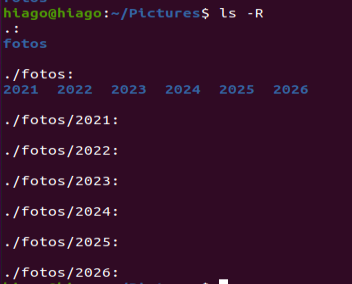

# Linux LPI parte 5

Aqui vamos ver sobre os significados dos nomes das pastas e o que eles significam para o sistema operacional e aprender um conjunto de funções para manipulação desses arquivos e diretórios como o `mkdir`, `mv`, `cp` e outros. Além de saber o que são caminhos absolutos e relativos.

## Diretório raiz /

O diretório raiz pode ser visto com

```sh
ls /
```

E dentro desse diretório tenho mais uma porrada de outros diretórios tal como `bin` que nos dá diversos executáveis e dentro da raiz tenho pro exemplo o diretório `etc` também.

E por ter esse nome eu não posso criar um arquivo com `/` no meio desse nome e nem uma pasta com `/` compondo o nome dele. A barra ele é um separador de diretórios.

Não confundir o diretório raiz com o usuário root.

### Nome de arquivos

Os nomes de pastas em geral são todas em minusculas, as que são pro usuários (como a pasta Downloads, Videos, Music) começam com maiúscula (pois elas são mais amigáveis) e por padrão o linux é case sensitive tanto para pastas como para arquivos então um arquivo chamado `hiago.txt` e `Hiago.txt` são arquivos diferentes enquanto no Windows seriam arquivos iguais.

O diretório raiz ou root no Linux é representado pela /. Esse é o diretório onde ficam os outros diretórios.

Se tivéssemos que fazer uma comparação com o Windows, o diretório / seria correspondente ao C:\

No geral usa-se caracteres como `_-+.` e caracteres de 0 até 9, a até z e A até Z para nomes de arquivos e pastas. Se evita esses caracteres por conta do Windows. (o . até se usa mas para arquivos ocultos ou invisíveis)

Caracteres com espaço em seu nome devem ser lidos como

```sh
cat hiago\ guedes.txt
cat "hiago guedes.txt"
```

Se evita fazer isso

Você pode criar arquivos sem extensão no linux (como scripts por exemplo), uma vez que no linux não existe o conceito de extensão (como .txt .pdf .png) como tem no windows, mas fica mais fácil identificar um arquivo pela sua extensão então scripts podem ser encontrados com .sh no final ou não. Ela serve para alguns softwares reconhecerem aquele programa como imagem, música, script ou qualquer outra coisa, quando o programa abrir que ele vai reconhecer aquilo ou não, no geral a extensão é somente um indicador para um programa específico, como um compilador c vai querer saber se aquele arquivo é uma biblioteca, um código fonte ou coisa do tipo.

## Caminho absoluto e relativo

Caminho absoluto é todo o caminho desde o root até o local desejado (usado para guardar informaçÕes no PATH) e caminho relativo ao lugar onde estou (util para me locomover entre pastas com o `cd` ou até para direcionar páginas em um arquivo html onde eu referencio o local onde o arquivo está naquele diretório)

Então se eu estou na pasta hiago eu posso me mover para desktop com `cd Desktop` e não precisar dar `cd /home/hiago/Desktop`, pois o comando cd age de acordo com o local onde eu estou no momento. O absoluto começa no diretório raiz como pode se ver.

Para voltar ao diretório anterior eu dou um `cd ..` assim como `ls ..` você consegue ver arquivos no diretório anterior. Você pode escrever o .. em qualquer lugar do caminho. Tal como:

```sh
cd $HOME/../maria
```

O cd ENTER também vai para a pasta home.

Onde eu entro no meu home, volto uma e entro na pasta da usuária maria.

Assim como o .. é o diretório anterior temos o diretório atual com o .

Então se quisermos executar um programa no diretório atual nós temos que digitar

```sh
./programa
```

Uma vez que esse programa não está referenciado no PATH.

Agora o relativo para a pasta home é representado pelo ~

```sh
cd ~/Desktop
```

Ou seja com esse comando estamos na pasta home de qualquer usuário e entrando na Desktop.

O ~ seria a representação do caminho da home

## O que o help e o man nos diz sobre alguns comandos

### Para o cd

Dando um `type cd` vemos que o cd é do tipo builtin então ele tem um help. Logo pelo help vemos que:


Ele nos diz que o diretório dir é opcional (por causa dos colchetes) pois se não digitarmos nada ele é a variável HOME do shell por padrão.

O comando `cd -` volta pro diretório anterior e não está no help do `cd`

### Para o ls

Dando um `ls` logo de cara vemos que ele adota um sistema de cores (onde o cmder no Windows adota também mas o prompt não adota nada) e nele vemos que azul significa pasta, verde um script ou um programa executável, vermelho é um pacote e branco um arquivo qualquer (plain file), azul claro é um link externo.

Com `ls -F` conseguimos ver como seria para identificar esses arquivos caso a tela não tivesse cores. Para ter uma experiência real um comando seria `/bin/ls -F`, onde @ seria atalho, * executável, / pasta e nada o plain file.

Para listar o diretório propriamente dito, podemos utilizar a opção -d, com -ld vemos informações desse diretório, tal como `ls -ld /etc`

`ls -a` ou `ls --all` mostra os arquivos e pastas invisíveis

`ls --reverse` ou `ls -r` inverte a ordem da saída do ls. Não confunda -r com recursivo que é com -R. A diferença do `ls *` pro `ls -R` é que o `ls -R` entra recurssivamente em todas as pastas que estão na minha pasta atual e nas pastas seguintes o `ls *` entra somente nos diretórios das pastas onde eu estou, sem entrar na pasta dentro da pasta.

`ls --sort=size` ou `ls -S` ordenam pelo tamanho (do maior para o menor), existem uma série de palavras que podem ser vistas no manual do `ls`

Cada arquivo está representado por um nó (como se o sistema se referenciasse por nós) e cada um desses nós pode ser visto como `ls -i`

Para mais veja o manual do comando ls.

## Criar diretórios

O comando para criar diretórios é conhecido e é

```sh
mkdir <nome da pasta que quero criar>
```

Caso eu de um caminho com pastas que não existem eu posso forçar a criação deles com `-p`

make directory

E para remover o diretório

```sh
rmdir <nome da pasta existente>
```

Enquanto os diretórios estão vazios eu posso remover todos com `-p` também. Entenda vazio como nenhum arquivo (oculto ou não) e nenhum diretório dentro da pasta.

Posso com o globbing criar diversas pastas que seguem um certo padrão como

```sh
mkdir Pictures/fotos/201{1,2,3,4,5,6}
```

Com isso crio as pastas de fotos de 2011,2012,2013,2014, 2015 e 2016



E eu posso fazer mais como um

```sh
mkdir Pictures/fotos/201{1,2,3,4,5,6}/trimestre{1,2,3,4}
```

Que cria mais pastas dentro de pastas, dá para fazer esse procedimento com o `rmdir` (pode parecer que dá errado mas se dermos um `-v` junto com o `-p` vemos o que ele faz de fato. Apagando tudo o que pedimos (desde que esteja vazio, sem arquivos))

## Criando e removendo arquivos

Se dermos um `touch <nome de arquivo que não existe>` nós criamos um arquivo novo (esse touch serve para tocar um arquivo, não faz nada só atualiza o tempo da ultima modificação dele), o touch não cria nada dentro desse arquivo, mas se ele nao existe ele cria

Para remover um arquivo eu escrevo com `rm` somente

```sh
rm <arquivo que existe>
```

E `rm` somente remove arquivos e não diretórios.

Para apagar todos os arquivos de uma pasta eu dou

```sh
rm -r <nome da pasta>
```

Para ver tudo que está sendo feito `-v` para ser perguntado `-i` e para forçar o apagamento `-f`. Cuidado para nao apagar a pasta raiz hahaha

## copy

Podemos aplicar o copy de um arquivo para outro com nome diferente, de um arquivo para uma pasta diferente, e copiar uma pasta inteira para outra

Para fazer um backup de uma série de arquivos para outras nós usamos o `-u` pois utilizamos apenas os arquivos modificados ou `-b` mesmo que deixa os arquivos antigos. `-i` me pergunta se eu quero realmente fazer isso.

Para copiar uma pasta nós temos que copiar recursivamente com `-r` ou `-R`

```sh
cp -rv logs logs_backup
```

Se logs_backup não existe ele cria e copia os arquivos para dentro dele, mas se existe ele copia a pasta logs para dentro de logs_backup.
