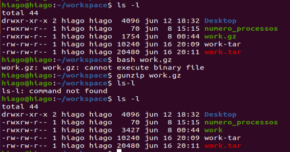
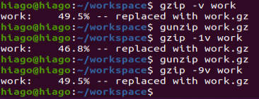

# Linux LPI parte 6

Aqui falaremos muito sobre os comandos de compressão e empacotamento no linux, como o tar,zip, gzip e bzip

## Diferença entre arquivar e comprimir

Um arquivo pode ser qualquer documento que contenha informações, e o processo de arquivar é juntar todos os arquivos e documentos que quero empacotar em um unico documento, enviar para uma pessoa e quando esse arquivo chegar nessa pessoa eu posso desjuntar para ele. É isso que o tar (tape arquive, por que esse comando foi feito na época da fita magnética) faz, eu junto, por exemplo, três arquivos html em um super arquivo só de modo que eu sei separar o que é o título e o seu conteúdo e aí eu tenho a capacidade de desjuntar ele depois (pois adicionei coisas dentro desse arquivo para poder identificar conteúdo e titulo). E isso independente do tipo de documentos que tem dentro dele.

Compressão é uma forma de apertar meu arquivo de modo a termos um tamanho de informação razoavelmente menor, mas que não perca nenhuma informação ou que perca pouca informação (como os arquivos .mp3 que não tem uma qualidade tão boa se comparada a um .flac mas é razoável para serem transportadas e baixadas por aí), o mp3 tenta otimizar quais são os pedaços de arquivo que podem ser retiradas sem que nós percebamos (nós no caso de que não temos ouvido absoluto).

Diferença para a Alura- Normalmente o termo arquivar é utilizado para representar o processo de unir vários arquivos em um só. Isso facilita enviar os arquivos por email por exemplo, pois bastaria anexarmos um arquivo em vez de vários menores.

Já comprimir significa que aplicamos algoritmos que de alguma forma conseguem diminuir o tamanho do arquivo. Aqui, pode haver perda de dados, como conversões para o formato MP3; ou podemos ter compressão sem perda de dados. o tipo que estamos interessados nesse momento é a compressão sem perda de dados.

É comum unirmos esses dois processos. No Windows por exemplo, quando utilizamos programas como winzip, além de realizar a compressão para diminuir o tamanho dos arquivos, também arquivamos e acabamos com um único arquivo, que devido a compressão pode ser menor que a soma dos arquivos que foram arquivados.

## tar para arquivação

Para criar um arquivo tar nós simplesmente fazemos

```sh
tar -cf <nome do arquivo>.tar <arquivos que quero empacotar, aqui se usa muito o globbing>
```

Para ver o que tem dentro desse conteúdo digitamos

```sh
tar -tf <nome do arquivo>.tar
```

Para extrair

```sh
tar -xf <nome do arquivo>.tar
```

Entenda o f como arquivo (file).

O problema do tar é que ele pode subir muito o tamanho do arquivo total, e ter um tamanho além da soma de todos os arquivos dentro dele, uma vez que ele adiciona diversas permissões e informações a esse arquivo .tar.

O comum não é criarmos o arquivo tar no diretório que nós estamos, o comum de darmos o tar é estarmos no diretório anterior a pasta que queremos arquivar. De modo que um exemplo seria

```sh
tar -cf work.tar workspace/*
```

O * ignora todos os arquivos invisíveis, então nem sempre queremos usar o globbing, pois os arquivos invisíveis são importantes também para muitos projetos.

O -v mostra de forma verborrágica o que está sendo feito principalmente no processo de criação e de extração (que são funções silenciosas).

O comando tar decide tirar a barra no seu caminho, então se formos empacotar uma pasta `/home/hiago/loja` quando formos extrair teremos no arquivo uma pasta home, depois uma pasta hiago para aí sim vermos os arquivos da pasta loja.

Existe um comando update com -u , mas ele não sobrescreve o arquivo que foi atualizado, ele so cria um novo com o mesmo nome, pois lembre ele é do tempo da fita magnética e você não apaga arquivos na fita, você simplesmente cria um vetor de informações. Na prática você cria um novo arquivo tar mesmo.

## Usando o tar para arquivar e compactar

Com o sufixo z conseguimos comprimir esse arquivo

```sh
tar -czf <nome>.tar.gz <arquivos que quero compactar>
```

Para descompactar invés do c usa o z.

```sh
tar -xzf <nome>.tar.gz
```

Esse tipo de compactação usa o gzip.

Agora para compactar com o bzip

```sh
tar -cjf <nome>.tar.bz2 <arquivos que quero compactar>
```

Puta j nada a ver mas é isso aí. Como o gzip comprime mais e tem uma semântica melhor então prefiro usar o gzip.

E para extrair um bzip com tar

```sh
tar -xjf <nome>.tar.bz2
```

## Compactando com gzip e bzip sem usar o tar

### gzip e gunzip

O gzip compacta um arquivo de cada vez, e com isso ele destroi o arquivo orginal criando o arquivo compactado. Então perfeitamente podemos fazer:

```sh
gzip arquivo.txt
```

Criando um arquivo arquivo.txt.gz, para descompactar esse arquivo fazemos:

```sh
gunzip arquivo.txt.gz
```



E o gunzip apaga o arquivo .gz.

Assim como posso descompactar o arquivo.gz com

```sh
gzip -d arquivo.txt
```

Posso colocar o nível de compactação pro arquivo sabendo que o nível 6 é o padrão, nível 1 é menos compactado (só que mais rápido) e 9 é compactar mais.

```sh
gzip -9 arquivo.txt
```



Onde essas porcentagens são os níveis de compactação, ou seja, quanto do arquivo original ele tirou. E nem sempre conseguimos tirar acima de um determinado limite.

O mais comum é usarmos com o tar pois não excluiremos arquivos fonte e o tar protege contra isso.

Uma forma de não apagar o arquivo que está dentro da pasta é com o redirecionamento e a função -c, ou seja

```sh
gzip -c arquivo.html > arquivo.html.gz
```

O -c cospe o que seria a resposta da compactação com o gzip e o > redireciona esse conteúdo para um arquivo qualquer. Essa compactação normalmente nos mostra uns caracteres bem estranhos

### bzip2

Funciona da mesma forma que o gzip onde temos o comando `bzip2` para compactar e o `bunzip2` para descompactar, onde o bunzip apaga o arquivo original para criar um arquivo com extensão .bz2.

Invés de descompactar o arquivo com `bunzip2` aqui eu tbm posso usar o `bzip2 -d` e também temos os níveis de 1 até 9 para a compactação, só que o -1 usa menos memória para compactar o arquivo enquanto o -9 usa mais memória. Aqui é legal termos em conta o alvo dessa descompactação, se o -9 é usado em um microprocessador talvez não seja legal usar mais memória RAM para essa operação.

O bzip não permite o -c
