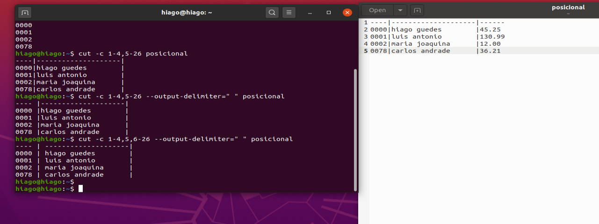

# Linux LPI parte 7

Aqui nós vamos saber como pesquisar ,extrair e filtrar dados de um programa ou arquivo, aqui vamos falar dos comandos `grep`, `less`,`cat`, `head` e `tail`,`sort`, `cut` e o `wc` além da importância do pipe e do redirecionamento de dados de um arquivo para um programa.

## wc (word count)

Pelo man do comando wc vemos que temos os seguintes sufixos

|letra|significado|
|--|--|
|-c|printa o numero de bytes|
|-m|numero de caracteres|
|-l|linhas|
|-w|numero de palavras|
|-L|printa o máximo de tamanho que o editor deve ter para ler a linha mais longa, podemos mesclar a informação da linha mais longa com os outros comandos|

Posso dar um wc para multiplos arquivos como em

```sh
wc <arquivo1> <arquivo2>
```

## Visualização de arquivos

### more

Com o comando `more` eu consigo ver como se fosse a primeira página de um arquivo, como em:

```sh
more <arquivo>
```

Dando `enter` eu consigo ver o arquivo aos poucos, com espaço o more pula uma tela inteira para baixo, `b` eu volto a tela anterior, `q` sai da tela, `h` pede ajuda (dando mais atalhos até),`/` para pesquisar(case sensitive, mas é meio ruim o método de pesquisa do more), `v` entra no editor VI.

Como o more é um editor mais antigo e o linux era muito mais o terminal do que é hoje, então o more permite executar um programa enquanto se le aquele texto, então posso executar um comando qualquer com `!` dentro do more. então dentro do more eu faria

```sh
!ls
```

E estaria lá o resultado do ls no meio do arquivo que estou lendo. No windows chega a ter o more também mas ele não aceita comandos.

Quando o arquivo acaba, acaba o programa more. E como o more aceita outros arquivos o more tem um menu que se movimenta de um arquivo para outro.

Como o more não tem um monte de funcionalidades como navegar com as setinhas direcionais (ou a rodinha do mouse mesmo) então ele não acaba sendo muito utilizado no terminal, sendo apenas um recurso historico.

### less

Como menos é mais, então o less veio como evolução do more.

Basicamente o que funciona no more funciona no less também, funciona o `b` o espaço , o enter, mas posso navegar com setinha para cima e para baixo, assim como mais comandos. Com h eu tenho help.

No windows o less também existe e aceita os mesmos comandos. Home (ou g) vai pro começo da pagina e G (ou shift+G) (ou tecla END) pro final. Com p50 eu vou para metade do arquivo.

/palavra busca a palavra e destaca a palavra para você no arquivo, com n vemos as próximas buscas para aquela palavra, N ou shift+N volta as palavras anteriores e ?palavra busca as palavras de trás para frente.

Com v ele abre o nano invés do vi.

Com ! eu executo comandos. Se a tela estiver meio zoada por causa de algum comando o CTRL+L arruma a tela pra gente.

Quando colocamos mais arquivos no comando less o less não nos redireciona direto para o proximo arquivo, nesse caso temos que dar :n para que ele vá para o próximo arquivo.

### cat

Com cat eu vejo todo o arquivo, mais útil quando o arquivo é menor. O cat é mais um concatenador de arquivos, então se fizermos:

```sh
cat <arquivo1> <arquivo2>
```

O cat vai juntar dois arquivos em um só e me mostrar na tela isso.

O comando  `head <arquivo>` le as 10 primeiras linhas de um arquivo. para selecionar as 5 primeiras linhas eu faço `head -5 <arquivo>` e posso colocar multiplos arquivos. O `tail` aplica o mesmo que o head mas é o fim do arquivo.

Para mostrar tudo a partir de uma linha especifica fazemos:

```sh
tail -n +30 <arquivo>
```

Nesse comando mostramos tudo a partir da linha 30 de um arquivo

## Redirecionamento de entrada e saída

Nomes e siginificados comuns

|nome|tradução de|Significado|
|--|--|--|
|stdout|standart output|Saída padrão de um comando ou programa, no bash a saida normal do resultado de um comando é o meu terminal|
|stderr|standart error output|saída padrão de mensagem de erro|
|stdin|standart input|A entrada padrão de um comando|
|io ou I/O|entrada e saída|terminologia comum para dizer que estou lidando com entrada e a saída de algo|

Um comando de entrada de dado é o comando `read` onde eu espero o usuário digitar algo para aí poder salvar em uma variável.

```sh
$ read IDADE
34
$ echo $IDADE
34
```

Se dermos um comando ls tanto no windows quanto no linux nós temos a saída no terminal mas supondo que eu esteja na home e queira lista os arquivos e diretórios no Desktop em um arquivo txt eu posso redirecionar a saída com:

```sh
ls > Desktop/saida.txt
```

Se o arquivo existe o `>` sobrescreve o arquivo para adicionar eu faço

```sh
ls >> Desktop/saida.txt
```

Com `tail -f` (-f de follow) eu vejo novas modificações que forem adicionadas no arquivo, se eu sobrescrever com `>` o arquivo trunca e o `tail -f` quebra, entenda o `>>` como um append (adicionar). Isso pode ser util para acompanhar mensagens de log em um programa.

### Saída

canal 0->canal de entrada

canal 1-> canal de saida padrão

canal 2-> canal de erro

E eu posso direcionar a mensagem de erro para um arquivo da seguinte forma

```sh
cd pastaQueClaramenteNãoExiste 2> saida.txt.
```

Eu posso redirecionar uma saída de erro para o canal de saída padrão com:

```sh
cd asasasas 2 > &1
```

Esse & significa um endereço normal, pois as vezes a saida de erro ou ate mesmo a saida padrão não estão no terminal e assim podemos redirecionar o que tem nele para um outro arquivo.

Para indicar que o fluxo de uma saída é o mesmo da outra, podemos utilizar o &. Lembre-se que o canal 2 (2>) é a saída de erro; o canal 1 (padrão (>)) é a saída padrão; e o 0 representa a entrada padrão. Portanto se fizermos:

```sh
2>&1
```

estamos indicando que a saída de erro será direcionada para o mesmo local que a saída padrão.

Dessa forma:

```sh
$ cat arquivo-nem-existe > novo_arquivo.txt 2>&1
```

Aqui direcionamos a saída para um arquivo e depois dizemos que a saída de erro será direcionada para o mesmo local (o arquivo novo_arquivo.txt).

O comando abaixo não funciona como esperamos porque no momento direcionamos a saída de erro para o mesmo local da saída padrão, a saída padrão (canal 1) ainda é o terminal. Por esse motivo os erros ainda serão exibidos no terminal. Note que a ordem importa.

```sh
$ cat arquivo-nem-existe 2>&1 > novo_arquivo.txt
```

O próximo comando parece funcionar, já que o erro é direcionado para o arquivo. Mas note que a saída padrão ainda é o terminal, pois no momento que definimos que o local da saída padrão é o mesmo local da saída de erro, a saída de erro ainda era o terminal.

```sh
$ cat programa.c >&2 2> novo_arquivo.txt
```

### Entrada

Como executar o comando find nós já vimos em um outro curso. Aqui vamos redirecionar sua saída para um arquivo:

```sh
$ find -name "*log*" -name "*2016*" > resultado-find.txt
```

Feito isso, basta utilizar o < para indicar ao comando zip que a entrada será feita de um arquivo. Mas o zip espera receber os arquivos que serão compactados como argumentos, quando digitamos o comando. Precisamos utilizar a opção -@, que nos permite digitar uma lista de arquivos na entrada padrão. Dessa forma, vamos combinar as duas coisas:

```sh
$ zip -@ logs.zip < resultado-find.txt
adding: logs/log-2016-05-13.txt (stored 0%)
  adding: logs/log-2016-05-12.txt (stored 0%)
  adding: logs/log-2016-06-25.txt (stored 0%)
  adding: logs/log-2016-04-22.txt (stored 0%)
  adding: logs/log-2016-04-21.txt (stored 0%)
  adding: logs/log-2016-04-20.txt (stored 0%)
  adding: logs/log-2016-06-28.txt (stored 0%)
  adding: logs/log-2016-05-10.txt (stored 0%)
  adding: logs/log-2016-06-30.txt (stored 0%)
  ```

Com < eu redireciono a entrada de um programa que pede algum tipo de entrada como o zip pede

Podemos até mesmo direcionar a saída do zip para um arquivo:

```sh
$ zip -@ logs.zip < resultado-find.txt > saida-zip.txt
```

E o conteúdo do arquivo será:

```sh
$ cat saida-zip.txt
updating: logs/log-2016-05-13.txt (stored 0%)
updating: logs/log-2016-05-12.txt (stored 0%)
updating: logs/log-2016-06-25.txt (stored 0%)
updating: logs/log-2016-04-22.txt (stored 0%)
updating: logs/log-2016-04-21.txt (stored 0%)
updating: logs/log-2016-04-20.txt (stored 0%)
updating: logs/log-2016-06-28.txt (stored 0%)
updating: logs/log-2016-05-10.txt (stored 0%)
updating: logs/log-2016-06-30.txt (stored 0%)
```

Para fechar a escuta do -@ aperte CTRL+D

### Pipe |

E se eu quero executar direto a saida de um comando para entrada do outro, sem precisar criar um arquivo entre os dois? Para isso tem-se o pipe |, o que simplifica nosso `$ find -name "*log*" -name "*2016*" > resultado-find.txt` e posteriormente para `$ zip -@ logs.zip < resultado-find.txt`

```sh
find -name "*log*" -name "*2016*" | zip -@ logs.zip
```

O pipe é o redirecionamento de uma saida de resultado de um programa para outro programa, se eu redirecionar para um arquivo eu tenho que usar > ou <.

Uma forma legal de ver o resultado de um programa que retorna um resultado muito grande é com

```sh
ls -la | less
```

Ou resultados de cache:

```sh
apt-cache search mysql | less
```

## cut

Uma forma de ver quantos usuários meu sistema tem (e que não é so vc e o root hahah) é vendo o arquivo em etc/passwd (que relaxa não tem a sua senha lá nele, antigamente tinha mas não mais hoje (de forma criptografada) tá meio diferente).

Mas note que ele tem um padrão que vai desde nome do usuario de login até o `:` e se quiséssemos saber somente o nome dos usuários no meu sistema. O porgrama `cut` ajuda a cortar nossos arquivos

Começando pelo simples, nós podemos pegar apenas as quatros primeiras colunas de um arquivo de texto com

```sh
cut -c 1,2,3,4 arquivo.txt
```

```sh
cut -c 1-4 arquivo.txt
```

O gedit e outros editores de texto usam a posição 1 para começo de arquivos e não o zero

Esse arquivo é útil para arquivos que já tem um formato que precisa ser padronizado como um arquivo que armazena as notas fiscais emitidas por uma loja.

Porém se executarmos esses dois comandos pode ser que certos espaços fiquem um tanto juntos pra isso eu uso o `outout-delimiter` da seguinte forma:

```sh
cut -c 1-4,15-20 --output-delimiter=" , " arquivo.txt
```

Isso criará um espaço vírgula espaço na saída de dois espaços de modo que:



A esse tipo de arquivo como na imagem acima nós dissemos que ele é do tipo posicional onde um campo ocupa 4 caracteres outro ocupa 20 e outro 5, mas isso é limitante. O etc/passwd cada campo está entre dois pontos e esse arquivo é mais interessante. para isso eu faço

```sh
cut -f 1 -d: /etc/passwd
```

-f de field (campo), 1 eu quero so o primeiro campo e -d: eu digo que o delimitador é o :, aqui eu posso colocar o `--output-delimiter` para delimitar a saida de mais campos.

Mas eu não consigo inverter a ordem de um cut com:

```sh
cut -c 15-20,1-4 --output-delimiter=" , " arquivo.txt
```

### paste

Isso fará o resultado ser exatamente o mesmo, mas existe uma gambiarra que consegue fazer isso, isso se deve ao fato do cut sempre olhar para frente, sempre trocando e vendo qual o menor esforço ele pode fazer com as informações que você der. E esse comando é o paste

Eu corto um intervalo que eu quero, salvo em um arquivo, salvo outro pedaço em outro arquivo e ai dou paste nos dois arquivos na ordem que eu quero

Por padrão ele separa as linhas dos arquivos com um TAB, para separar com : podemos colocar no comando `-d:`.

Para fazer uma tabela transposta usamos o serial

## sort

Eu posso passar todas as listas de usuários do meu sistema com:

```sh
cut -f 1 -d: /etc/passwd > arquivo
```

Porém como temos 30 e poucos usuários no sistema então pode ser meio ruim encontrar um usuário específico, para isso podemos arrumar alfabeticamente com:

```sh
sort arquivo | less
```

Ou simplesmente com:

```sh
cut -f 1 -d: /etc/passwd | sort | less
```

Mas se atente que a linguagem de ordenação é a língua inglesa

Por padrão o sort organiza por ordem alfabética as linhas, para separar por números usamos

```sh
sort -k <numero do campo onde quero arrumar> -t<caracter delimitador>
```

Um -r nos daria uma ordenação reversa, e essa arrumação vale tanto para letras quanto para números, -u tira linhas que estão repetidas não necessariamente que estão em sequencia (o comando uniq retira linhas repetidas que estão em sequência), com -o eu coloco a saída desse comando em algum lugar (é perigoso usar o > pois eu posso apagar o arquivo original dos dados caso eu queira redirecionar para esse mesmo arquivo). E com isso posso fazer mais pipes pegando o head, o tails enfim você que manda.

Comentário Alura:

É possível redirecionar a saída do sort utilizando o >. O problema dessa abordagem é que o shell irá primeiro criar/sobrescrever o arquivo e por esse motivo vamos acabar com um arquivo vazio e sem conteúdo para o sort ordenar.

Para esses casos e mesmo quando formos criar um novo arquivo, a melhor prática é utilizar a opção -o do sort. Dessa forma evitamos que o shell crie o arquivo primeiro, e deixamos essa responsabilidade para o próprio comando:

```sh
cut -c 1-4,5-14,15-20 --output-delimiter=: notasfiscais.posicional | sort -k
```

## Expressões regulares e grep

### grep

O programa `grep` procura para mim quais as linhas que eu tenho uma determinada palavra com o comando:

```sh
grep palavra arquivo.txt
```

E o resultado é uma sequencia de linhas onde encontramos determinada palavra, com -n ele me mostra a linha que aparece essa palavra, -c me mostra em quantas **linhas** tem essa palavra, -i faz a busca ignorando letra maiuscula de minuscula

### Expressão regular

E se quisessemos encontrar dentro do arquivo os anos que vão desde 2010 até 2019 como fazemos? Existe o globbing certo então poderíamos fazer `grep 201? arquivo.txt`? Não, pois o globbing é válido para procurarar apenas arquivos e diretórios dentro de uma pasta, para procurar conteúdo temos as expressões regulares onde qualquer caractere é o ponto, ou seua podemos fazer esse comando com:

```sh
grep 201. arquivo.txt
```

Para conteúdo o `.` é similar ao `?` para procurar pastas dentro do interpretador do shell, lembre-se o ? é interpretado pelo shell o . é pelo programa grep, ou outros que tenham acesso a expressões regulares como essa. A boa prática é usar '' para não me confundir e nem confundir o bash com o que é expressão regular ou o que é globbing. Então para procurar qualquer ano (sem caracteres indesejados nós temos)

```sh
grep '201[0123456789]' arquivo.txt
```

ou

```sh
grep '201[0-9]' arquivo.txt
grep '201[[:digit:]]' arquivo.txt (isso tem no man do grep)
```

Pois o [] também existe no globbing então, para garantir use '', por que isso é uma coisa que confunde mesmo

Supondo que eu quero pesquisar todos os números que aparecem em um arquivo (com decimais separados por . eu poderia fazer como):

```sh
grep '[[:digit:]]\+,[[:digit:]]\+' arquivo.txt
```

Onde o + escapado serve para dizer que eu tenho 1 ou mais digitos para procurar, precisamos escapar o + pois ele é um caracter especial dentro desse contexto, se eu quero pegar números alem dos decimais e também os inteiros eu tenho que digitar que a vírgula é opcional e para isso fazemos `,\?`

```sh
grep '[[:digit:]]\+,\?[[:digit:]]\+' arquivo.txt
```

Para pegar apenas um número mesmo, que não tenha números decimais mesmo, então usamos o * invés de \+ da seguinte forma:

```sh
grep '[[:digit:]]\+,[[:digit:]]*' arquivo.txt
```

Aqui o * não precisa escapar pois ele não é caractere especial para expressão regular

Para pegar números separados por , ou por . nós já vimos e é o colchete, mas o ponto precisa ser escapado pois ele é um caractere especial

```sh
grep '[[:digit:]]\+[,\.][[:digit:]]*' arquivo.txt
```

-v para encontrar todas as linhas que não tem esse tipo de busca, -l para achar quais programas ou arquivos tem essa busca (pois posso adicionar diversos arquivos no grep), -r procura de maneira recursiva da pasra onde eu to para pastas filhas.

grep, egrep ,fgrep e rgrep são programas que fazem a mesma coisa mas podem ter um parâmetro ou outro um pouco diferentes

Com pipe posso filtrar duas palavras de pesquisa fazendo

```sh
grep -n palavra arquivo.txt | grep [[:digit:]] arquivo.txt
```

Isso filtra uma palavra e qualquer digito em uma linha e me mostra quais linhas tenho esses casos, `cat | grep` é meio inutil ta? hahahaha no geral o grep sabe ler o arquivo todo e me mostra no terminal também, e o grep pode receber na entrada padrão
