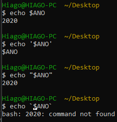

# Linux LPI parte 8

Essa parte fala mais sobre os scripts no linux, vamos falar de variáveis internas dentro do script, além do laço `for` e de editores de texto comuns no terminal

## O que é script?

Scripts são arquivos de texto onde dentro dele temos uma série de comandos e ações que serão repetidas diversas vezes. Diversas vezes veremos scripts com a extensão .sh (de shell) mesmo vendo que o linux não precisa de extensões para rodar seus arquivos

Supondo que criamos um script com nome `script.sh` as formas de rodar esse script são com:

```sh
bash script.sh
sh script.sh
```

Sabendo que estamos na pasta onde estão o script

Ou darmos dar permissão de execução com `chmod +x` com

```sh
chmod +x script.sh
```

E aí podemos fazer

```sh
./script.sh
```

Outra forma é colocando o diretório no PATH com:

```sh
PATH=$PATH:<caminho absoluto do diretório>
```

### shebangs

Com `#` nós simplesmente comentamos o texto no script mas com `#!` na primeira linha do script nós dizemos quem que vai interpretar o nosso código, e se quisermos que seja o bash nós dizemos

```sh
#!/bin/bash
<corpo do script>
```

## Redirecionando a saída padrão com crase

Supondo que queiramos printar o nosso diretório atual dentro de um echo, nós podemos fazer ele sem precisar de nenhuma variável, só precisaríamos da crase

```sh
echo Meu diretório atual: `pwd`
```

Dessa forma estaríamos pegando a saída do pwd e colocando na entrada do echo

O que difere das aspas simples que executa o comando resultante que está dentro das aspas simples, enquanto a crase aplica o resultado do que está dento da crase em alguma variável ou entrada de um programa (como a propria execução do shell).

Então se tentarmos executar `pwd` isso nos dará um erro pois ele tentará executar sua pasta atual, mas uma pasta não é um programa o que dá num erro.

Uma outra forma de executar esse comando (com as crases) é com `$(pwd)`

## source e variáveis internas

Se rodarmos um script com source como em

```sh
source script.sh
```

Nós podemos alterar as variáveis do shell atual com as variáveis do script, uma outra forma de chamar o source é com

```sh
. script.sh
```

Ou seja se temos um ANO=2018 no shell atual e no final colocarmos ANO=2019, com o source a variável do shell atual (o terminal) será 2019

### variáveis internas

Nós podemos passar uma variável para o script da seguinte maneira

```sh
ANO=2016 ./script.sh
```

Porém isso não é muito usual o comum é passarmos como argumento da seguinte forma

```sh
./script.sh 2016
```

E dentro do script fazermos o seguinte

```sh
echo O ano atual é $1
```

Cujo resultado será 

```r
O ano atual é 2016
```

Onde $1,$2,$3,... são os parâmetros que passamos no corpo da execução do script, a variável $0 nos mostra o caminho relativo ou absoluto do caminho do script (caso esteja no PATH esse script $0 será o caminho absoluto) de qualquer outra forma o caminho será o relativo

Com `$#` mostra quantos argumentos foram passados pro script e `#*` mostra o valor desses argumentos pra gente

### Diferenças entre aspas duplas e simples

Uma variável como `${ANO}` nas aspas duplas é interpretada enquanto nas aspas simples não

Como podemos ver abaixo



Note que a crase fez com que o bash tentasse executar um programa chamado 2020 pois é o resultado de $ANO é 2020.

O ideal é sempre tentar utilizar aspas duplas mesmo, ou separar variáveis.

#### Exercícios

Vamos começar criando e exportando a variável:

```sh
$ export ANO=2016
```

No fim do script, faremos o seguinte:

```sh
find . -name "*log*" -name "*${ANO}*" | zip -@ logs.zip | wc -l
```

ANO=2018
No terminal, quando imprimimos a variável, o valor permanece o inicial:

```sh
$ compacta-logs.sh
```

```sh
$ echo $ANO
2016
```

Agora vamos utilizar o source e em seguida imprimir novamente o valor:

```sh
$ source compacta-logs.sh
Compactando os logs de 2016 em /home/lucas
6
```

```sh
$ echo $ANO
2018
```

Lembre-se que esse normalmente não é o comportamento que desejamos, mas pode ser útil em alguns casos, como quando queremos executar arquivos de configuração que alteram variáveis de ambiente.

O source pode ser substituído pelo . (ponto):

```sh
$ . compacta-logs.sh
```

## Laços

O laço for tem a seguinte sintaxe

```sh
for var in <valores que var pode ter>
do
    <lógica do script>
done
```

Tal como:

```sh
lista='pera uva maçã salada_mista'
for i in $lista
do
    echo $i
done
```

Posso usar qualquer comando para iterar o i como

```sh
for i in `ls`
do
    echo $i
done
```

E até mesmo aplicar o glob

```sh
for i in *
do
    echo $i
done
```

Esse último inclusive pode ser visto como uma variação do ls.

Ainda falta o while e o for mas a prova infelizmente não cobra então não será visto.

### Exercícios

Executando o find para vários anos

Crie um laço para que a compactação dos logs no script compact-logs.sh seja executada para vários anos, que serão passados como argumento.

Um exemplo da invocação do script:

```sh
$ compact-logs.sh 2016 2017 2018
```

E então o script irá buscar e compactar os logs de 2016, 2017, 2018.

Remova o comando wc, pois o zip exibirá alguns erros caso não existam arquivos para comprimir. Ao remover o wc veremos esses erros.

Precisamos iterar pelos argumentos que foram passados na linha de comando.

O laço for é capaz de iterar em uma lista. Por exemplo:

```sh
for num in 1 2 3
do
    echo "Numero ${num}"
done
```

O resultado disso seria:

```sh
$ ./test-for 
Numero 1
Numero 2
Numero 3
```

Perceba que o que delimita o item da lista é o espaço. Já vimos como obter todos os argumentos que são passados para o script, separados por espaço: na variável $*. Portanto basta iterarmos pela variável $*:

```sh
#!/bin/bash

for ano in $*
do
    echo "Compactando os logs de ${ano} em `pwd`"

    find . -name "*log*" -name "*${ano}*" | zip -@ logs.zip
done
```

Pronto! Agora basta executar o script passando os anos:

```sh
$ compacta-logs.sh 2016 2017 2018
```

### Para saber mais: omitindo o in

É possível omitir o in do for. Nesse caso ele irá iterar pelos argumentos passados pela linha de comando. Ou seja: a seguinte linha

```sh
for ano in $*
```

tem o mesmo efeito que

```sh
for ano
```

Faça o teste no seu código, execute o script e veja que o comportamento é o mesmo.

## Editores de texto mais comuns no terminal

Muita das vezes nos vemos tentados a usar o gedit que é um editor com interface gráfica. Agora no terminal tenho como editar o texto?

### vi ou vim

O vi de certa forma é o editor básico de terminal, pois sabendo ele consigo usar qualquer outro

Navego com as setinhas do teclado quando estou no modo de navegação

A tecla A adiciona no final da linha as teclas que eu quiser, aqui as setinhas não navegam no editor. ESC sai do modo de edição, x apaga o caractere atual.

O vi não suportam teclas como DEL,END,INS pois essas teclas vieram depois do vi (pra você ver o lance historico), i insere no caractere atual,X apaga

/ procura as coisas no arquivo

a maior barreira do vi é decorar uma série de comandos para ser produtivo, o que pode não valer a pena

:w para salvar e :q para sair, para sair sem salvar :!q

Para executar comandos é necessário estar no modo de navegação, para isso devemos pressionar a tecla "Esc". Pois no mode de inserção apenas inserimos textos no documento. Após pressionarmos I (Shift + i) ou A (shift + a), o cursor vai para o início ou fim da linha e entramos no mode de inserção, onde é possível digitar os textos.

Para excluir uma linha inteira, utilizamos o comando dd.

O DD (Shift + d [2x]), exclui o conteúdo da linha, mas não exclui a linha em si.

### pico ou nano

O pico redireciona para o nano pois o pico é bem antigo e há toda uma discussão sobre ele. (quando executamos ls -l `type pico` vemos que ele nos redireciona para /bin/nano com um atalho)

O nano é bem mais visual que o vi e já tem uns comandos dentro da tela, como salvar com `CTRL+O` onde ^ representa o CTRL, CTRL+K corta o texto e CTRL+U cola

Shift+6 ou ^ seleciona um pedaço de texto

Esses editores são bem suficientes para a edição de texto via terminal
